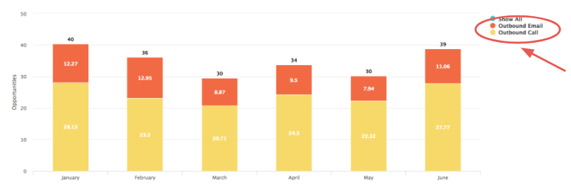
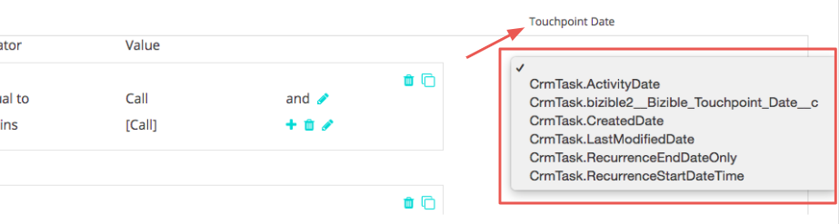

# Salesforce Activities Attribution {#salesforce-activities-attribution}

Salesforce Activities Attribution - Bizible - Product Documentation

Bizible's Salesforce Activities integration will bring in specific Task and Event records into your attribution model. Begin to track things like sales emails or sales phone calls that weren't receiving due credit. To configure your activities rule, you'll need to go to [apps.bizible.com](https://slack-redir.net/link?url=http%3A%2F%2Fapps.bizible.com&v=3). From there, go to the Settings tab and click on the Activities tab.

You're about to make your Sales team very happy! Let us take you through a quick tutorial.

To start off, we're introducing a new concept called a Bizible Campaign. For each rule that you define, you're going to bucket the records into a Bizible Campaign that you can name. Add multiple campaigns as needed. Imagine measuring the effectiveness of an Outbound Sales campaign next to a Paid Media campaign!

You're going to use this Bizible Campaign Name to tell us which Channel it should get mapped to. If you're still thinking about Outbound Sales, perhaps all Outbound Sales campaigns should sit in a BDR channel.

Get familiar with this hierarchy:

* Channel

    * Subchannel

        * Campaign
        * Campaign

    * Subchannel

        * Campaign

>[!TIP]
>
>If you want to set a unique Campaign for each Sales rep for example, utilize our dynamic replacement parameters to fill in the Bizible Campaign Name. In our same example, you can enter "Outbound Sales - {AssignedTo}" and we'll morph it into something like "Outbound Sales - Jill" or "Outbound Sales - Jack." You have no idea how much time we just saved you!

Once your Bizible Campaign Name is set, it's time to set up your Activity rules.

The rules act as a filter to tell us which records are eligible for attribution. Imagine you're creating a report in your CRM using similar logic to generate that report. You have the flexibility of using a combination of and/or statements and various operators like matches any, contains, starts with, ends with, is equal to, etc. Define "and" statements within a boxed rule or layer "or" statements outside the box.

>[!NOTE]
>
>Formula fields cannot be used within your rules and will not appear in the picklist. Because formulas calculate in the background and do not modify a record, Bizible cannot detect whether a record fits a rule or not.

Lastly, let's choose one of your date or date/time fields to utilize as the Bizible Touchpoint Date. Either standard and custom fields are selectable. 

>[!TIP]
>
>With your package installation, Bizible includes a custom Bizible Touchpoint Date field on the Activity record. If you want to use a dynamic date, like the date when a status changes, it's possible to use a CRM workflow to set the "Bizible Touchpoint Date" then select the Bizible Touchpoint Date here on this step.

Don't forget to set different rules for Tasks or Events. You'll need to know which object your Sales team uses to record their activities.

You'll probably want to place these new touchpoints into their appropriate [Marketing Channel](http://apps.bizible.com/MyAccount/Business?busView=false&id=10#!/MyAccount/Business/Account.Settings.SettingsHome?tab=Channels.Online%20Channels). You can do that by defining the Channel with its new Campaign mapping that you just created. Perhaps you'll create a new row for the BDR channel where the Campaign starts with Outbound.

>[!TIP]
>
>When adding a Channel definition, make use of wild card values, an easier way to state operators like:
>
>starts with ( Outbound&#42; )
>
>contains ( &#42;Outbound&#42; )
>
>ends with ( &#42;Outbound )
>
>No wild card basically means "is equal to" so be sure to use them as needed.

| **Operator** |**Use Case** |
|---|---|
| Is Equal To |Single value - exact match |
| Contains |Single value - contains value |
| Matches Any |Multiple values - Exact Match |
| Matches Any (Contains) |Multiple values - &#42;value&#42;, &#42;value, &#42;value&#42; |

And last but not least, you have the option of entering costs for your new channels. Our [Marketing Spend upload](http://apps.bizible.com/MyAccount/Business?busView=false&id=10#!/MyAccount/Business/Account.Settings.SettingsHome?tab=Reporting.Marketing%20Spend) allows you to enter your spend at the Channel level, Subchannel level, or Campaign level. With your new Bizible Campaigns, you can add those related costs by month, then see the ROI for each Campaign!

>[!NOTE]
>
>**Related Articles**
>
>[Activity Attribution FAQ](http://docs.marketo.com/x/UAEgAQ)
>
>[Bizible University: Activities Attribution](https://universityonline.marketo.com/courses/additional-features-1/#/page/5be3747e5b62f440323a468a)

