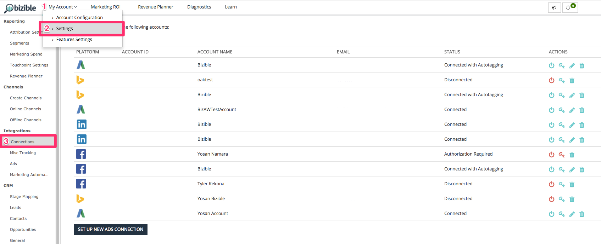
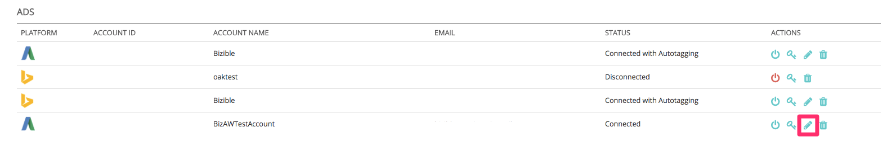

# Integrated Ad Platforms {#integrated-ad-platforms}

Integrated Ad Platforms - Bizible - Product Documentation

Bizible has API connections with Google AdWords, Microsoft BingAds, Facebook Ads and DoubleClick Campaign Manager. Through these API connections, Bizible is able to easily pull data and push it to your CRM along with the external Bizible app. No manual uploading of costs or data is required. Rather, your accounts simply need to be connected and authorized to the Bizible app. Bizible will then automatically download your marketing costs from the platforms and load them into the Bizible app. If you select to enable auto-tagging for AdWords, BingAds, or Facebook Ads, Bizible will automatically append its parameters to the URLs of your ads.

### What's in this article? {#whats-in-this-article}

[How to Connect Ad Platforms](#how-to-connect-ad-platforms)  
[Google AdWords](#google-adwords)  
[What Happens When Auto-tagging is Enabled](#what-happens-when-auto-tagging-is-enabled)  
[How to Enable Bizible Auto-tagging for Adwords](#how-to-enable-bizible-auto-tagging-for-adwords)  
[How to Set up a Tracking Template in AdWords with Bizible Parameters](#how-to-set-up-a-tracking-template-in-adwords-with-bizible-parameters)  
[How to Automatically Generate UTM Tags for Google AdWords](#how-to-automatically-generate-utm-tags-for-google-adwords)  
[Bing Ads](#bing-ads)  
[Facebook Ads](#facebook-ads)  
[LinkedIn Sponsored Content](#linkedin-sponsored-content)  
[Non-integrated Platforms](#non-integrated-platforms)

#### How to Connect Ad Platforms {#how-to-connect-ad-platforms}

Before we get into specifics of each platform, we'll go over how to connect any of these accounts to Bizible. First log into the Bizible app and navigate to the **Settings **option under the **My Account **tab at the top left of the screen. Next, select **Connections **under the **Integrations **section on the left.

As shown in the image below, you will see a button to set up new ads connections.

After you click the Set up New Ads Connection button, a window (shown below) will pop up with four ad connection types. Click connect and another window will appear asking for credentials. Enter the credentials and click authorize to connect the account to Bizible.

#### Google AdWords {#google-adwords}

When you create your ads in Google AdWords, you are encouraged to tag your campaigns in one of three ways--manual tagging, automatic tagging, or by creating a Tracking Template. Manually tagging your AdWords URL relies on you defining and adding the parameters at the end of the ads’ URLs. Manual tagging allows any non-Google platform to easily read the data collected by the parameters.

The Tracking Template is a tool Google provides to add what it calls ValueTrack parameters. They work in the same manner as UTMs and other tagging parameters.

#### What Happens When Auto-tagging is Enabled {#what-happens-when-auto-tagging-is-enabled}

Bizible Searches for Tracking Templates in your AdWords account:

* *Option A*: Tracking Template is found. Bizible adds its parameters to the template.
* *Option B*: Third-party redirect is found. If a third-party redirect is found in the Tracking Template, Bizible cannot take any action. You will need to manually add the Bizible tags to the third-party system. An example of a third-party redirect would be a bid management tool like Kenshoo or Marin. Learn more about how [bid management tools affect Bizible](http://docs.marketo.com/x/YAEgAQ).

* *Option C*: No Tracking Template is found. Bizible will scan all of your Ad Destination URLs for the Bizible parameters. Based on the scan, if:

    * Parameters are found: the setup is complete! 
    * Parameters are not found: Bizible will append its parameters to the end of the Ad Destination URLs. Bizible appends new ads within two hours after they are created. Keep in mind that the parameters will not be added to a template.

Learn more about our [AdWords auto-tagging functionality](http://docs.marketo.com/x/NgEgAQ).

#### How to Enable Bizible Auto-tagging for Adwords {#how-to-enable-bizible-auto-tagging-for-adwords}

Before enabling Bizible auto-tagging, **please ensure that you have a tracking template enabled at the Account, Campaign or Ad Group level within your Adwords account. This is required for any Adwords account that will have Bizible auto-tagging enabled.** Enabling a tracking template prevents any loss in ad performance history data. Please note that enabling tracking templates at the Keyword, Sitelink, or Ad level will cause the ad to go through the review and approval process and can potentially restart your ads' performance history. If there is no tracking template enabled at all, Bizible will append the Bizible tracking parameters directly to the ad's "Final URL" which can also result in loss of ad history data.

Once you have a tracking template in place, please follow the instructions below to enable Bizible Auto-tagging. Note: Bizible will also auto-tag any paused ads in your account.

1. Sign-in to your Bizible account at [apps.bizible.com.](http://apps.bizible.com)
1. Go to My Account > Settings > Integrations > Connections.

   

1. Select the **Pencil Icon** next to the Adwords Account that will be have Bizible auto-tagging enabled.

   

1. In the top right-hand corner, toggle the **Autotagging**&nbsp;switch to **Yes**. At the bottom of the page, click **Learn More» **to expand the text box and click&nbsp;**Save**. Auto-tagging setup is complete.

   

#### How to Set up a Tracking Template in AdWords with Bizible Parameters {#how-to-set-up-a-tracking-template-in-adwords-with-bizible-parameters}

Keep in mind that you should add tracking templates at the Account, Campaign or Ad Group level in AdWords. If you add Tracking Templates to the Keyword, Sitelink or Ad level, your ad will need to go through the review and approval process and you risk restarting your ads' performance history. Learn more about [creating tracking templates.](http://support.google.com/adwords/answer/6076199?hl=en#tracking)

1. Log-in to your Google AdWords Account.
1. Go to your Campaigns view from the left-hand navigation bar
1. * *Navigate to "Settings", also in the left-hand nav bar
1. Toggle to the "Account Settings" view across the top
1. Expand the "Tracking" section
1. Paste one of the following strings of text in the tracking template to set the template’s value:

    * If you have question marks in ALL of your URLs, then use the following URL text:

   *{lpurl}&_bt={creative}&_bk={keyword}&_bm={matchtype}&_bn={network}&_bg={adgroupid}*

    * If you do not have question marks on any of your URLs, then add the following URL text:

   *{lpurl}?_bt={creative}&_bk={keyword}&_bm={matchtype}&_bn={network}&_bg={adgroupid}*

   To prevent errors from taking place when you manually tag your URLs, it’s typically recommended to generate the UTM parameters automatically. This doesn’t have to mean auto-tagging with AdWords or Bizible parameters, there are multiple tools that simplify the process by automatically generating the parameters for the URL based on the information you provide.

   >[!TIP]
   >
   >If you’re getting an error saying that the Tracking Template is invalid, try clearing your browser cache and trying again - this often solves the issue.

#### How to Automatically Generate UTM Tags for Google AdWords {#how-to-automatically-generate-utm-tags-for-google-adwords}

UTM tags can appear difficult to create at first but there are many tools available to easily build URLs with UTM parameters. You can use any one of the following resources or search the web for more tools. Keep in mind that Bizible does not endorse or guarantee anything with these platforms and tools.

**Google URL Builder**

Google URL Builder is standard tool for building correctly-formatted URLs with UTM tags. Simply enter the URL and the desired value of each parameter and click “Generate URL”. This is an ideal tool to use if you only have a handful of URLs to tag. Access the tool [here](http://support.google.com/analytics/answer/1033867?hl=en).

**Google Spreadsheet generated by EpikOne**

This spreadsheet has a formula that will automatically generate tagged destination URLs. This is a great tool to use if a large number of links need to be tagged. Access the spreadsheet [here](http://spreadsheets.google.com/ccc?key=p7c_HKcmspSUfEYSO0gskKw&hl=en).

**Rafflecopter Link Tagging Tool**

The spreadsheet created by Rafflecopter is a modified version of EpikOne’s spreadsheet. It also contains a formula that will auto-generate tagged destination links for you to use.

Each of these tools has detailed instructions on how to use and modify it to fit your needs. The tool is available [here](http://docs.google.com/spreadsheets/d/1QCIr1WUJQHE68cA4VTks2XE7nxuryaUymCEy_23-Oew/edit#gid=0).

**Effin Amazing UTM Builder**

This tool is a Chrome extension that allows you to quickly generate UTM tags. Find it [here](http://chrome.google.com/webstore/detail/effin-amazing-utm-builder/eoaapiimcaimddnfhfnifgkinmpcbccp?hl=en).

#### Bing Ads {#bing-ads}

Bing Ads is an integrated platform that allows you to enable auto-tagging for URLs or use a third-party tool, such as Bizible, to tag ads. Bing Ads relies on UTM parameters as well.

Bing Ads’ auto-tagging feature adds the following UTM parameters:

* Utm_source
* Utm_medium
* Utm_term

Bing Ads' auto-tagging also adds the following custom parameter:

*_bt={adid}*

The string would look like this:

*{lpurl}?_bt={adid}&utm_term={keyword}&utm_source=Bing_Yahoo&utm_medium=CPC*

It’s important to note that Bing Ads allows you to add even more parameters by using their custom tags in your final URLs to gain more granularity, if you would like.

A tracking template can be used if wanted but it is not necessary for Bing Ads and Bizible to integrate. This is because Bing allows ads to be edited without changing history, so Bizible is able to update the Destination URL.

Auto-tagging should be enabled through Bizible so that the custom Bizible parameters can be automatically appended. There is no risk of losing past ad performance history with Bing Ads.

Visit the  [Bing Ads](http://advertise.bingads.microsoft.com/en-us/blog/post/august-2016/upgraded-urls-now-available-in-bing-ads-an-easier-way-to-manage-your-tracking-urls)website for more information on adding tags on their platform.

#### Facebook Ads {#facebook-ads}

Bizible’s integration with Facebook allows it to automatically download ad information and tag the URL with its parameters. Bizible will pull in the Campaign and Ad Set information through our auto-tagging. The Ad Set will populate our Ad Group Name field. For more information on setting up URL tags on the Facebook platform, visit the Facebook [business](http://www.facebook.com/business/help/1016122818401732/?ref=u2u) page.

Before enabling auto-tagging with Facebook Ads, it is important to export the previous performance history as a CSV. At this point, when Bizible tags Facebook Ads with its _bf parameter, Facebook reads the ads as brand new and erases the performance history. Therefore it is important to export a record of the previous performance if that is something of value to you and your organization.

Please note that you may connect your Facebook account at any time to the Bizible app and no data will be lost--it is only when auto-tagging is enabled that the performance history is wiped.

[Please see this article](http://www.facebook.com/business/help/393890194130036) from Facebook for more information about exporting Facebook Ad reports.

#### LinkedIn Sponsored Content {#linkedin-sponsored-content}

The LinkedIn integration allows Bizible to tag destination URLs on LinkedIn Sponsored Content, which ultimately allows Bizible to follow a user through their entire touchpoint journey and map the activity back to the specific LinkedIn Campaign and Creative. This provides insights to customers about the ROI of their LinkedIn activity. Bizible will search for creatives with a unique LinkedIn Share and add a **?_bl={creativeId}** parameter to the end of it.

Because LinkedIn Shares can be used across multiple Campaigns and Creatives, we ask that customers do not copy/clone/duplicate existing Creatives so that it can maintain its uniqueness. If Shares are found and are detected to only be used on one Creative, Bizible can tag the Share as is without having to recreate any Creatives or Shares and all ads history (impressions, clicks, shares) will remain.

As soon as a Share is found to be shared across multiple Creatives, Bizible will have to run through a process of pausing, copying, and re-tagging in order to make a unique set. Bizible will pause and archive live creatives, which means the creative containing the impressions, clicks, and social shares are also archived.

#### Non-integrated Platforms {#non-integrated-platforms}

For platforms that are not integrated with Bizible, Bizible’s auto-tagging functionality cannot be used. The parameters will need to be added manually.   

