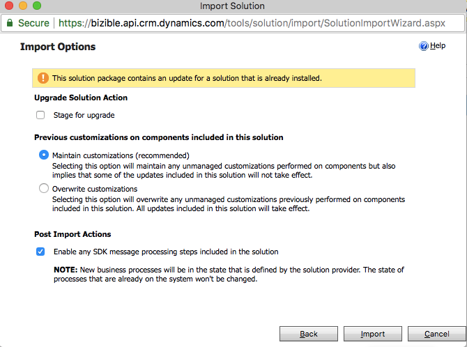
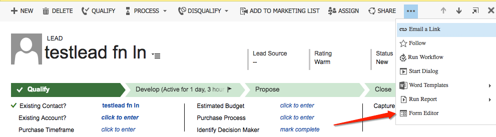
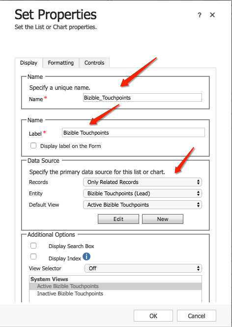
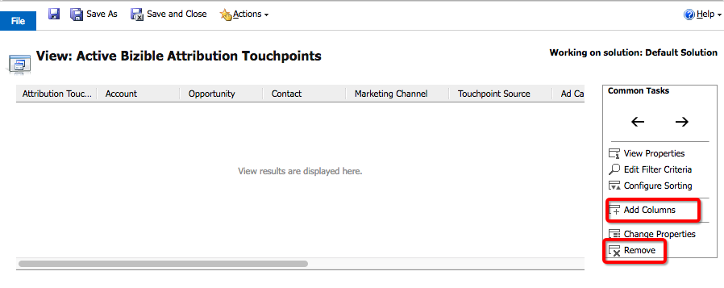
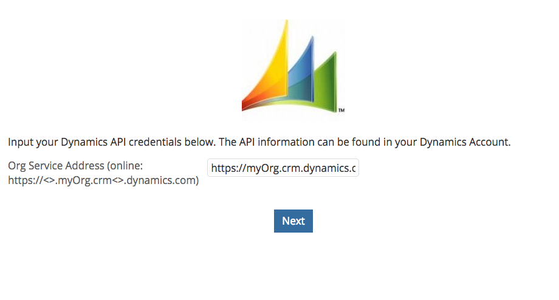
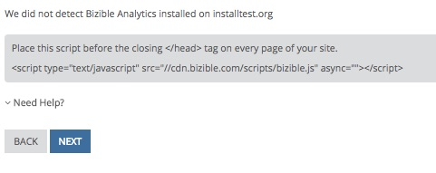
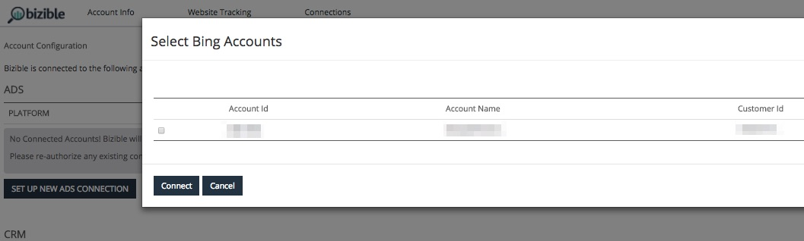

# Microsoft Dynamics CRM Installation Guide {#microsoft-dynamics-crm-installation-guide}

Microsoft Dynamics CRM Installation Guide - Bizible - Product Documentation

#### Supported Versions {#supported-versions}

Bizible supports the following Microsoft Dynamics CRM versions:

* Microsoft Dynamics 2016 (Online and On-Premise)
* Microsoft Dynamics 365 (Online and On-Premise)

For connection and authentication, Bizible supports the following Active Directory Federated Services (ADFS) versions:

* ADFS 4.0 - Windows Server 2016
* ADFS 5.0 - Windows Server 2019

#### Install the Managed Solution {#install-the-managed-solution}

Install the zip file within Dynamics CRM. Your Solutions Engineer will provide you with the installation file via email.

Settings > Customizations > Solutions > Import (button) > Choose File

>[!NOTE]
>
>The following two screenshots may vary slightly from yours, as they were taken during a solution upgrade.

#### Bizible User Permissions {#bizible-user-permissions}

We recommend creating a dedicated Bizible User within Dynamics for us to export and import data through to avoid any issues with other users in your CRM. Take note the username and password as well as the endpoint URL as this will be used when creating the Bizible account.

#### Security Roles {#security-roles}

If your organization uses Dynamics Security Roles, please make sure the connected user, or the dedicated Bizible User has sufficient read/write permissions to the required entities.

Security Roles are located here: Settings > Security > Security Roles

For Bizible custom entities, we will need full permissions across all of our entities.

>[!NOTE]
>
>Users who will be closing opportunities also will need the full permissions.

  
For Dynamics standard entities, please refer to Bizible’s Dynamics schema document. At a high level, Bizible just needs to read in certain entities in order to gather the appropriate data and write to custom fields that will get installed with the managed solution. We will not create new standard records, nor will we update any standard fields.

#### Include Touchpoints on Page Layouts: {#include-touchpoints-on-page-layouts}

1. For each Entity, navigate to the Form Editor. You can either find this under Settings > Customizations > Customize the System > [Entity] > Forms. Or you can find it on the settings while you’re viewing a record.

    1.

        * The entities to configure: Account, Opportunity, Contact, Lead, and Campaign.

   

1. Page Layouts: first add a “One Column” tile in the section you want the Touchpoints to live. Within that new column, we will need a sub grid added to each form within your Account, Opportunity, Contact, and Lead entities.

   

   

1. Select the object (Bizible Attribution Touchpoints or Bizible Touchpoints) that should render in the subgrid, which depends on the object relationship. Optionally, change the columns that will display by clicking the Edit button. A default layout has been set by the managed solution.

   Bizible Attribution Touchpoint Subgrid - Accounts, Opportunities, and Contact  
   Bizible Touchpoint Subgrid - Leads and Contacts

   

1. Once you’re done updating the form, publish and save your changes.

   #### Schema-related Considerations   
   {#schema-related-considerations}

   **`Revenue`**

   Bizible points to the standard Actual Revenue field by default. If you are not using this, please explain how you report on revenue to your Solutions Engineer or Success Manager as a custom workflow will be needed.

   **`Close` `Date`**

   Bizible points to the Actual Close Date field out of the box. If you are not using this or also use the Estimated Close Date field, please explain your process to your Solutions Engineer or Success Manager. A custom workflow may be need to account for both fields.

#### Create your Bizible Account {#create-your-bizible-account}

1. Navigate to [https://apps.bizible.com/SalesForce/Signup?accountType=Dynamics](http://apps.bizible.com/SalesForce/Signup?accountType=Dynamics) to create your Bizible account.
1. Input your company information: company name, phone number, and site. Click **Save**.
1. Use the newly created Username and Password when you save the connection and input the Endpoint URL.

   >[!CAUTION]
   >
   >Users will need to log into the Bizible application with their instance URL, username and password. OAuth support will be added soon. Accounts with Two-Factor Authentication enabled may experience some issues. Please contact [`[email protected]`](http://docs.marketo.com/cdn-cgi/l/email-protection#21525451514e53556143485b48434d440f424e4c) if you do encounter these issues.

     

1. On the next screen you will be brought to our Bizible JavaScript. This needs to be applied to the entirety of your website including all landing pages. We recommend hardcoding the script within the head of your landing pages or adding through a Tag Management System such as Google Tag Manager.

   

1. Within the next page, you will connect the API integrated Ads accounts: AdWords, Bing Ads, and Facebook. Select **Set Up New Ads Connection** and log-in with your Ad account's credentials. A window will pop-up for you to select the account you’d like to connect. You may close out your session and exit the application once all ad accounts have been connected successfully.

   

