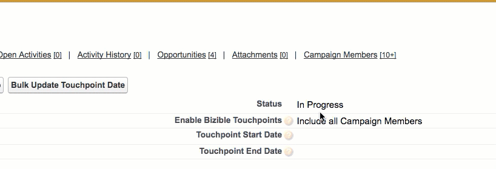

# Campaign Sync Dates {#campaign-sync-dates}

Campaign Sync Dates - Bizible - Product Documentation

Learn what the Campaign Sync Dates feature does, as well as offer some use cases for this feature.

**Bizible Package Required: 6.9 or above**

This feature consists of two simple date fields on the Salesforce Campaign Object:

* Touchpoint Start Date
* Touchpoint End Date

Once Bizible Touchpoints are enabled on a particular campaign, Campaign Sync Dates will allow you to set Touchpoint Date parameters on the individual Campaign. So, if you were to add a Touchpoint End Date of March 1st, 2017 then Bizible will only create Touchpoints on Campaign Members that were added to the Campaign before that date. Bizible will not create Touchpoints for campaign members that were added after March 1st, 2017.

Similarly, if you were to add a Touchpoint Start Date on a Campaign (let's say January 1st, 2017), then Bizible will not create Touchpoints on Campaign Members that were added to the Campaign before January 1st, 2017. You don't need to add a Touchpoint Start Date if you add a Touchpoint End Date and vice-versa.

#### Use cases  {#use-cases}

**Back-filling Touchpoints**

There may be times when a marketing team may miss adding utm parameters to a particular marketing effort. Campaign Sync Dates will allow you to (if you use SFDC campaigns for online efforts) back-fill some missed data. Let's say that you're running an e-mail campaign that started May 1st, but your team didn't add utm parameters on that e-mail campaign until May 15th. If you're tracking e-mail conversions via a SFDC Campaign, you'll be able to set a Touchpoint End Date of May 15th on that Campaign and enable Touchpoints for 'Responded' members of the Campaign. This action will tell Bizible to create Touchpoints for all of those responses up to May 15th.

**Retroactive Campaign Membership Touchpoints**

If you're a new Bizible customer, you may be interested in bringing some of the marketing data you've been tracking via SFDC Campaigns. However, if you were to enable Touchpoints to your online SFDC campaigns, then you could run into the issue of double counting attribution since Bizible is automatically creating Touchpoints for your online marketing efforts. In an effort to avoid double counting data, you could use Campaign Touchpoint End Dates to set a limit on the Touchpoint dates created by Bizible on the SFDC campaign. As an example, if you wanted to add retroactive conversions for a Social Campaign you've been tracking in SFDC, but you understand that you've added the Bizible JavaScript (which is creating online Touchpoints) on July 1st, then you can edit the Social SFDC Campaign to contain a Touchpoint End Date equal to July 1st and enable Bizible Touchpoints for that Campaign.

There may be many other use cases for Touchpoint End Dates. If you need help figuring out a specific situation, don't hesitate to [contact us](http://docs.marketo.com/cdn-cgi/l/email-protection#83f0f6f3f3ecf1f7c3e1eaf9eae1efe6ade0ecee)!

>[!NOTE]
>
>**Related Articles**
>
>[Bizible University: Campaign and Campaign Member Fields](https://learn.bizible.com/2-bizible-customization/137720https://universityonline.marketo.com/courses/bizible-fundamentals-channel-management/#/page/5c63007334d9f0367662b758)

