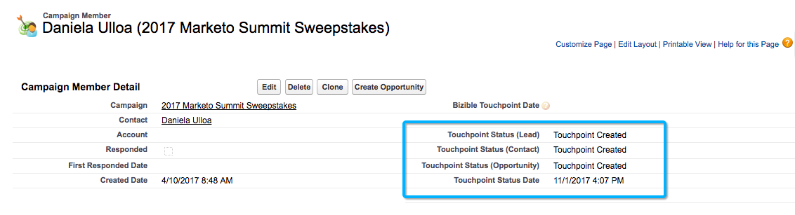

# Campaigns and Campaign Members {#campaigns-and-campaign-members}

Campaigns and Campaign Members - Bizible - Product Documentation

Salesforce Campaigns are intended to track lists of Leads and Contacts that are associated to a marketing program, or activity. This has commonly been webinars, or registrations, or booth visits, for example. Marketers can select whether or not a Campaign should get credited in a touchpoint journey.

### What's in this article? {#whats-in-this-article}

[Enabling Touchpoints](#enabling-touchpoints)  
[Campaign Sync Dates](#campaign-sync-dates)  
[Use Case for Touchpoint Start Date](#use-case-for-touchpoint-start-date)  
[Use Case for Touchpoint End Date](#use-case-for-touchpoint-end-date)  
[Campaign Members](#campaign-members)  
[Bizible Touchpoint Status](#bizible-touchpoint-status)  
[Bizible Touchpoint Date](#bizible-touchpoint-date)  
[Bulk Update Touchpoint Date](#bulk-update-touchpoint-date)  
[Campaign Costs](#campaign-costs)  
[Campaign Member Removal](#campaign-member-removal)

#### Enabling Touchpoints {#enabling-touchpoints}

The Bizible Salesforce Package will include a field labeled “Enable Bizible Touchpoints” on the Campaign object. Once the field has been added to the page layout, it’ll appear similar to this:

The options available in the picklist are:

* Include all Campaign Members - Every single Lead or Contact that is added to the campaign will receive a Touchpoint associated to that campaign.
* Include only “Responded” campaign Members - Only Leads or Contacts that have a Campaign Member Status of “Responded” will receive a Touchpoint associated to that campaign.
* Exclude all Campaign Members - None of the Leads or Contacts will receive a Touchpoint associated to that campaign.

Please note that campaign members must have an email address associated to their record in order for Bizible to create a touchpoint. Without an email address, Bizible will not assign a touchpoint to the campaign member.

#### Campaign Sync Dates {#campaign-sync-dates}

With the installation of the package, Bizible will also include 2 date fields on the Campaign object: Touchpoint Start Date and Touchpoint End Date.

These dates tell Bizible when we should start or stop including Campaign Members from the Campaign into the touchpoint journey. You can either set one date, or both, or none at all.

#### Use Case for Touchpoint Start Date {#use-case-for-touchpoint-start-date}

Start date can be used in the case that an existing Campaign is used for tracking Leads and Contacts, but the user only wants to start measuring once new systems or processes have been in place, so they decide to set a start date once Bizible should start tracking those Campaign Members.

#### Use Case for Touchpoint End Date {#use-case-for-touchpoint-end-date}

If before using Bizible, you used a Marketing Automation platform that tracked Leads' digital interactions (IE form submissions), and then uploaded those Leads into a Saleforce Campaign, you can leverage the Touchpoint End Date field. You'd set the Touchpoint End Date as your start date with Bizible and enable Bizible Touchpoints, then each of these Leads' digital interaction would be created as a Touchpoint. The reason you'll set the Touchpoint End Date to be your Start Date with Bizible is because, moving forward, we will be tracking these digital interactions through our javascript.

#### Campaign Members {#campaign-members}

Campaign Members are nested under Campaigns, and are related to a Lead or Contact. A Lead or a Contact can only be added once to a Campaign, which can be problematic depending on the use case of the Campaign. When a Campaign is synced, the campaign membership is used as a marketing activity that is put into the touchpoint journey and treated like a form fill.

#### Bizible Touchpoint Status {#bizible-touchpoint-status}

If enabled, Bizible will push a status value onto the Campaign Member across 4 different fields that’s included in the installed package: Touchpoint Status (Lead), Touchpoint Status (Contact), Touchpoint Status (Opportunity), and Touchpoint Status Date. This helps customers audit whether or not a touchpoint has been created as a Bizible Touchpoint or Bizible Attribution Touchpoint, depending on the object that it’s related to. The Touchpoint Status Date is simply the last date that the status was updated on the Campaign Member.

#### Bizible Touchpoint Date {#bizible-touchpoint-date}

With the installation of the package, Bizible also includes a field on the Campaign Member labeled “Bizible Touchpoint Date.” This allows the user to override the date that Bizible would use for the Touchpoint Date on the Touchpoint record.&nbsp;

This could be necessary if a list was uploaded days/weeks/months after an event actually occurred. There are ways to update all records at once, which is explained [below](#below).

To know if you need to use the Bizible Touchpoint Date or not, here are how the dates are determined by Bizible depending on the Sync Type that is selected for the Campaign.

If the Sync Type is set to “Include all Campaign Members,” the priority of setting the Touchpoint Date is from top to bottom:

* Bizible Touchpoint Date
* Campaign Member Created Date

If the Sync Type is set to “Include only ‘Responded’ Campaign Members,” the priority of setting the Touchpoint Date is from top to bottom:

* Bizible Touchpoint Date
* First Responded Date

    * The First Responded Date is automatically set as soon as the Status is changed to “Responded” and is a standard Salesforce field that cannot be changed

* Campaign Member Created Date

#### Bulk Update Touchpoint Date {#bulk-update-touchpoint-date}

The Bulk Update Touchpoint Date is included in the installed Bizible Salesforce package and button will need to be added to the page layout.

If a large number of Campaign Member records needs to be updated, you can use the Bulk Update Touchpoint Date button to mass edit.

If there are unique use cases that this interface doesn’t cover, you can also use the [Data Loader](http://dataloader.io/) to export the records, make the change, and upload the records back in.

Start by searching for the records and filtering the ones that you want to set a Bizible Touchpoint Date for.

>[!CAUTION]
>
>There is one search that does not work, which is displayed in the example below. The UI does not support searching for null Bizible Touchpoint Dates (the below search would not work):

   
If you don’t need to use the search and just apply the dates to every Campaign Member record, use the “Include All Records” checkbox (see screenshot below), which will check all records on all pages.

Select the date and time from the calendar picker. If you want to select the current date and time, click the date/time that is shown next to the calendar picker.

Once your date and time is set, click the **Update Selected Records** button to apply the changes.

#### Campaign Costs {#campaign-costs}

Learn all about Campaign Costs [in this article](http://docs.marketo.com/x/QAEgAQ).

####   
Campaign Member Removal {#campaign-member-removal}

The way that Bizible keeps up with any deleted records in Salesforce, whether they’re deleted Leads or Accounts or Opportunities is to see those records in the API and track that an entry is marked as “IsDeleted.” Unfortunately with Campaign Members, Salesforce introduced a different way of deleting these Campaign Members from a Campaign and they’re actually just marked as “removed” as opposed to “deleted” so the issue is that touchpoints were still living in Salesforce that were related to deleted Campaign Members.

To get around this issue, Bizible created a Bizible History object and a trigger to track whenever Campaign Members are removed and then delete the corresponding touchpoint. **You will need Bizible Marketing Analytics package V6.15 or higher **to use this feature.

>[!CAUTION]
>
>Keep in mind that this trigger does not track any campaign members that were removed in the past, so this only works moving forward. If you need to remove a large number of past campaign members' touchpoints, contact [`[email protected]`](http://docs.marketo.com/cdn-cgi/l/email-protection#deadabaeaeb1acaa9ebcb7a4b7bcb2bbf0bdb1b3).

>[!NOTE]
>
>**Related Articles**
>
>[Bizible University: Campaign Object Fields](https://universityonline.marketo.com/courses/bizible-fundamentals-channel-management/#/page/5c63007334d9f0367662b758)
>
>[Bizible University: Mapping Offline Channels](https://universityonline.marketo.com/courses/bizible-fundamentals-channel-management/#/page/5c630eca34d9f0367662b77f)

