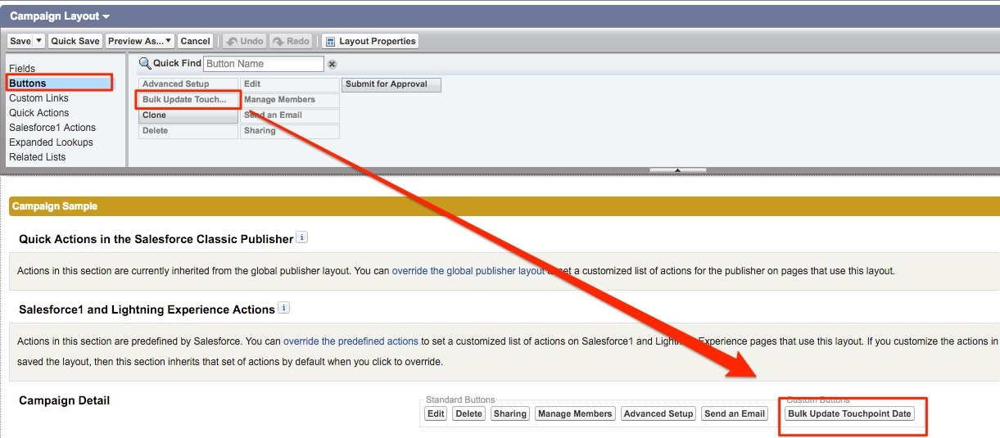

# Page Layout Instructions {#page-layout-instructions}

Page Layout Instructions - Bizible - Product Documentation

To easily see Bizible data, it's recommended to update Page Layouts for the Account, Contact, Lead, Opportunity, and Campaign Objects. The instructions are broken out for each Object Page Layout below.

To begin, first navigate to your Salesforce Setup settings and locate the Customize tab.

### What's in this article? {#whats-in-this-article}

[Campaign Object](#campaign-object)  
[Leads](#leads)  
[Contacts](#contacts)  
[Opportunities](#opportunities)  
[Accounts](#accounts)

#### Campaign Object {#campaign-object}

1. Within your Build option, select **Campaigns**.
1. Click **Page Layouts**.

   

1. Click **Edit** next to the page layout you want to update.&nbsp;

   

1. Within the fields option, select the **Enable Bizible Touchpoints** field and drag it wherever you would like on the page. Next, add the **Touchpoint Start Date** and **Touchpoint End Date** fields.

   

1. Next, at the top of the page click the “Buttons” option within the quick find menu.
1. Drag the **Bulk Update Touchpoint Date** button to your custom buttons section.

   

1. Click **Save**.

   >[!NOTE]
   >
   >If you are using multiple Campaign record types, the picklist values for the **Enable Bizible Touchpoints** field will need to be updated. Please reference [this article](http://docs.marketo.com/x/PgEgAQ)&nbsp;for instructions.

   `  
   `

#### Leads {#leads}

1. Within your Build option, select **Leads**.
1. Click **Page Layouts**.
1. Click Edit next to the page layout you want to update. Keep in mind that multiple page layouts can contain the Bizible Touchpoints sections.
1. Click on the VisualForce page option on the left within your quick find menu.
1. Create a new section and name it “Bizible Touchpoints.”&nbsp;&nbsp;

   >[!NOTE]
   >
   >Select the "one column" format for each of these sections.

1. Drag the **Bizible Lead Related List** VisualForce page into your page layout section.

   

1. Click on the wrench within the VisualForce page and change the height to 100 and enable scrollbars.
1. Back in the menu, select the Canvas Apps section and create a new section called "Bizible Insights" beneath the Touchpoints VisualForce section you just created.

   >[!NOTE]
   >
   >Select the "one column" format for each of these sections.

1. Drag the Bizible Insights Canvas App into that newly created section. Click Save! Sometimes it is necessary to save the page layout first before dropping in the Canvas App because Salesforce doesn't instantly recognize it. So after creating the new section, save the page layout and then re-edit to drag the canvas app within that section. This applies to every object.

   >[!NOTE]
   >
   >For the Bizible Insights Canvas App to function properly, [permissions need to be configured properly](http://docs.marketo.com/x/kQEgAQ). [>](https://support.bizible.com/hc/en-us/articles/360002043794-Bizible-Insights-Configuration)

   `If you are leveraging Bizible's ABM feature,  [please click here for additional page layout instructions](http://docs.marketo.com/x/agEgAQ).`

#### Contacts {#contacts}

1. Within your Build option, select **Contacts.**
1. Click **Page Layouts.**
1. Select the Page Layout you’d like to edit.

   Go to the Related Lists option within the quick find menu and add the **Bizible Touchpoints** related list.

1. Click the wrench icon and add the following columns in this order:

    * `Bizible Touchpoint`
    * `Marketing Channel`
    * `Touchpoint Source`
    * `Ad Campaign Name`
    * `Touchpoint Position`
    * `Touchpoint Date`

1. Sort By: Touchpoint Date, Ascending.

   

1. Expand the Buttons option and deselect **New**.

   

1. Go back to the Related List&nbsp;option in the menu and now add the **Bizible Attribution Touchpoint** related list.
1. Click the wrench icon and add the following columns in this order:

    * `Attribution Touchpoint`
    * `Marketing Channel`
    * `Opportunity`
    * `Ad Campaign Name`
    * `Touchpoint Type`
    * `Touchpoint Position`
    * `Attribution % W-Shaped (or most robust attribution model such as Full Path or Custom)`
    * `Revenue W-Shaped (or most robust attribution model such as Full Path or Custom)`
    * `Touchpoint Date`

1. Sort by Touchpoint Date > Ascending.
1. Expand the Buttons section and deselect **New**.
1. Click **Save**.

#### Opportunities {#opportunities}

1. Within your Build option, select **Opportunities**.
1. Click **Page Layouts**.
1. Select the Page Layout you’d like to edit.
1. Add the **Bizible Attribution Touchpoint** Related List and click the wrench to add the following columns for Opportunities:

    * `Attribution Touchpoint`
    * `Marketing Channel`
    * `Contact`
    * `Ad Campaign Name`
    * `Touchpoint Type`
    * `Touchpoint Position`
    * `Attribution % W-Shaped (*or most robust attribution model such as Full Path or Custom*)`
    * `Revenue W-Shaped (*or most robust attribution model such as Full Path or Custom*)`
    * `Touchpoint Date`

1. Sort by Touchpoint Date > Ascending.
1. Deselect **New** within the Buttons section.
1. Click **Save**.

#### Accounts {#accounts}

1. Within your Build option, select **Accounts**.
1. Click **Page Layouts**.
1. Select the Page Layout you’d like to edit.
1. Add the **Bizible Attribution Touchpoint**&nbsp;Related List and click the wrench to add the following columns:

    * `Attribution Touchpoint`
    * `Marketing Channel`
    * `Opportunity`
    * `Ad Campaign Name`
    * `Touchpoint Type`
    * `Touchpoint Position`
    * `Attribution % W-Shaped (*or most robust attribution model such as Full Path or Custom*)`
    * `Revenue W-Shaped (*or most robust attribution model such as Full Path or Custom*)`
    * `Touchpoint Date`

1. Sort by Touchpoint Date > Ascending.
1. Deselect **New** within the Buttons section.
1. Click **Save**.

   `  
   If you are leveraging Bizible's ABM feature,  [please click here for additional page layout instructions](http://docs.marketo.com/x/agEgAQ)` `.` `  
   `

