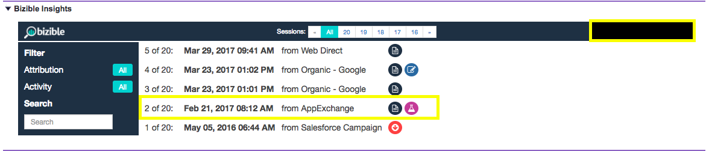

# Bizible Insights Explained {#bizible-insights-explained}

Bizible Insights Explained - Bizible - Product Documentation

Learn about the Bizible Insights view in Salesforce, including what the different icons represent and how to use the feature. This feature is most helpful for seeing the first 20 sessions of a Lead, Contact, or Account.

Once someone is tracked by Bizible's javascript and fills out a form on your website, the person will become a Lead in your system and we'll push their digital marketing data to your Salesforce (SFDC) org. When this occurs, you'll see the touchpoint data populated within the Bizible Lead Insights section (a Canvas App) on the Lead/Contact/Opportunity/Account Objects.

First, you'll see in the middle part of your insights, the number of sessions the person has had on your website. You can scroll through these sessions and navigate at will.

You can look at the roll-up of all your sessions if you click on "All" in the middle-upper part of your insights. There you'll understand the dates of the individual sessions, what channel or source drove these, and a set of icons specifying more information.

The first thing you'll see is the FT or LC icons. These represent the touchpoint position of your listed sessions. Specifically, FT stands for First Touch and LC stand for Lead Creation. You can have multiple sessions but only one Touchpoint can be the FT or LC. You will never find multiple FTs or LCs associated to one person.

The icons that look like paper indicate that a page view happened within the session. It's likely that every session will include this icon.

The icon that looks like a beaker signals that an A/B test experiment occurred. We integrate with Optimizely and VWO at this point. With this integration, we are able to push the experiment and variation that the user saw on their specific session.

If you click on any specific session (you can do this by clicking on the actual date of the session or in the upper middle part of the grouped sessions), you'll be able to see the session detail. In each session, you can see all the specific pages the user saw ordered by date and time.

On the right hand side of each session, you can see more of the granular marketing data that we're pushing on the Bizible fields in your SFDC. In this example, you can see Ad Group, Ad Content, Campaign, Keyword, Medium. You can also scroll down to see more of the Bizible data we provide.

Finally, once someone has a myriad of sessions, you can use some filters within Insights to look for specific parts of their engagement on your site. You can filter by Touchpoint Position for example.

You can also search by Page Views, AB Tests, or Forms.

