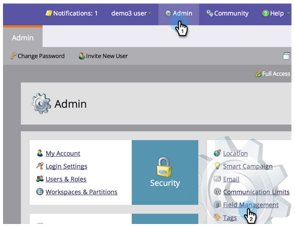
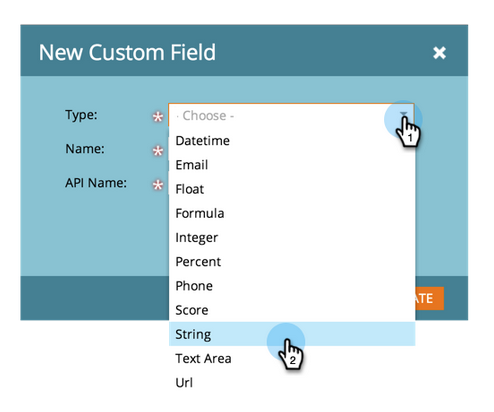
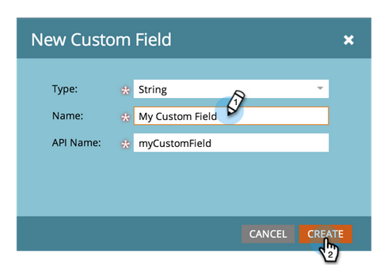

# Create a Custom Field in Marketo

If you need a new custom field in Marketo to store/capture data, here's how to create one.

1. Go to Admin and click Field Management.

>[!TIP]
>
>If you want the fields to be kept in sync with your CRM, create them in the CRM and they will automatically be created in Marketo.

2. Click New Custom Field.

3. Choose the field Type. This will change how it is rendered in smart lists and forms in Marketo.

>[!TIP]
>
>Check out the [Custom Field Types Glossary](https://docs.marketo.com/display/DOCS/Custom+Field+Type+Glossary).

4. Enter the Name as you want it to appear in Marketo. The API Name is automatically generated. You can tweak it, but it cannot be renamed once set. Click Create when done.

>[!CAUTION]
>
>Field names cannot start with the following characters: .  &  +  [  ].

>[!NOTE]
>
>The API name is used by the SOAP API and other backend processes.

You can now use this custom field in forms, flow steps and smart lists!
