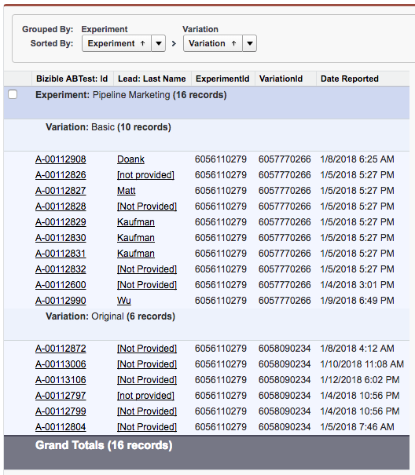

# A/B Testing Set Up and Reporting {#a-b-testing-set-up-and-reporting}

A/B Testing Set Up and Reporting - Bizible - Product Documentation

The Bizible A/B Test integration allows you to track the revenue impact of your [Optimizely](http://optimizely.com/) and VWO site experiments. This article guides provides instructions on how to add Bizible A/B Test sections to the Lead, Contact, Case, and Opportunity page layouts. We will also cover general reporting practices and recommendations for running Bizible A/B report types.

### What's in this article? {#whats-in-this-article}

[Set Up](#set-up)  
[Reporting](#reporting)  
[Salesforce Example Reports](#salesforce-example-reports)

#### Set Up {#set-up}

Add the Bizible A/B Test sections on Lead, Contact, Case, and Opportunity. Bizible A/B Test integration allows you to track the revenue impact of your [Optimizely](http://optimizely.com/) and [VWO](http://vwo.com/) site experiments.

1. Verify you are using package [Bizible v3.9 or later](http://bizible.com/sf). You can do this by going to Salesforce > Set Up > Installed packages.
1. Edit the Lead page layout and add the **Bizible A/B Tests** Related List to the page.

   

1. Click the Wrench button. Remove the stock "Id" field from the list of Selected fields. Add **Experiment**, **Variation**, and **DateReported** fields. Change "Sort by" to **Date Reported**, and select **Descending** in the drop-down.

   

1. Under Buttons, uncheck **New**.

   

1. Contact your Bizible rep or email [`[email protected]`](http://docs.marketo.com/cdn-cgi/l/email-protection#60131510100f12142002091a09020c054e030f0d) to enable the feature.

#### Reporting {#reporting}

Customers have access to a couple of Bizible A/B report types that allow you to report on A/B Test in relation to Leads, Contacts, and Opportunities:

* Bizible A/BTests
* Bizible A/BTests with Contact
* Bizible A/BTests with Lead
* Bizible A/BTests with Opportunity

A/B report types are used to report on which Lead or Contact or Opportunity has been exposed to an A/B test. Additionally, these reports can show you the amount of revenue tied to an Opportunity that was exposed to an A/B test.

It's important to note that Optimizely/VWO is a content variation platform and not a marketing channel. Therefore, these Bizible A/B report types are used differently than Bizible Touchpoint reports. Bizible touchpoint reports types are used to understand which marketing channel (e.g., paid advertising, web direct, social) drove a Lead or Contact to a specific page. However, Bizible A/B report types cannot be used to report on how a variation influenced a Lead or Opportunity. Additionally, since an A/B test variation is not a channel, details about the variation will not appear on the Bizible touchpoint.

Here are some common fields we recommend using when reporting on A/B test to help increase clarity and insight:

* Lead converted
* Experiment
* Experiment ID
* Variation
* Variation ID
* Date Reported

#### Salesforce Example Reports {#salesforce-example-reports}

**Bizible A/B Test with Lead**

**Bizible A/B Test with Opportunity**

