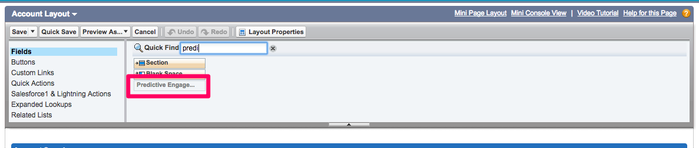
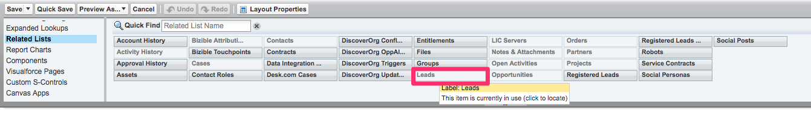
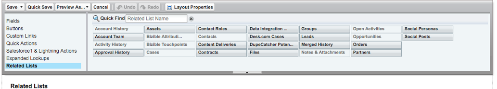

# Account Based Marketing Overview {#account-based-marketing-overview}

Account Based Marketing Overview - Bizible - Product Documentation

Below is a brief overview of ABM, the components of Bizible's ABM feature, and how to add it to your Salesforce page layout. To read more about ABM, check out this [Bizible blog post](http://www.bizible.com/blog/what-is-account-based-marketing-everything-you-need-to-know).

To navigate directly to the instructions for setting up ABM within your Salesforce instance, please [click here](#setup).

### What's in this article? {#whats-in-this-article}

[What is ABM](#what-is-abm)  
[Lead-to-Account Mapping](#lead-to-account-mapping)  
[Predictive Engagement Score](#predictive-engagement-score)  
[Setting up ABM Page Layout in Salesforce](#setting-up-abm-page-layout-in-salesforce)

#### What is ABM {#what-is-abm}

Account based marketing, ABM, is a marketing strategy in which you target and sell to companies and accounts as a whole, not just as individuals. Bizible helps Marketing and Sales teams execute successful ABM strategies with its lead-to-account mapping functionality and Predictive Engagement Score.

In order for our Account Based Marketing model to begin to populate in your CRM, Bizible needs the following criteria to be met:

* Your CRM needs at least 25 Accounts that have at least one Closed Won Opportunity on them, so we can better gauge the commonalities of a "successful" Account/Opportunity to your business.
* The other side of the coin, your CRM needs at least 25 Accounts without any Closed Won Opportunities (all opps must either be in our "Open" stage category, or in a "Closed Lost" category - this helps us gauge what makes a lower grade Account in your organization.

>[!NOTE]
>
>The above "bad" accounts need to be open for at least 12 months without accumulating a Closed Won opp; that's our basic guideline for whether or not an Opp has gone stale for the model's purposes.

#### Lead-to-Account Mapping {#lead-to-account-mapping}

Lead-to-account mapping is a crucial part of an effective ABM approach. With lead-to-account mapping, prospects, or leads, are grouped into the same company account as they engage with your brand. This allows you to target and sell to individuals from the same company in a consistent manner. There is no additional Salesforce configuration needed in order to begin benefitting from this feature. Bizible's Lead to Account Mapping five different matching methods:

* Lead Website to Account Website
* Lead Email Domain to Account Website Domain
* Lead Company Name to Account Name
* Lead Company to Account Website Domain
* Matching the Domain on the Lead's Email Address to the Account via the Contact's Email Address

#### Predictive Engagement Score {#predictive-engagement-score}

Bizible's Predictive Engagement Score, or PES, is a dynamic value that illustrates how engaged a particular account is with your marketing efforts. This score is helpful for segmenting accounts to target. It is a valuable tool for identifying accounts to target more effectively and efficiently.

There are many components that go into the algorithm that calculates the PES. Recency and age has a large influence on score changes, along with last touchpoint activity or page views. Adding new contacts to an account also impacts PES. Below is a list of some PES inputs:

* Total number of page views from the account
* Average number of page views
* Average number of persons in the account
* Age of last page view
* Average age of page views
* Number of persons in the account
* Specific important pages and if there has been a visit in the past 30/60/90 days
* If the account has a closed lost/won deal
* How likely it will be closed lost/won

>[!NOTE]
>
>You may notice a grade of "N/A" or "-" (the dash symbol) in your Predictive Engagement Score for some Accounts.

*A grade of "N/A" simply means that we do not have sufficient data yet on that account for our model to generate a true grade - with more data, a grade will be given eventually.* *A grade of "-" (the dash symbol) means that this account has yet to be processed by our ABM process, due to time constraints, occasionally missed processes, etc. If you believe an Account should have a grade, based on other similar accounts or timeframes, please reach out and let Bizible know.  
*

####  Setting up ABM Page Layout in Salesforce {#setting-up-abm-page-layout-in-salesforce}

To begin using the PES, you simply need to add the PES field and Related List to the appropriate page layouts in Salesforce.

1. Navigate to **Setup** > **Customize** > **Accounts** > **Page Layout**. Then select the page layout you'd like to edit.
1. Go to Fields and move the field "Predictive Engagement Score" into your Account Information section.

   

1. Finally, go to Related Lists and move the "Leads" Related List into your page layout.

   

1. Next, navigate to **Setup** > **Customize** > **Leads** > **Page Layout** and select the appropriate page layouts you would like to edit.
1. Click **Fields** and add the Account field where you see fit on the page.

   

   You're all set!

>[!NOTE]
>
>**Related Articles**
>
>* [Bizible University: Account Based Marketing - Predictive Engagement Score](https://universityonline.marketo.com/courses/additional-features-1/#/page/5be3747e5b62f440323a4680)
>* [Edit_Page_Layout__Account_Layout___Salesforce_-_Unlimited_Edition.png](http://docs.marketo.com/display/biz/assets/edit-page-layout-account-layout-salesforce-unlimited-edition.png)
>* [Edit_Page_Layout__Account_Layout___Leads(account).png](http://docs.marketo.com/display/biz/assets/edit-page-layout-account-layout-leads-28account-29.png)
>* [LeadsABM.png](http://docs.marketo.com/display/biz/assets/leadsabm.png)
>

