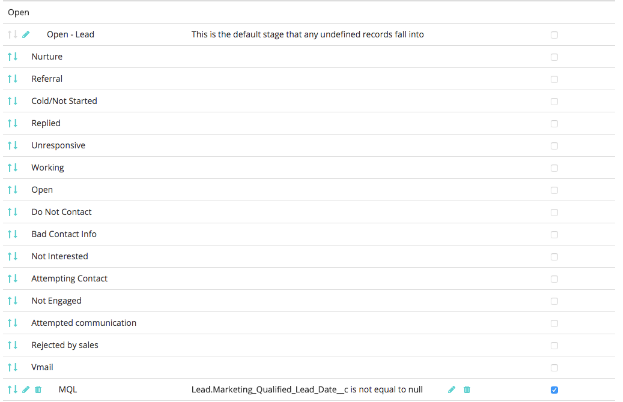
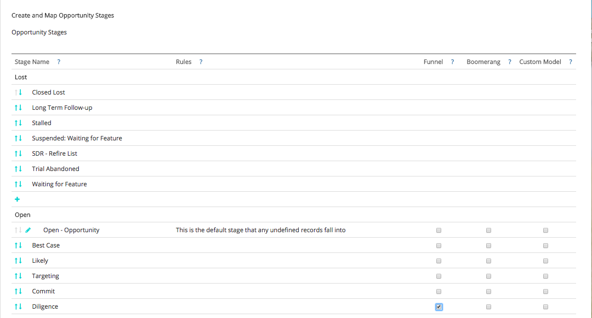

# Custom Attribution Model and Setup {#custom-attribution-model-and-setup}

Custom Attribution Model and Setup - Bizible - Product Documentation

See below for an overview of Bizible's custom attribution model and how to set it up.

### What's in this article? {#whats-in-this-article}

[Custom Attribution Model](#custom-attribution-model)  
[How to Set up Your Custom Attribution Model](#how-to-set-up-your-custom-attribution-model)  
[Touchpoint Positions](#touchpoint-positions)  
[The Difference Between Funnel Stages and Custom Model Stages](#the-difference-between-funnel-stages-and-custom-model-stages)

#### Custom Attribution Model {#custom-attribution-model}

Bizible's Custom Attribution model allows users to choose which touchpoints or custom stages to include in the model. Users are able to control the percentage of revenue credit attributed to these touchpoints and stages, or, can use the attribution percentage values suggested by Bizible's Machine Learning Model.

#### How to Set up Your Custom Attribution Model {#how-to-set-up-your-custom-attribution-model}

1. Determine which stages you want to include in your custom model.

   To start building your custom attribution model, you will need to select which stages are important to your Marketing team. In addition to Bizible's milestone stages (FT, LC, OC, Closed) you can add up to six additional Lead/Contact Statuses or Opportunity stages in your custom model. For example, it's common for the MQL stage to be included in the custom model. Marketing teams often want to know what efforts or channels are driving transitions to the MQL stage.

   Sign into [apps.bizible.com](http://apps.bizible.com). Go to My Account > Settings > and under the CRM section, select&nbsp;**Stage Mapping**.&nbsp;

   Once here, you will need to select which Leads/Contacts, and Opportunity stages to include by selecting the **Include in Model**&nbsp;box.

   

   >[!NOTE]
   >
   >**All **Leads/Contacts and Opportunity stages will appear here, even if the stage is inactive or no longer used in Salesforce. If you want these stages removed, you'll need to hard delete them in Salesforce.

   **Save & Process****Attribution Settings**If there are other stages that you want to include in the model, but they are not in the Lead/Contact Status or Opportunity Stage list, you can define your own custom stage based off of fields in your CRM.

   In the example below, a custom “MQL” stage is defined using a date field. The rule simply states that if the MQL Date field isn’t empty, it should be considered an MQL and should be included in the custom model. Please note it is also important to sort the custom stages once they have been created so that it follows the progression of your sales cycle.

   

   >[!CAUTION]
   >
   >Don't forget to enable history tracking for custom fields.

   [please click here.](http://docs.marketo.com/x/mQEgAQ)

1. Determine the attribution percentages for the custom model.

   Go to the **Attribution Settings** in Bizible Apps; the custom stages will appear here in the attribution table. The attribution table displays all of Bizible's attribution models, and the attribution weighting of each model. The attribution percentages of the first five models are fixed and cannot be changed.

   In the far right column labeled "**Custom**," you can set the percentage weighting for each stage in your custom attribution model. Simply input the values for each stage under the Custom column. Then **Save and Reprocess** once complete.

   To the left of the "Custom" column is **Bizible's Machine Learning model**. The Machine Learning model calculates attribution weighting based on the relative importance to winning a deal depending on what happened at each custom stage. For more information about the Machine Learning model, [please click here.](http://docs.marketo.com/x/lwEgAQ)

   

When you've selected your stages, be sure to click the  button at the bottom of the page. The stages will now appear in the  tab and you'll be able to assign attribution percentages to each stage. Custom stages will also be displayed in the Marketing Performance Suite as a Lead or Opportunity stage within the Demand Waterfall.      If a custom field is being used in your custom model, Field History tracking MUST be enabled in the CRM. For instructions on how to enable field history tracking, 

#### Touchpoint Positions {#touchpoint-positions}

After the attribution percentages have been saved and processed, touchpoints will be updated and receive their new stages and positions. The touchpoint that occurred most recently, prior to a stage transition, will receive credit for that stage (as shown below). The custom weighting and revenue gets redistributed as well.

#### The Difference Between Funnel Stages and Custom Model Stages {#the-difference-between-funnel-stages-and-custom-model-stages}

You can now see custom stages in your Marketing Funnel, even if you don’t have Custom Model enabled. This would be through the use of our Funnel Stage functionality. Funnel Stages now give you the ability to add stages to the funnel, but not see attribution for them.

Funnel Stages will still get tracked as Touchpoints and will still appear as Touchpoint Positions in your CRM. Without Custom Model, these Touchpoints may still receive middle touch attribution if there’s a form fill (10% for Middle Touches), but zero attribution credit if it’s just a web visit.

As you can see below, we've included the Diligence stage as apart of our Funnel Stages. This means we will have Touchpoints where the position contains Diligence, but those Touchpoints will only receive Middle Touch attribution credit if Custom Model isn't enabled (at most 10%).

>[!NOTE]
>
>**Related Articles**
>
>[Bizible University: Custom Modeling and Custom Stages](https://universityonline.marketo.com/courses/additional-features-1/#/page/5c64c6ebac158965be68467c)

