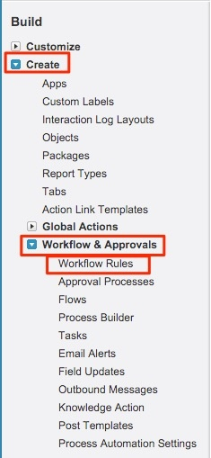
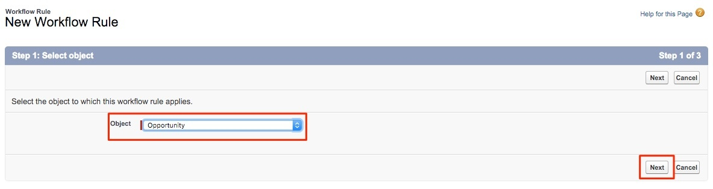
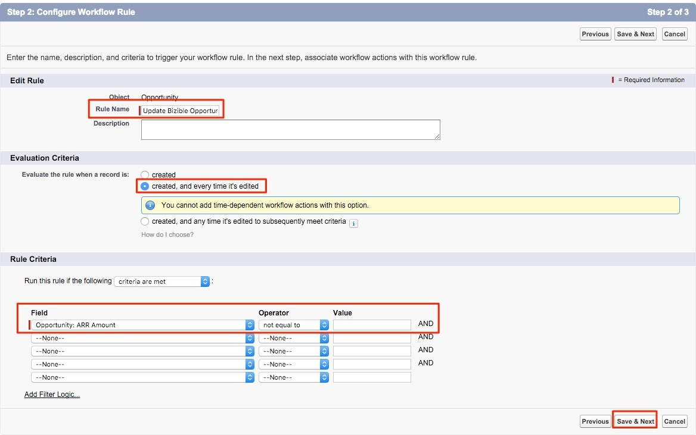
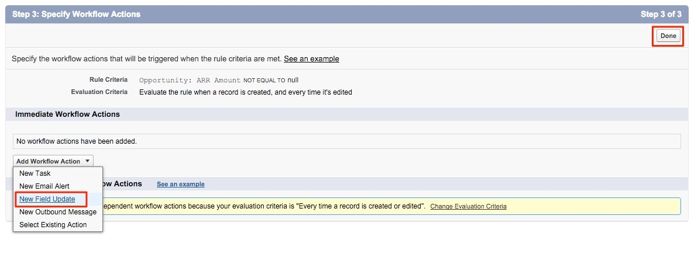
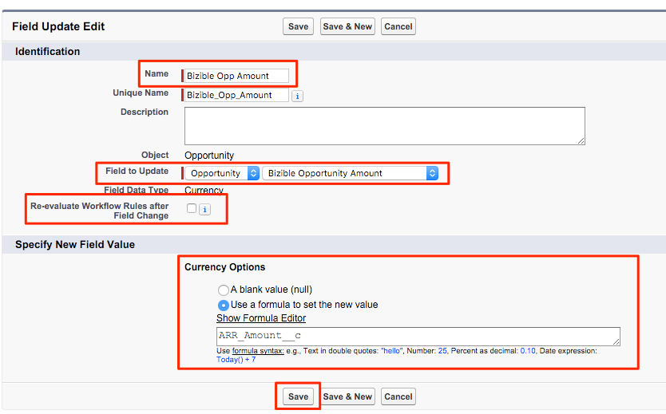

# Using a Custom Revenue Amount Field {#using-a-custom-revenue-amount-field}

Using a Custom Revenue Amount Field - Bizible - Product Documentation

By default, Bizible Attribution Touchpoints will pull the Opportunity Amount from one of two fields:

* `Amount (SFDC Default)`
* `Bizible Opportunity Amount (Custom)`

If you are using a custom Amount field on your Opportunities, we will need to configure a workflow in order to calculate the Bizible Touchpoint Revenue. This takes some more advanced knowledge of Salesforce, so it may require assistance from your SFDC Admin.

Starting off, we will need the following information:

* `API Name of your Amount field`

From here, we will start creating the workflow.

1. Navigate to Setup > Create > Workflow & Approvals > Workflow Rules.

   

1. Select **New Rule** and set the object as “Opportunity” and click **Next**.

   

   

1. Configure the workflow. Set the Rule Name as “Update Bizible Opportunity Amount." Set the Evaluation Criteria to “Created, and every time it’s edited.” For the Rule Criteria, select your custom Amount field and select the Operator as “Not Equal To” and leave the “Value” field blank.

   

1. Add a workflow action. Set this picklist to “New Field Update.”

   

1. Here you will fill out field information. In the “Name” field, we recommend using this naming: “Bizible Opp Amount." The “Unique Name” will automatically populate based off the “Name” field. In the “Field to Update” picklist select “Bizible Opportunity Amount." After selecting the field, select the "Re-Evaulate Workflow Rules after Field Change" box. In the “Specify New Field Value,” select “Use a formula to set the new value." In the empty box, drop the API name of your custom Amount field. Click **Save**.

   

1. You will be brought back to a roll-up page for your workflow, be sure to “Activate” and you’ll be good to go. To activate, click **Edit** next to your new workflow and then click **Activate**.&nbsp;

   Once you’ve completed these steps, the opportunities will need to be updated in order to trigger the workflow to have the new value from the custom opportunity field.

   This can be accomplished by running your opportunities through Data Loader within SFDC. Please find details on using Data Loader in [this article](http://docs.marketo.com/x/kwEgAQ).

If there are any questions along the way, please don’t hesitate to reach out to your Bizible Success Manager or [`[email protected]`](http://docs.marketo.com/cdn-cgi/l/email-protection#50232520203f22241032392a39323c357e333f3d).

