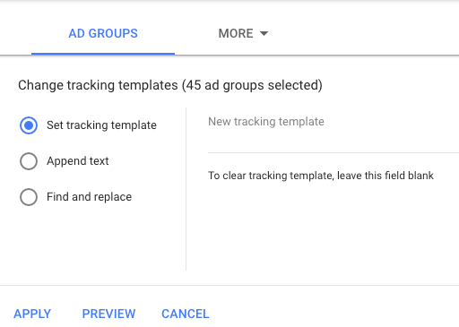

# Understanding Bizible AdWords Tagging {#understanding-bizible-adwords-tagging}

Understanding Bizible AdWords Tagging - Bizible - Product Documentation

In order to track your ads at a very granular level, the Ad Destination URLs must be unique. To accomplish this, Bizible's autotagging automatically adds tracking parameters to the Ad Destination URLs of your AdWords ads. Let's take a look at an example below.   
  
The following URL will not provide any granular data:

* `http://example.com/landing-page?myParam=foo`*

However, the same URL will provide granular data because of the Bizible parameters:

* `http://example.com/landing-page?myParam=foo&_bt={creative}&_bk={keyword}&_bm={matchtype}&_bn={network}&_bg={adgroupid`}*

### What's in this article? {#whats-in-this-article}

[How Bizible's Auto-tagging Works](#how-bizibles-auto-tagging-works)  
[Tracking Templates](#tracking-templates)  
[Setting up a Tracking Template at the Account Level](#setting-up-a-tracking-template-at-the-account-level)  
[Setting up a Tracking Template at the Campaign Level](#setting-up-a-tracking-template-at-the-campaign-level)  
[Setting up a Tracking Template at the Ad Group Level:](#setting-up-a-tracking-template-at-the-ad-group-level)  
[FAQ](#faq)

#### How Bizible's Auto-tagging Works {#how-bizibles-auto-tagging-works}

##### If Bizible finds a Tracking Template: {#if-bizible-finds-a-tracking-template}

* Bizible will add its parameters to the Tracking Template.
* If a third-party redirect is found in a Tracking Template such as Kenshoo or Marin, Bizible will take no action. Instead, you must [add Bizible parameters to the third-party tool in your account](http://docs.marketo.com/x/YAEgAQ).

##### However, if no Tracking Template is found, Bizible will: {#however-if-no-tracking-template-is-found-bizible-will}

* Scan all Ad Destination URLs for our Bizible Parameters.
* If found, you're good to go.
* If not found, Bizible will append its parameters to the end of the Ad Destination URLs. For new ads, Bizible will append its parameters to the Ad Destination URL within two hours of creation.
* It is important to have a tracking template in place before enabling auto-tagging so that Bizible can attach to it and prevent an ad history reset.

Bizible recommends using an Account-Level, Campaign-Level, or Ad Group-Level Tracking template, as it allows for the addition and subtraction of parameters for all ads without the risk of Ad History interruptions or deletion.

#### Tracking Templates {#tracking-templates}

As explained by Google AdWords, a tracking template is the URL that is used to reach a landing page. The tracking information collected is used to understand your ad traffic. [Click here](http://support.google.com/adwords/answer/7197008?hl=en) for more information from Google.

Bizible recommends using an Account Level, Campaign Level, or Ad Group Level Tracking template, as it allows for the addition and subtraction of parameters for all ads without the risk of Ad History interruptions or deletion.

There are two tracking templates Bizible recommends using. Please use the following to determine which version is appropriate for you:

* If all of your ad URLs have a “?” in them, use this URL:

*{lpurl}&_bt={creative}&_bk={keyword}&_bm={matchtype}&_bn={network}&_bg={adgroupid}*

* If none of your ad URLs have a “?” in them, use this URL:

*{lpurl}?_bt={creative}&_bk={keyword}&_bm={matchtype}&_bn={network}&_bg={adgroupid}*

#### Setting up a Tracking Template at the Account Level {#setting-up-a-tracking-template-at-the-account-level}

1. Log-in to your Google AdWords Account.
1. Click **All campaigns** and then **Settings** in the expanding window.

   

1. Click **Account Settings** at the top and then **Tracking Template**. Enter the Bizible Tracking Template.

   

1. Click **Save**.

#### Setting up a Tracking Template at the Campaign Level {#setting-up-a-tracking-template-at-the-campaign-level}

1. Click **All campaigns** and then **Campaigns** in the expanding window.

   

1. Select all applicable campaigns or **Select All**, click **Edit**, and then click **Change Tracking Templates**.

   

1. Enter the Bizible Tracking Template and click **Apply**.

#### Setting up a Tracking Template at the Ad Group Level: {#setting-up-a-tracking-template-at-the-ad-group-level}

1. Click **All campaigns** and then **Ad Groups** in the expanding window.

   

1. Select all applicable Ad Groups or Select All, click **Edit** and then click **Change Tracking Templates**.
1. Enter the Bizible Tracking Template and click **Apply**.

   

#### FAQ {#faq}

##### Q: What permissions does the connected user need? {#q-what-permissions-does-the-connected-user-need}

A: userinfo.email

##### Q: How long can it take to import spend data? {#q-how-long-can-it-take-to-import-spend-data}

A: 6 hours

##### Q: How long can it take to import ad data? {#q-how-long-can-it-take-to-import-ad-data}

A: 4 hours

>[!NOTE]
>
>Once the changes are made, you are done. Feel free to reach out to [`[email protected]`](http://docs.marketo.com/cdn-cgi/l/email-protection#3f4c4a4f4f504d4b7f5d5645565d535a115c5052) if there are any questions during setup.

[Click here](http://support.google.com/adwords/answer/6076199?hl=en#tracking) for instructions from Google on creating Account-Level Tracking Templates. 