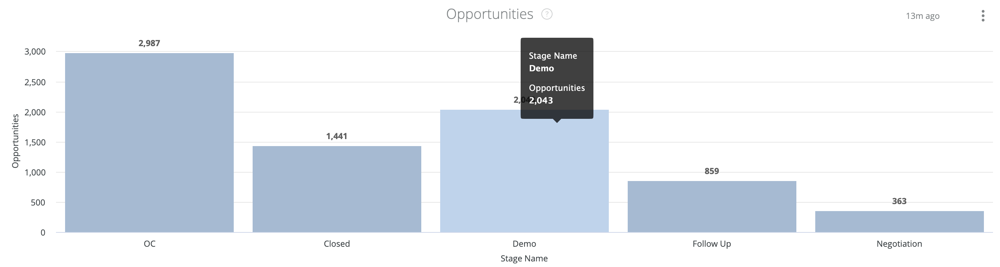
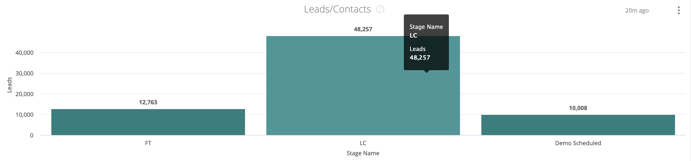

# Passport Dashboard Documentation {#passport-dashboard-documentation}

Passport Dashboard Documentation - Bizible - Product Documentation

Passport dashboard enables Marketers to view Leads/Contacts and Opportunities that have gone through each pipeline stage during a given time frame.

This dashboard has two tiles:

* Opportunities: The number of Opportunity records passed through each stage during the given time frame.
* Leads/Contacts: The number of Lead or Contact records passed through each stage during the given time frame.

>[!NOTE]
>
>Across all Discover dashboards, only one person object, either Lead or Contact, can be reported. This is set in Settings > Reporting > Attribution Settings > Default Dashboard Object.

This dashboard supports the following filters (all filters apply to both tiles):

* Date: select the time frame.
* Channel: filter the records by channels. A record is associated to a channel if any of its touchpoints are associated to the channel.
* Subchannel: filter the records by subchannels. A record is associated to a subchannel if any of its touchpoints are associated to the subchannel.
* Campaign: filter the records by campaigns. A record is associated to a campaign if any of its touchpoints are associated to the campaign.
* Campaign Source: filter the records by campaign sources. Example campaign sources are Adwords, BingAds, Facebook, LinkedIn etc. A record is associated to a campaign source if any of its touchpoints are associated to the campaign source.
* CRM Account Name: filter the records by CRM Account Names.
* Segment filters: filter the records by custom segments. A record is associated to a segment if any of its touchpoints are associated to the segment.

Across all filters, "AND" logic is used.

>[!NOTE]
>
>If a record changes stage on the selected date, the record will be counted for the from and to stages, and all pass-through stages.

#### Opportunities {#opportunities}

Stages include OC, selected Funnel stages in Open Opportunity Stages (Settings > CRM > Stage Mapping), and Won Opportunity Stages (Settings > CRM > Stage Mapping).

>[!NOTE]
>
>For Won stages, the record counts are only for records transitioned into the stage during the selected time frame.

You can drill down from each bar to view the Opportunity records for each stage.

#### Leads/Contacts {#leads-contacts}

Stages include FT, LC, selected Funnel stages in Open Lead/Contact Stages on Settings - CRM - Stage Mapping, and Converted Lead/Contact Stages on Settings - CRM - Stage Mapping.

Note: for Converted stages, the record counts are only for records transitioned into the stage during the selected time frame.

You can drill down from each bar to view the Lead/Contact records for each stage.
