# Definitions and Encyclopedia {#definitions-and-encyclopedia}

Definitions and Encyclopedia - Bizible - Product Documentation

The following is an overview of the different Boards and Tiles present in the Discover platform, as well as the Filters within those Boards. Within the screenshot of each Board are several number Tiles, the definitions of which can be found in that Board's section below.

### What's in this article? {#whats-in-this-article}

[Bizible Boards](#bizible-boards)  
[Role-Based Views](#role-based-views)  
[Journey](#journey)

**Bizible Boards**

Overview

Growth

Ads ROI

Account Based Marketing

Marketing Spend

Web Traffic

**Role-Based Views**

CMO

Paid Media

Content Marketing

Marketing Ops

**Journey**

Velocity

Snapshot

Passport Funnel

Engagement Path

# Bizible Boards {#bizible-boards}

### Overview {#overview}

Overview gives the user a high-level look at how the marketing team is performing in regards to their impact on revenue, spend, and ROI.

**Filters**

Date Type is Close Date

Date is in the past 12 complete months

Attribution Model is W-Shaped

Metric is Revenue

Dimension is Channel

Channel is equal to __

Subchannel is equal to __

Campaign is equal to __

Categories

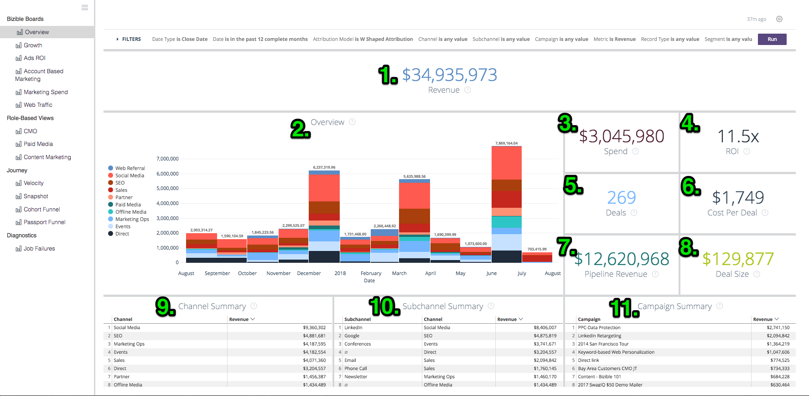

**Revenue**

1. The total revenue amount from Closed Won opportunities, based off the attribution model.

Click to Show Details and drill into the data by viewing it as a visualization and table.

**Overview**

2. Using the Metric dropdown from the Filters menu, this chart shows revenue / pipeline revenue / spend / deals / opportunities / leads / contacts attributed to each channel, shown over time.

**Spend**

3. The total amount of recorded spend from both API costs and self reported costs rolled up at the highest Channel level.

Click to Show Details and drill into the data by viewing it as a visualization and table.

**ROI**

4. Using the Dimensions dropdown from the Filters menu, this shows how much ROI was attributed to each Channel / Subchannel / Campaign / Account / AdGroup / Ad / Advertiser / Creative / Keyword / Placement / Site based off the attribution model during the entire date range selected.

**ROI Summary**

Using the Dimensions dropdown from the Filters menu, this shows how much Revenue, Spend, and ROI was attributed to each Channel / Subchannel / Campaign / Account / AdGroup / Ad / Advertiser / Creative / Keyword / Placement / Site based off the attribution model during the entire date range selected.

**Deals**

5. The total number of Closed Won opportunities, based of the attribution model count. If the date type “Touchpoint Date” is selected, partial counts are possible because it is possible to exclude some touchpoints within an opportunity using this date type.

Click to Show Details and drill into the data by viewing it as a visualization and table.

**Cost Per Deal**

6. The total spend divided by the total number of deals, providing an average cost that it takes to acquire one closed won opportunity.

**Pipeline Revenue**

7. The total potential revenue from any Open Opportunity, meaning that it is not Closed Lost or Closed Won. The revenue is based off the selected attribution model.

Click to Show Details and drill into the data by viewing it as a visualization and table.

**Deal Size**

8. The average amount of a Closed Won opportunity.

**Channel Summary**

9. Using the Metric dropdown from the Filters menu, this is a list of channels based on how much revenue / pipeline revenue / spend / deals / opportunities / leads / contacts was attributed to each channel, sorted by the highest based off the selected attribution model.

**Subchannel Summary**

10. Using the Metric dropdown from the Filters menu, this is a list of subchannels based on how much revenue / pipeline revenue / spend / deals / opportunities / leads / contacts was attributed to each subchannel, sorted by the highest based off the selected attribution model.

**Campaign Summary**

11. Using the Metric dropdown from the Filters menu, this is a list of campaigns based on how much revenue / pipeline revenue / spend / deals / opportunities / leads / contacts was attributed to each campaign, sorted by the highest based off the selected attribution model.

### Growth {#growth}

Growth allows the Marketer to see what they’ve generated across the board, from leads to contacts to opportunities to revenue. It’s a quick view of all pipeline and how they’ve performed over time.

**Filters**

Date Type is Touchpoint Date

Date is in the past 12 complete months

Attribution Model is W-Shaped

Group by None

Channel is equal to __

Subchannel is equal to __

Campaign is equal to __

Categories

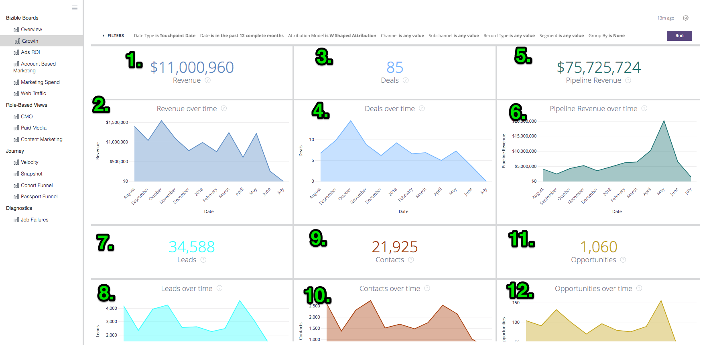

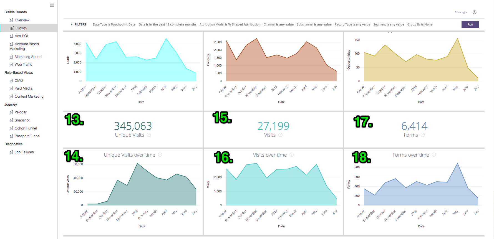

**Revenue**

1. The total revenue amount from Closed Won opportunities, based off the attribution model.

Click to Show Details and drill into the data by viewing it as a visualization and table.

**Revenue over time**

2. The total revenue amount from Closed Won opportunities, based off the attribution model showing the trend over a specific time frame. Use the Group By filter to change the stack by Channel, Subchannel, Campaign, Account, Ad Group, Ad, Advertiser, Creative, Keyword, Placement, Site.

Drill in to view the data from a smaller date dimension.

**Deals**

3. The total number of Closed Won opportunities, based of the attribution model count.

Click to Show Details and drill into the data by viewing it as a visualization and table.

**Deals over time**

4. The total number of Closed Won opportunities, based off the attribution model showing the trend over a specific time frame. Use the Group By filter to change the stack by Channel, Subchannel, Campaign, Account, Ad Group, Ad, Advertiser, Creative, Keyword, Placement, Site.

Drill in to view the data from a smaller date dimension.

**Pipeline Revenue**

5. The total potential revenue from any Open Opportunity, meaning that it is not Closed Lost or Closed Won. The revenue is based off the selected attribution model.

Click to Show Details and drill into the data by viewing it as a visualization and table.

**Pipeline Revenue over time**

6. The total potential revenue from any Open Opportunity, based off the attribution model showing the trend over a specific time frame. Use the Group By filter to change the stack by Channel, Subchannel, Campaign, Account, Ad Group, Ad, Advertiser, Creative, Keyword, Placement, Site.

Drill in to view the data from a smaller date dimension.

**Leads**

7. The total number of Leads, based off the attribution model. If the date type “Touchpoint Date” is selected, partial counts are possible because it is possible to exclude some touchpoints within a Lead record using this date type. If an attribution model beyond U-Shaped is applied, the U-Shaped count is used for W-Shaped, W-Shaped, and Custom Model.

Click to Show Details and drill into the data by viewing it as a visualization and table.

**Leads over time**

8. The total number of Leads, based off the attribution model showing the trend over a specific time period. Use the Group By filter to change the stack by Channel, Subchannel, Campaign, Account, Ad Group, Ad, Advertiser, Creative, Keyword, Placement, Site.

Drill in to view the data from a smaller date dimension.

**Contacts**

9. The total number of Contacts, based off the attribution model. If the date type “Touchpoint Date” is selected, partial counts are possible because it is possible to exclude some touchpoints within a Contact record using this date type. If an attribution model beyond U-Shaped is applied, the U-Shaped count is used for W-Shaped, W-Shaped, and Custom Model.

Click to Show Details and drill into the data by viewing it as a visualization and table.

**Contacts over time**

10. The total number of Contacts, based off the attribution model showing the trend over a specific time period. Use the Group By filter to change the stack by Channel, Subchannel, Campaign, Account, Ad Group, Ad, Advertiser, Creative, Keyword, Placement, Site.

Drill in to view the data from a smaller date dimension.

**Opportunities**

11. The total number of Opportunities, based off the attribution model. If the date type “Touchpoint Date” is selected, partial counts are possible because it is possible to exclude some touchpoints within an Opportunity record using this date type.

Click to Show Details and drill into the data by viewing it as a visualization and table.

**Opportunities over time**

12. The total number of Opportunities, based off the attribution model showing the trend over a specific time period. Use the Group By filter to change the stack by Channel, Subchannel, Campaign, Account, Ad Group, Ad, Advertiser, Creative, Keyword, Placement, Site.

Drill in to view the data from a smaller date dimension.

**Visits**

13. The total number of site visits tracked across all known and anonymous visitors.

Click to Show Details and drill into the data by viewing it as a visualization and table.

(This will appear as 0 if this feature is disabled.)

**Visits over time**

14. The total number of site visits tracked showing the trend over a specific time period. Use the Group By filter to change the stack by Channel, Subchannel, Campaign, Account, Ad Group, Ad, Advertiser, Creative, Keyword, Placement, Site.

Drill in to view the data from a smaller date dimension.

(This will appear empty if this feature is disabled.)

**Unique Visits**

15. The total number of unique site visits tracked across all known and anonymous visitors.

Click to Show Details and drill into the data by viewing it as a visualization and table.

(This will appear as 0 if this feature is disabled.)

**Unique Visits over time**

16. The total number of unique site visits tracked showing the trend over a specific time period. Use the Group By filter to change the stack by Channel, Subchannel, Campaign, Account, Ad Group, Ad, Advertiser, Creative, Keyword, Placement, Site.

Drill in to view the data from a smaller date dimension.

(This will appear empty if this feature is disabled.)

**Forms**

17. The total number of forms submitted across all known and anonymous visitors.

Click to Show Details and drill into the data by viewing it as a visualization and table.

(This will appear as 0 if this feature is disabled.)

**Forms over time**

18. The total number of forms submitted showing the trend over a specific time period. Use the Group By filter to change the stack by Channel, Subchannel, Campaign, Account, Ad Group, Ad, Advertiser, Creative, Keyword, Placement, Site.

Drill in to view the data from a smaller date dimension.

(This will appear empty if this feature is disabled.)

### Ads ROI {#ads-roi}

Ads ROI gives paid media managers a view into their marketing efforts, giving them insight into their campaign performance to keyword performance.

**Filters**

Date Type is Close Date

Date is in the past 12 complete months

Attribution Model is W-Shaped

Channel is equal to __

Subchannel is equal to __

Campaign is equal to __

Categories

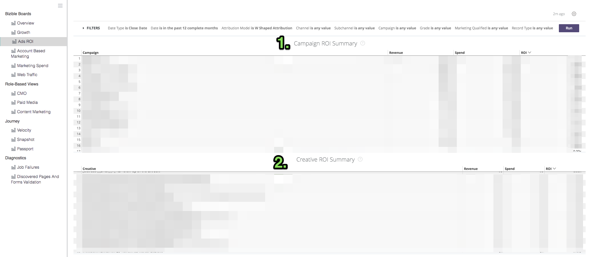

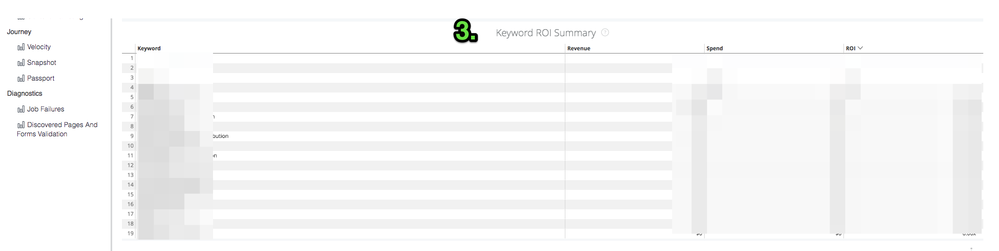

**Campaign ROI Summary**

1. A list of campaigns based on how much revenue, spend, and ROI attributed to each campaign, sorted by the highest revenue based off the selected attribution model.

**Creative ROI Summary**

2. A list of creatives based on how much revenue, spend, and ROI attributed to each creative, sorted by the highest revenue based off the selected attribution model.

**Keyword ROI Summary**

3. A list of keywords based on how much revenue, spend, and ROI attributed to each keywords, sorted by the highest revenue based off the selected attribution model.

### Account Based Marketing {#account-based-marketing}

Account Based Marketing provides companies using ABM the ability to track their efforts towards their target accounts and how much engagement they’ve seen from their marketing.

**Filters**

Date Type is Touchpoint Date

Date is in the past 12 complete months

Attribution Model is W-Shaped Attribution

Group By is Channel

Accounts is equal to __

**Revenue**

The total revenue amount from Closed Won opportunities, based off the attribution model.

Click to Show Details and drill into the data by viewing it as a visualization and table.

**Pipeline Revenue**

The total potential revenue from any Open Opportunity, meaning that it is not Closed Lost or Closed Won. The revenue is based off the selected attribution model.

**Average Number of Touches Per Account**

The average number of touchpoints generated from each CRM Account, by Account ID.

**Leads Matched**

The total number of Leads that were successfully matched to an Account using Bizible’s Lead-to-Account feature, using website, company name, and email domain matching algorithms.

**Accounts Engaged**

The total number of accounts that received any touchpoint. If a target account list is used, this is the subset of accounts from that target account list.

**Opportunities Engaged**

The total number of opportunities that received any touchpoint. If a target account list is used, this is the subset of opportunities from that target account list.

**Individuals Engaged**

The total number of individuals (leads and contacts by email addresses) that received any touchpoint. If a target account list is used, this is the subset of individuals from that target account list.

**Touchpoints Over Time**

The total number of touchpoints recorded during the specified time period. If a target account list is used, this is the subset of accounts from that target account list.

**Accounts Touched Over Time (chart)**

The total number of accounts that received any touchpoint per month during the specified time period with the option of grouping the results by Channel, Subchannel, Campaign, Account, Ad Group, Ad, Advertiser, Creative, Keyword, Placement, or Site. If a target account list is used, this is the subset of accounts from that target account list.

**Accounts by Touchpoint Count**

By Account ID and Account Name, the total number of touchpoints from each account.

**Touchpoint Count**

The number of touchpoints attributed to each dimension, where the dimension can be changed by the Group By filter such as: None / Channel / Subchannel / Campaign / Account / Advertiser / Ad / Creative / Ad Group / Keyword / Placement / Site.

### Marketing Spend {#marketing-spend}

Marketing Spend shows Marketers how much they’ve spent over a period of time so they can track spend by month and by channel.

**Filters**

Date Type is Touchpoint Date

Date is in the past 12 complete months

Attribution Model

Group By is equal to Channel

Channel is equal to __

Subchannel is equal to __

Campaign is equal to __

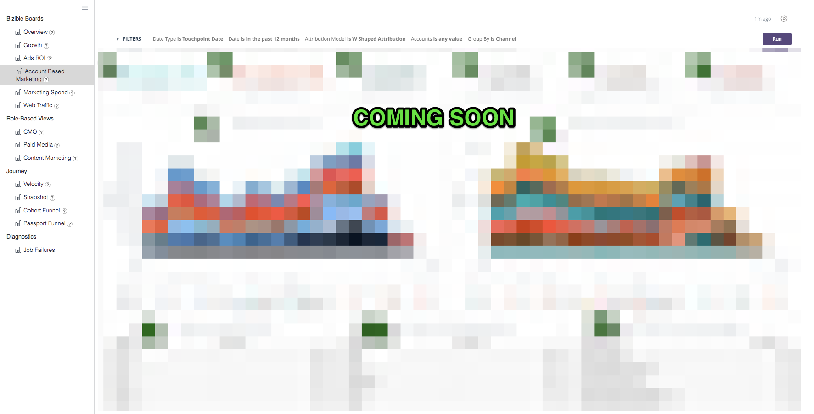

**Revenue**

The total revenue amount from Closed Won opportunities, based off the attribution model.

Click to Show Details and drill into the data by viewing it as a visualization and table.

**Spend**

The total amount of recorded spend from both API costs and self reported costs rolled up at the highest Channel level.

Click to Show Details and drill into the data by viewing it as a visualization and table.

**ROI**

The calculated ROI (return on investment) from the total revenue (from the selected attribution model) and total spend.

**Spend (chart)**

The total amount of recorded spend showing the trend over a specific time period. Use the Group By filter to change the stack by None, Channel, Subchannel, Campaign, Account, Ad Group, Ad, Advertiser, Creative, Keyword, Placement, Site.

Because Spend is not recorded at all levels, it is possible that the totals do not equal to each “Group By” selection. For example, the total of all Campaigns will not equal to the total of all Subchannels.

**Spend + ROI**

Displays the amount of marketing spend permonth alongside the ROI on the right y-axis.

**Spend by Channel**

A list of channels based on how much was reported for each channel, sorted by the highest spend.

**Spend by Subchannel**

A list of subchannels based on how much was reported for each subchannel, sorted by the highest spend.

**Spend by Campaign**

A list of campaigns based on how much was reported for each campaigns, sorted by the highest spend. The campaigns consist of a full list of campaigns which include utm_campaign values from Page Views.

### Web Traffic {#web-traffic}

The Web Traffic view allows marketers to track activity on their website, measuring traffic from both known and anonymous site visitors.

**Filters**

Date Type is Touchpoint Date

Date is in the past 12 complete months

Attribution Model is W-Shaped Attribution

URL is equal to __

Group By is None

Metric is Visits

Channel is equal to __

Subchannel is equal to __

Campaign is equal to __

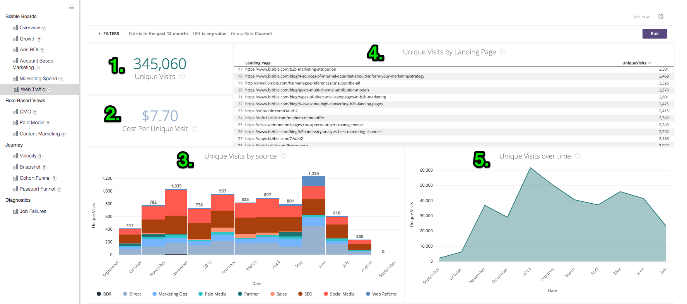

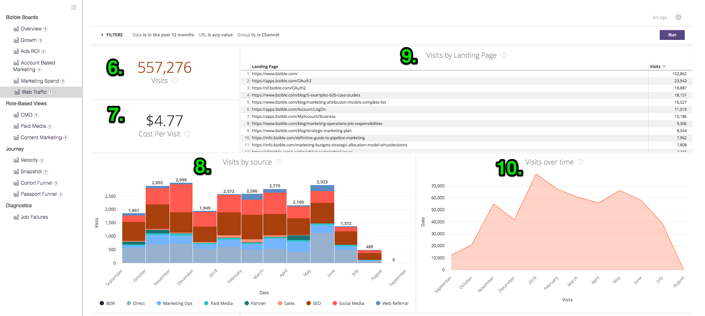

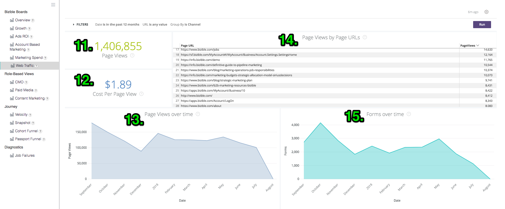

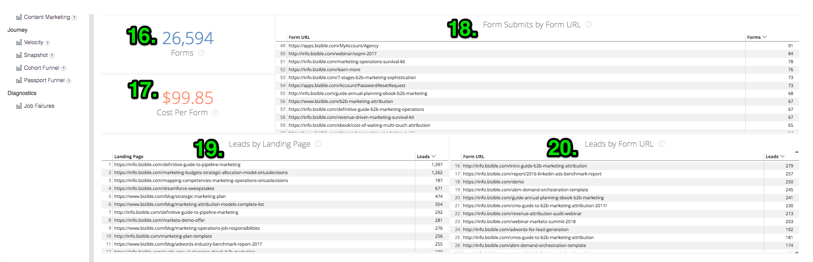

**Unique Visits**

The total number of unique site visits tracked across all known and anonymous visitors.

Click to Show Details and drill into the data by viewing it as a visualization and table.

**Visits**

The total number of site visits tracked across all known and anonymous visitors.

Click to Show Details and drill into the data by viewing it as a visualization and table.

**Cost Per Unique Visit**

The total spend divided by the total number of unique visits, providing the cost per unique visit rate.

**Cost Per Visit**

The total spend divided by the total number of visits, providing the cost per visit rate.

**Revenue Per Unique Visit**

The calculated average of closed revenue per unique site visit from known and anonymous visitors.

**Revenue Per Visit**

The calculated average of closed revenue per site visit from known and anonymous visitors.

**Page Views**

The total number of pages views tracked across all known and anonymous visitors.

Click to Show Details and drill into the data by viewing it as a visualization and table.

**Forms**

The total number of forms submitted across all known and anonymous visitors.

Click to Show Details and drill into the data by viewing it as a visualization and table.

**Overview**

Using the Metric dropdown from the Filters menu, this chart shows revenue / pipeline revenue / spend / deals / opportunities / leads / contacts / clicks / impressions / visits / unique visits / page views / forms attributed to each dimension, shown over time. Dimensions can be changed from None to Channel / Subchannel / Campaign / Account / Advertiser / Ad / Creative / Ad Group / Keyword / Placement / Site.

**Web Traffic Summary**

By URL, view the number of page views, visits, unique visits, and form submits that’s credited to each.

**Referrer Summary**

The number of page visits and unique visits that came from each referring URL.

**Unique Visits by source**

Using the Group By dropdown from the Filters menu, view the source of the Unique Visitors to your site. Change the Group by to: Channel, Subchannel, Campaign, Account, Ad Group, Ad, Advertiser, Creative, Keyword, Placement, Site.

**Visits by source**

Using the Group By dropdown from the Filters menu, view the source of the Visitors to your site. Change the Group by to: Channel, Subchannel, Campaign, Account, Ad Group, Ad, Advertiser, Creative, Keyword, Placement, Site.

**Leads by Landing Page**

A list of landing pages based on the number of leads that were generated from each landing page, sorted by the most number of leads.

**Leads by Form URL**

A list of form URLs based on the number of leads that were generated from each URL, sorted by the most number of leads.

# Role-Based Views {#role-based-views}

### CMO {#cmo}

The CMO views gives the CMO a high-level look at how the marketing team is performing in regards to their impact on revenue, spend, and ROI.

**Filters**

Date Type is Close Date

Date is in the past 12 complete months

Attribution Model is W-Shaped

Channel is equal to __

Subchannel is equal to __

Campaign is equal to __

Metric is Revenue

Categories

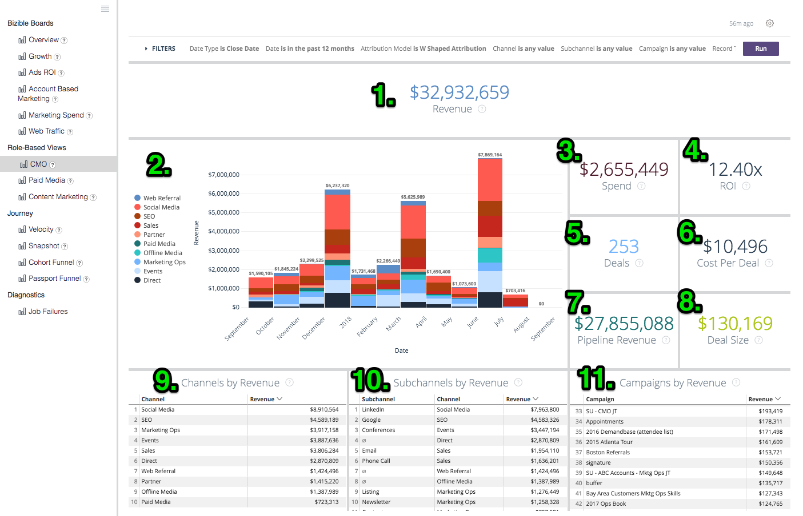

**Revenue**

1. The total revenue amount from Closed Won opportunities, based off the attribution model.

Click to Show Details and drill into the data by viewing it as a visualization and table.

**Overview**

2. Using the Metric dropdown from the Filters menu, this chart shows revenue / pipeline revenue / spend / deals / opportunities / leads / contacts attributed to each channel, shown over time.

**Spend**

3. The total amount of recorded spend from both API costs and self reported costs rolled up at the highest Channel level.

Click to Show Details and drill into the data by viewing it as a visualization and table.

**ROI**

4. The calculated ROI (return on investment) from the total revenue (from the selected attribution model) and total spend.

**Deals**

5. The total number of Closed Won opportunities, based of the attribution model count. If the date type “Touchpoint Date” is selected, partial counts are possible because it is possible to exclude some touchpoints within an opportunity using this date type.

Click to Show Details and drill into the data by viewing it as a visualization and table.

**Cost per Deal**

6. The total spend divided by the total number of deals, providing an average cost that it takes to acquire one closed won opportunity.

**Pipeline Revenue**

7. The total potential revenue from any Open Opportunity, meaning that it is not Closed Lost or Closed Won. The revenue is based off the selected attribution model.

Click to Show Details and drill into the data by viewing it as a visualization and table.

**Deal Size**

8. The average amount of a Closed Won opportunity.

**Channel Summary**

9. Using the Metric dropdown from the Filters menu, this is a list of channels based on how much revenue / pipeline revenue / spend / deals / opportunities / leads / contacts was attributed to each channel, sorted by the highest based off the selected attribution model.

**Subchannel Summary**

10. Using the Metric dropdown from the Filters menu, this is a list of subchannels based on how much revenue / pipeline revenue / spend / deals / opportunities / leads / contacts was attributed to each subchannel, sorted by the highest based off the selected attribution model.

**Campaign Summary**

11. Using the Metric dropdown from the Filters menu, this is a list of campaigns based on how much revenue / pipeline revenue / spend / deals / opportunities / leads / contacts was attributed to each campaign, sorted by the highest based off the selected attribution model.

### Paid Media {#paid-media}

The Paid Media dashboards provides Paid Media Managers (or similar) a peek into their paid media performance. Be able to see how much was served in the relevant channels and how much demand was generated from your efforts. All metrics are pulled from paid media integrations.

**Filters**

Date Type is Touchpoint Date

Date is in the past 12 complete months

Attribution Model is W-Shaped

Metric is Revenue

Dimension is Channel

Channel is equal to __

Subchannel is equal to __

Campaign is equal to __

Categories

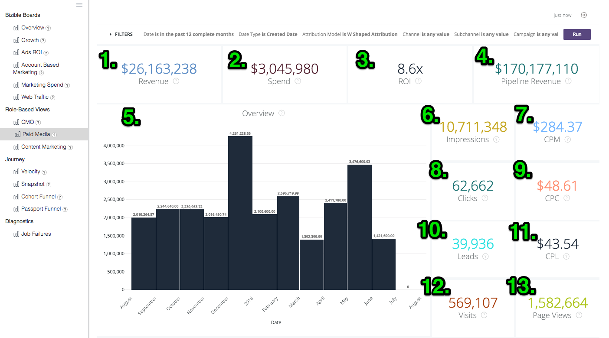

** 

**

**Revenue**

1. The total revenue amount from Closed Won opportunities, based off the attribution model.

Click to Show Details and drill into the data by viewing it as a visualization and table.

**Spend**

2. The total amount of recorded spend from both API costs and self reported costs rolled up at the highest Channel level.

Click to Show Details and drill into the data by viewing it as a visualization and table.

**ROI**

3. The calculated ROI (return on investment) from the total revenue (from the selected attribution model) and total spend.

**Pipeline Revenue**

4. The total potential revenue from any Open Opportunity, meaning that it is not Closed Lost or Closed Won. The revenue is based off the selected attribution model.

Click to Show Details and drill into the data by viewing it as a visualization and table.

**Overview**

5. Using the Metric dropdown from the Filters menu, this chart shows revenue / pipeline revenue / spend / deals / opportunities / leads / contacts / visits / unique visits / impressions / clicks / forms over time.

**Impressions**

6. The total number of impressions served from all the connected ads accounts.

Click to Show Details and drill into the data by viewing it as a visualization and table.

**CPM**

7. The total spend from the served impressions divided by the total impressions (divided by 1000), providing the CPM rate.

**Clicks**

8. The total number of clicks tracked from all the connected ads accounts.

Click to Show Details and drill into the data by viewing it as a visualization and table.

**CPC**

9. The total spend from the clicks tracked divided by the total clicks, providing the CPC rate.

**Leads**

10. The total number of leads created in the CRM.

**Cost Per Lead**

11. The total spend from the leads created divided by the total clicks, providing the CPL rate.

**Visits**

12. The total number of site visits tracked across all known and anonymous visitors.

Click to Show Details and drill into the data by viewing it as a visualization and table.

**Unique Visits**

13. The total number of unique site visits tracked across all known and anonymous visitors.

Click to Show Details and drill into the data by viewing it as a visualization and table.

**Web Traffic Summary**

Using the dimension picker in the Filters menu, switch between Channel, Subchannel, Campaign, Account, Ad Group, Ad, Advertiser, Creative, Keyword, Placement, Site, and view the number of page views, visits, unique visits, and form submits that’s credited to each.

**Lead Pipeline Summary**

Using the dimension picker in the Filters menu, switch between Channel, Subchannel, Campaign, Account, Ad Group, Ad, Advertiser, Creative, Keyword, Placement, Site, and view the number of Leads or Contacts attributed to each, based off the selected attribution model.

**Opportunity Pipeline Summary**

Using the dimension picker in the Filters menu, switch between Channel, Subchannel, Campaign, Account, Ad Group, Ad, Advertiser, Creative, Keyword, Placement, Site, and view the number of Opportunities, Deals, Pipeline Revenue, Spend, ROI, and Revenue attributed to each, based off the selected attribution model.

### Content Marketing {#content-marketing}

The Content Marketing dashboard gives content marketers to ability to see how well their marketing content has performed, from how many visits they generated to how much revenue was closed. View it by all content or narrow it down to specific pieces of content or pages.

Filters

Date Type is Touchpoint Date

Date is in the past 12 complete months

Attribution Model is W-Shaped

Landing Page is equal to __

Channel is equal to __

Subchannel is equal to __

Campaign is equal to __

Categories

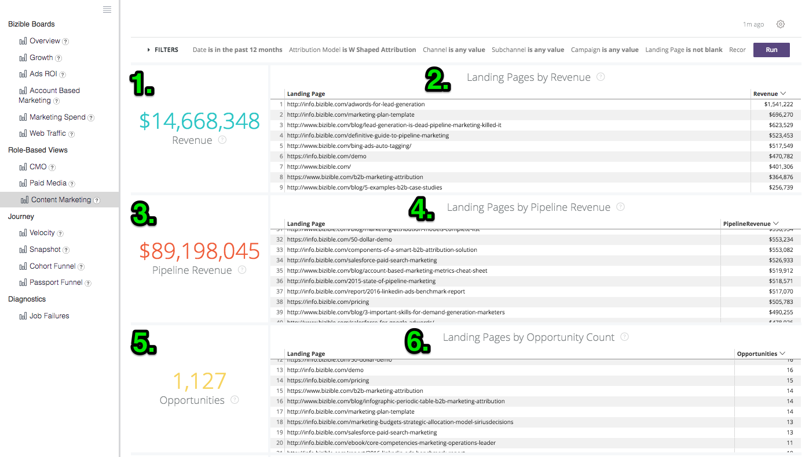

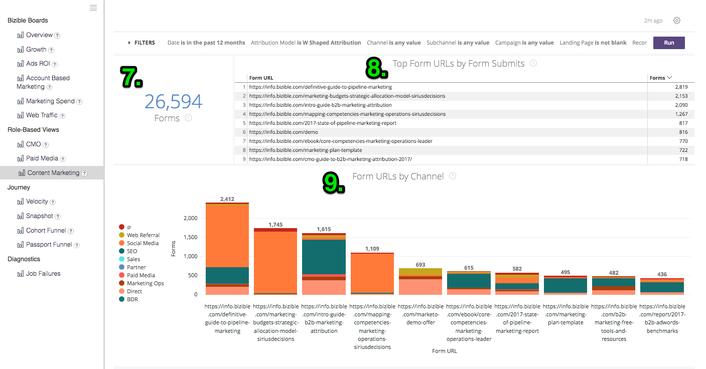

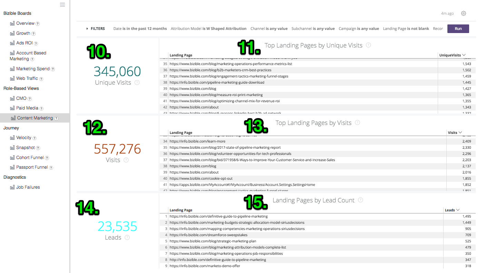

**Total Revenue**

1. The total revenue amount from Closed Won opportunities from digital sources only, based off the attribution model.

Click to Show Details and drill into the data by viewing it as a visualization and table.

**Landing Pages by Revenue**

2. A list of landing pages based on how much revenue was attributed to each landing page, sorted by the highest revenue based off the selected attribution model.

**Total Pipeline Revenue**

3. The total potential revenue from any Open Opportunity from digital sources only, meaning that it is not Closed Lost or Closed Won. The revenue is based off the selected attribution model.

Click to Show Details and drill into the data by viewing it as a visualization and table.

**Landing Pages by Pipeline Revenue**

4. A list of landing pages based on how much pipeline revenue was attributed to each landing page, sorted by the most pipeline revenue based off the selected attribution model.

**Total Opportunities**

5. The total number of Opportunities from digital sources only, based off the attribution model.

Click to Show Details and drill into the data by viewing it as a visualization and table.

**Landing Pages by Opportunity Count**

6. A list of landing pages based on how many opportunities were attributed to each landing page, sorted by the highest number of opportunities based off the selected attribution model.

**Forms**

7. The total number of forms submitted throughout all tracked pages.

**Top Form URLs by Form Submit**

8. A list of form URLs based on the number of forms that were submitted on each URL, sorted by the most number of forms submitted on a page.

**Form URLs by Channel**

9. The top 10 form URLs grouped by the channel that’s driving the visit.

Click to Show Details and drill into the data by viewing it as a visualization and table.

**Unique Visits**

10. The total number of unique site visits tracked across all known and anonymous visitors.

Drill in to see the unique site visits tracked by month.

**Top Landing Pages by Unique Visits**

11. A list of landing pages based on the number of unique visits to each landing page, sorted by the pages with the most number of unique visits.

Drill in to see the unique visits by month to the selected URL.

**Visits**

12. The total number of site visits tracked across all known and anonymous visitors.

**Top Landing Pages by Visits**

13. A list of landing pages based on the number of initial visits to each landing page, sorted by the pages with the most number of visits.

**Leads**

14. The total number of Leads, based off the attribution model. If the date type “Touchpoint Date” is selected, partial counts are possible because it is possible to exclude some touchpoints within a Lead record using this date type. If an attribution model beyond U-Shaped is applied, the U-Shaped count is used for W-Shaped, W-Shaped, and Custom Model.

Click to Show Details and drill into the data by viewing it as a visualization and table.

**Landing Pages by Lead Count**

15. A list of page URLs based on the number of leads created from each URL, sorted by the pages with the most leads.

### Marketing Ops {#marketing-ops}

Validate and diagnose Bizible data with complete visibility into individual touchpoints.

**Filters**

Account ID

Account Name

Opportunity ID

Lead or Contact ID

Lead or Contact Email

Campaign ID

Opportunity Won (Y/N)

Opportunity Created Date

Opportunity Close Date

Touchpoint Date

Attribution Model

**Drill-Downs**

Opportunity Details

Contact Details

Lead Details

Attribution Touchpoint Details

Touchpoint Details

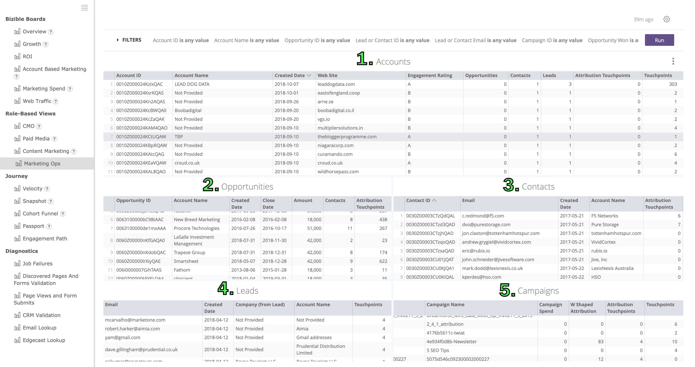

**Accounts **

1. List of all accounts with touchpoints. The information for each account includes engagement rating, number of opportunities, number of contacts, number of leads, number of attribution touchpoints, and number of touchpoint.

Click the aggregated numbers to drill down for base data details.

**Opportunities **

2. List of all opportunities with attribution touchpoints. The information for each opportunity includes the opportunity amount, number of contacts, and number of attribution touchpoints.

Click the aggregated numbers to drill down for base data details.

**Contacts **

3. List of all contacts with touchpoints. The information for each contact includes number of attribute touchpoints and number of touchpoints

Click the aggregated numbers to drill down for base data details.

**Leads **

4. List of all leads with touchpoints. The information for each lead includes number of touchpoints.

Click the aggregated numbers to drill down for base data details.

**Campaigns **

5. List of all campaigns with touchpoints. The information for each campaign includes campaign spend, attribute amount, number of attribution touchpoints, and number of touchpoints.

Click the aggregated numbers to drill down for base data details.

**Marketing Ops FAQ**

Q: Why is there both an ‘Account ID’ and ‘Account Name’ filter?  
A: While account IDs are unique, account names don’t have to be. For example, you could have created multiple different accounts for each business unit within an enterprise company. While using the account name may be more intuitive, to ensure you’re filtering for a specific account, you may want to use the account ID.

Q: If I filter by Account ID, will all the tables by filtered?  
A: Yes, it will apply the filter to every tile in the board. For example, if your were to apply an account filter for ‘Microsoft,’ in the ‘Opportunities’ tile you will only see opportunities related to Microsoft.

Q: What is the ‘Engagement Rating’ column?  
A: The engagement rating pulls from Bizible’s Predictive Account Engagement Score, which is available in Bizible Tier 2. If you do not have this, this field will show up as null.

Q: Can I change how the table is sorted?  
A: Yes, if you click any of the column headers, it will sort the table. If you click the same header again, it will reverse how the table is sorted.

Q: Can I export the data?  
A: Yes, when hovering over the tile title (e.g., ‘Accounts’), click on the three vertical dots in the upper right-hand corner. This will enable you to download the data for that tile in the following formats: TXT, CSV, XLS, JSON, HTML, and Markdown.

Q: Can I see beyond 500 rows of data?  
A: The tile is limited to displaying 500 rows at a time, but you can export the data and choose ‘All Results’ to see more than the 500 rows displayed.

# Journey {#journey}

### Sales Velocity {#sales-velocity}

Sales Velocity enables Marketers and Sales to see how quickly their prospects are moving through the funnel and to figure out which channels have a faster (or slower) conversion time.

**Filters**

Date is in the past 12 complete months

Won is Yes

Stage is equal to __

Channel is equal to __

Subchannel is equal to __

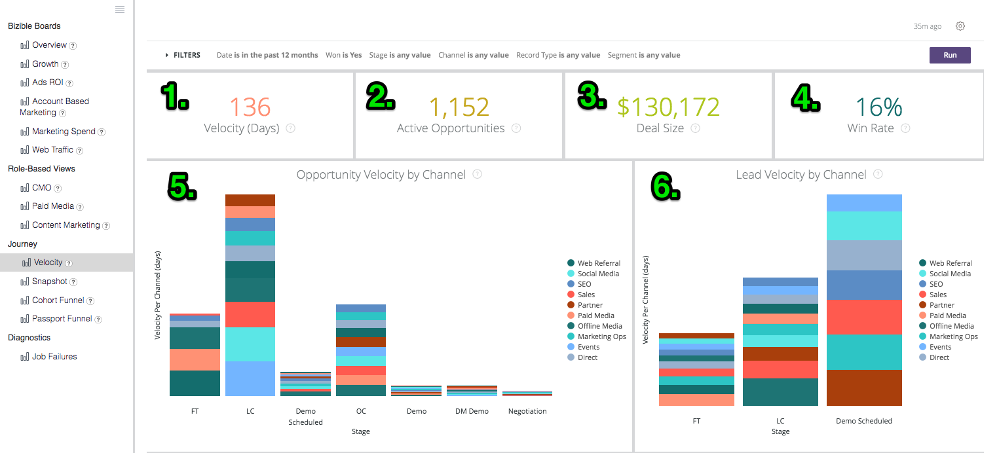

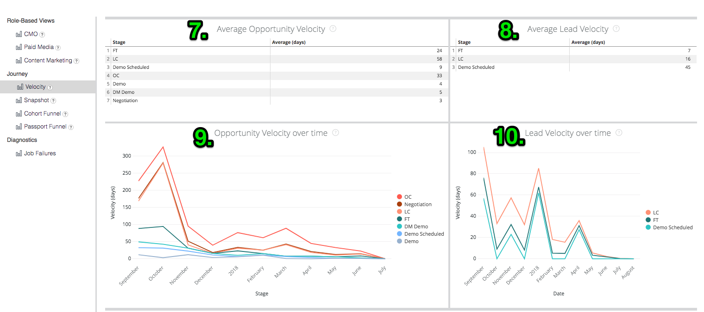

**Velocity (days)**

1. The average number of days that Opportunities are in their sales cycle, from the first anonymous touch through the opportunity close.

**Active Opportunities**

2. The total number of opportunities from any Open Opportunity, meaning that it is not Closed Lost or Closed Won.

**Average Deal Size**

3. The average amount of a Closed Won opportunity.

**Win Rate**

4. The total number of Closed Won opportunities divided by the total number of Closed Lost and Closed Won Opportunities, showing the win rate percentage.

**Opportunity Velocity by Channel**

5. The average number of days that Opportunities are in their cycle per stage, grouped by the Marketing Channel and showing length of time it takes to progress to the next stage. The stages that appear here are milestone stages (FT, LC, OC) and custom stages.

**Lead Velocity by Channel**

6. The average number of days that Leads are in their cycle per stage before they’re converted to a Contact/Opportunity/Account, grouped by the Marketing Channel and showing length of time it takes to progress to the next stage. The stages that appear here are milestone stages (FT, LC) and custom stages.

**Average Opportunity Velocity**

7. The average number of days that Opportunities are in their cycle per stage, showing length of time it takes to progress to the next stage. The stages that appear here are milestone stages (FT, LC, OC) and custom stages. The numbers here reflect the time per stage in the Opportunity Velocity by Channel chart above.

**Average Lead Velocity**

8. The average number of days that Leads are in their cycle per stage before they’re converted to a Contact/Opportunity/Account, showing length of time it takes to progress to the next stage. The stages that appear here are milestone stages (FT, LC) and custom stages. The numbers here reflect the time per stage in the Lead Velocity by Channel chart above.

**Opportunity Velocity over time**

9. The average number of days that Opportunities are in their cycle per stage with a trend over time.

**Lead Velocity over time**

10. The average number of days that Leads are in their cycle per stage with a trend over time.

### Snapshot {#snapshot}

Snapshot gives marketers a view of their whole pipeline at any given point in time. A single date is added to the filter to show what the state of their pipeline looked like on that date.

Filters

Date is on 2018-01-01

Leads or Contacts

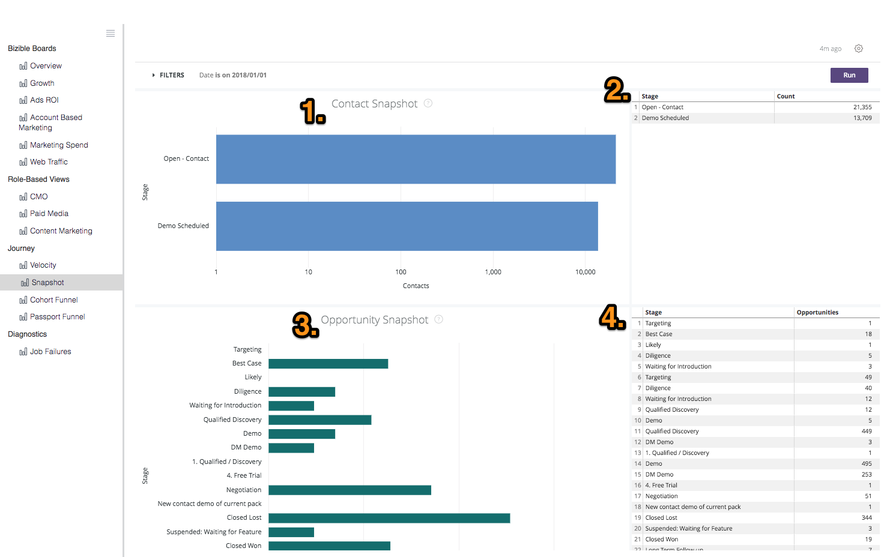

**Lead/Contact Snapshot**

1. The number of Lead or Contact records that were in each stage on the date selected.

**Lead/Contact Snapshot (Table)**

2. The number of Lead or Contact records that were in each stage on the date selected.

**Opportunity Snapshot**

3. The number of Opportunity records that were in each stage on the date selected.

**Opportunity Snapshot (Table)**

4. The number of Opportunity records that were in each stage on the date selected.

### Passport {#passport}

The Passport is the new demand waterfall view from the Bizible ROI Dashboard, where each stage shows the number of records in each stage and the total of records that have passed through each stage.

**Filters**

Date Type is Touchpoint Date

Date is in the past 12 complete months

Attribution Model is W-Shaped

Channel is equal to __

Subchannel is equal to __

Campaign is equal to __

Categories

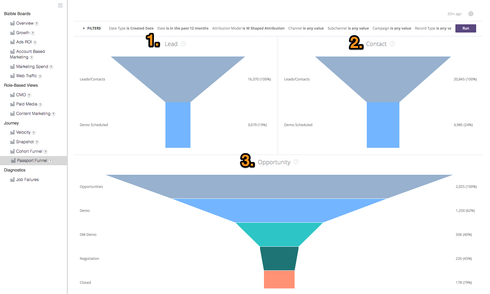

**Lead/Contact Passport**

1. & 2. Each stage shows the number of records in each Lead Status or Contact Stage and the total of records that have passed through each stage.

**Opportunity Passport**

3. Each stage shows the number of records in each Opportunity Stage and the total of records that have passed through each stage.

### Engagement Path {#engagement-path}

Understand how leads, contacts, opportunities, and accounts engage from first touch to close.

**Filters**

Account Name / ID

Lead ID / Email

Contact ID / Email

Attribution Model

Event Type

Bizible Touchpoint Position

Bizible Attribution Touchpoint Position

Touchpoint Date

User Touchpoint Email

Marketing Touch Type

Channel

Medium

Web Source

First Interaction with the Person (Y/N)

Attributed Revenue

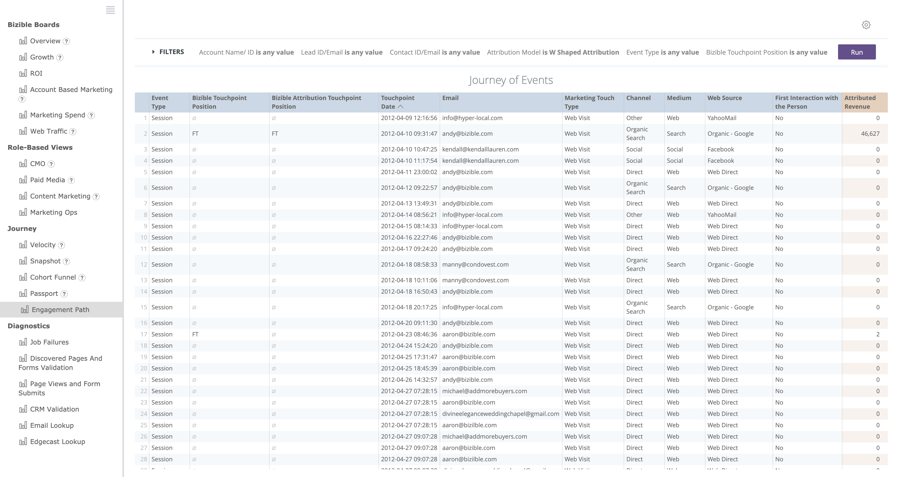

**Journey of Events**

List of all events with associated touchpoint details and attributed revenue.

Click Event Type to drill down to view event details.

**Engagement Path FAQ**

Q: How can I view a single person’s journey?  
A: Using either the ‘Lead ID/Email’ or ‘Contact ID/email’ filter, set the filter to ‘contains [email address]’ and then click ‘Run.’

Q: What does the ‘Attribution Model’ filter affect?  
A: The attribution model filter will affect the ‘Attributed Revenue’ column

Q: What is the ‘Marketing Touch Type’ filter?  
A: The ‘Marketing Touch Type’ is the type of engagement, which can include Web Visit, Web Form, Web Chat, Email, Call, Left Message, or CRM (i.e., campaign membership for offline channels)

Q: How do I filter out all the web sessions from the journey?  
A: Using the ‘Marketing Touch Type’ filter, set the filter to ‘doesn’t contain Web Visit’ OR ‘contains [all touch types except Web Visit], and then click ‘Run’

Q: Can I export the data?  
A: Yes, when hovering over the ‘Journey of Events’ table, click on the three vertical dots in the upper right-hand corner. This will enable you to download the data in the following formats: TXT, CSV, XLS, JSON, HTML, and Markdown.

Q: Can I change how the table is sorted?  
A: Yes, if you click any of the column headers, it will sort the table. If you click the same header again, it will reverse how the table is sorted. By default, the tables are sorted by Touchpoint Date starting with the oldest.

Q: Can I see beyond 500 rows of data?  
A: The tile is limited to displaying 500 rows at a time, but you can export the data and choose ‘All Results’ to see more than the 500 rows displayed.

