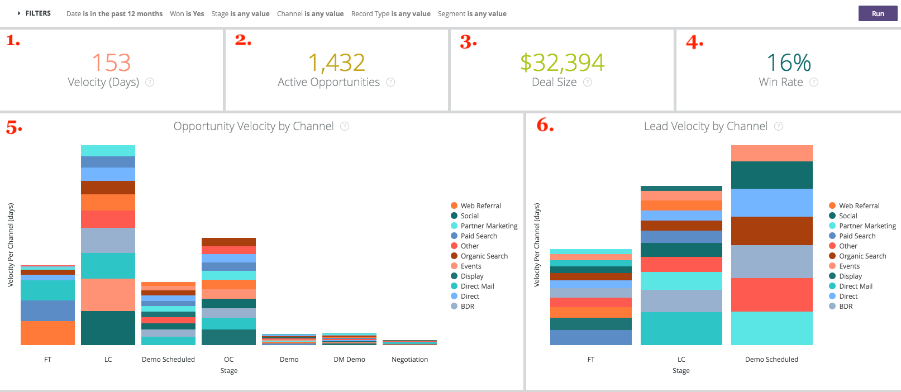
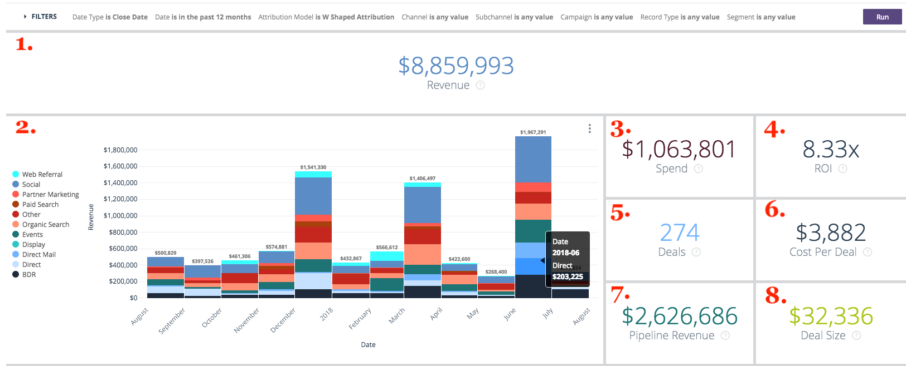

# Drill Throughs {#drill-throughs}

Drill Throughs - Bizible - Product Documentation

The Bizible Discover experience allows customers to drill into the data set that they care the most about. On certain measures throughout Bizible Discover, customers can click into a tile and explore more about that metric.

Below is a list of Dashboards and the Tiles that contain drill-throughs and the experience that a user should expect when drilling through. Keep in mind that global filters from the dashboard persist when drilling through.

#### Overview {#overview}

**Revenue**

Definition: Total revenue by month via bar chart and table. From there, it is possible to drill into a single month or break out a month by week, day, or time.

**Revenue (Chart)**

Definition: Total revenue by month via bar chart and table. Because the parent tile is already a bar chart, drill into Show Details will show a single month only.

*Drill Into: Total revenue by month broken down by week or date.*

**Spend**

Definition: Total spend by month via bar chart and table. From there, it is possible to drill into a single month or break out a month by week, day, or time.

**Deals**

Definition: Total number of deals by month via bar chart and table. From there, it is possible to drill into a single month or break out a month by week, day, or time.

**Pipeline Revenue**

Definition: Total pipeline revenue by month via bar chart and table. From there, it is possible to drill into a single month or break out a month by week, day, or time.

**ROI Summary**

Definition: Total revenue or spend from each channel by month via bar chart and table. From there, it is possible to drill into that row for a single month or break out a month by week, day, or time.

**Cost Per Deal**

Definition: The total spend divided by the total number of deals, providing the average cost needed to acquire a closed won opportunity. From there, it is possible to drill into that row for a single month or break out a month by week, day, or time.

**Channels by Revenue**

Definition: Total revenue from each channel by month via bar chart and table. From there, it is possible to drill into that row for a single month or break out a month by week, day, or time.

**Subchannels by Revenue**

Definition: Total revenue from each subchannel by month via bar chart and table. From there, it is possible to drill into that row for a single month or break out a month by week, day, or time.

**Campaigns by Revenue**

Definition: Total revenue from each campaign by month via bar chart and table. From there, it is possible to drill into that row for a single month or break out a month by week, day, or time.

**Deal Summary**

Definition: Total spend or deal count from each channel by month via bar chart and table. From there, it is possible to drill into that row for a single month or break out a month by week, day, or time.

#### Growth {#growth}

**Total Revenue**

Definition: Total revenue by month via bar chart and table. From there, it is possible to drill into a single month or break out a month by week, day, or time.

**Revenue over time**

Definition: Total revenue by month via bar chart and table. Because the parent tile is already a chart, drill into Show Details will show a single month only.

*Total revenue by month broken down by week or date.*

**Total Deals**

Definition: Total number of deals by month via bar chart and table. From there, it is possible to drill into a single month or break out a month by week, day, or time.

**Deals over time**

Definition: Total number of deals by month via bar chart and table. Because the parent tile is already a chart, drill into Show Details will show a single month only.

*Total number of deals by month broken down by week or date.*

**Total Pipeline Revenue**

Definition: Total pipeline revenue by month via bar chart and table. From there, it is possible to drill into a single month or break out a month by week, day, or time.

**Pipeline Revenue over time**

Definition: Total pipeline revenue by month via bar chart and table. Because the parent tile is already a chart, drill into Show Details will show a single month only.

*Total pipeline revenue by month broken down by week or date.*

**Total Leads**

Definition: Total leads by month via bar chart and table. From there, it is possible to drill into a single month or break out a month by week, day, or time.

**Leads over time**

Definition: Total leads by month via bar chart and table. Because the parent tile is already a chart, drill into Show Details will show a single month only.

*Total leads by month broken down by week or date.*

**Total Contacts**

Definition: Total contacts by month via bar chart and table. From there, it is possible to drill into a single month or break out a month by week, day, or time.

**Contacts over time**

Definition: Total contacts by month via bar chart and table. Because the parent tile is already a chart, drill into Show Details will show a single month only.

*Total contacts by month broken down by week or date.*

**Total Opportunities**

Definition: Total opportunities by month via bar chart and table. From there, it is possible to drill into a single month or break out a month by week, day, or time.

**Opportunities over time**

Definition: Total opportunities by month via bar chart and table. Because the parent tile is already a chart, drill into Show Details will show a single month only.

*Total opportunities by month broken down by week or date.*

**Unique Visits**

Definition: Total number of page views by month via bar chart and table. From there, it is possible to drill into a single month or break out a month by week, day, or time.

**Unique Visits over time**

Definition: The total number of unique visits showing the trend over a specific time period. Use the Group by filter to change the stack by Channel, Subchannel, Campaign, Account, Ad Group, Ad, Advertiser, Creative, Keyword, Placement, and Site. This will appear empty if this feature is disabled.

**Visits**

Definition: Total number of site visits by month via bar chart and table. From there, it is possible to drill into a single month or break out a month by week, day, or time.

**Visits over time**

Definition: The total number of site visits tracked showing the trend over a specific time period. Use the Group by filter to change the stack by Channel, Subchannel, Campaign, Account, Ad Group, Ad, Advertiser, Creative, Keyword, Placement, and Site. This will appear empty if this feature is disabled.

**Forms**

Definition: Total number of form submissions by month via bar chart and table. From there, it is possible to drill into a single month or break out a month by week, day, or time.

**Forms over time**

Definition: The total number of forms submitted showing the trend over a specific time period. Use the Group by filter to change the stack by Channel, Subchannel, Campaign, Account, Ad Group, Ad, Advertiser, Creative, Keyword, Placement, and Site. This will appear empty if this feature is disabled.

#### Spend {#spend}

**Spend**

Definition: Total spend by month via bar chart and table. From there, it is possible to drill into a single month or break out a month by week, day, or time.

**Spend (Chart)**

Definition: Total spend by month via bar chart and table. Because the parent tile is already a chart, drill into Show Details will show a single month only.

*Total spend by month broken down by week, date, or time. Time is possible for spend since Bizible downloads actual spend by the minute from our ads connections.*

**Spend by Channel**

Definition: Total spend from each channel by month via bar chart and table. From there, it is possible to drill into that row for a single month or break out a month by week, day, or time.

**Spend by Subchannel**

Definition: Total spend from each subchannel by month via bar chart and table. From there, it is possible to drill into that row for a single month or break out a month by week, day, or time.

**Spend by Campaign**

Definition: Total spend from each campaign by month via bar chart and table. From there, it is possible to drill into that row for a single month or break out a month by week, day, or time.

#### Sales Velocity {#sales-velocity}

**Velocity (Days)**

Definition: The average number of days the opportunities are in their sales cycle, from the first anonymous touch through the opportunity close.

**Active Opportunities**

Definition: The total number of opportunities from any Open Opportunity, meaning that it is not Closed Lost or Closed Won.

**Deal Size**

Definition: The average amount of a Closed Won opportunity.

**Win Rate**

Definition: The total number of Closed Won opportunities divided by the total number of Closed Lost and Closed Won opportunities.

**Opportunity Velocity by Channel**

Definition: The average number of days that Opportunities are in their cycle per stage, grouped by the Marketing Channel and showing length of time it takes to progress to the next stage. The stages that appear here are milestone stages (FT, LC, OC) and custom stages.

**Lead Velocity by Channel**

Definition: The average number of days that Leads are in their cycle per stage before they're converted to a Contact/Opportunity/Amount, grouped by the Marketing Channel and showing length of time it takes to progress to the next stage. The stages that appear here are milestone stages (FT, LC) and custom stages.

**Average Opportunity Velocity**

Definition: The average number of days that Opportunities are in their cycle per stage, showing length of time it takes to progress to the next stage. The stages that appear here are milestone stages (FT, LC, OC) and custom stages. the numbers here reflect the time per stage in the Opportunity Velocity by the Channel chart.

**Average Lead Velocity**

Definition: The average number of days that Leads are in their cycle per stage before they're converted to a Contact/Opportunity/Amount, showing length of time it takes to progress to the next stage. The stages that appear here are milestone stages (FT, LC) and custom stages. the numbers here reflect the time per stage in the Lead Velocity by the Channel chart.

**Opportunity Velocity over time**

Definition: The average number of days that Opportunities are in their cycle per stage with a trend over time.

**Lead Velocity over time**

Definition: The average number of days that Leads are in their cycle per stage with a trend over time.

#### Account Based Marketing {#account-based-marketing}

**Total Revenue**

Definition: Total revenue by month via bar chart and table. From there, it is possible to drill into a single month or break out a month by week, day, or time.

**Total Pipeline Revenue**

Definition: Total pipeline revenue by month via bar chart and table. From there, it is possible to drill into a single month or break out a month by week, day, or time.

**Leads Matched**

Definition: Total number of leads successfully matched to an account.

**Accounts Touched**

Definition: The total number of accounts that received any touchpoint.

**Opportunities Touched**

Definition: A list of Opportunity Ids with their corresponding Account Id

**Contacts Touched**

Definition: A list of Contact Ids with their corresponding Account Id

**Touchpoints Over Time (chart)**

Definition: A list of touchpoints from the selected month.

*The number of touchpoints touched broken down by week, date, or time.*

**Accounts Touched Over Time (chart)**

Definition: A list of Account Ids from the selected month.

*The number of accounts touched broken down by week, date, or time.*

#### Web Analytics {#web-analytics}

**Unique Visits**

Definition: Total number of unique site visits by month via bar chart and table. From there, it is possible to drill into a single month or break out a month by week, day, or time.

**Cost Per Unique Visit**

Definition: Total spend divided by the total number of unique visits. From there, it is possible to drill into a single month or break out a month by week, day, or time.

**Unique Visits by Landing Page**

Definition: A list of landing pages based on the number of unique visitors from each URL.

**Unique Visits by Source**

Definition: A view into the sources of unique visitors to your site.

**Unique Visits Over Time**

Definition: The total number of unique visits tracked, showing a trend over a specific time frame.

**Visits**

Definition: Total number of site visits by month via bar chart and table. From there, it is possible to drill into a single month or break out a month by week, day, or time.

**Cost Per Visit**

Definition: The total spend divided by the total number of visits.

**Visits by Landing Page**

Definition: A list of landing pages based on the number of visits to each URL.

**Visits by Source**

Definition: Source of visitors to your site. Can be altered by Channel, Subchannel, Campaign, Account, Ad Group, Ad, Advertiser, Creative, Keyword, Placement, and Site.

**Visits Over Time**

Definition: The total number of visits tracked, showing the trend over a specific time frame. From there, it is possible to drill into a single month or break out a month by week, day, or time.

**Page Views**

Definition: Total number of page views by month via bar chart and table. From there, it is possible to drill into a single month or break out a month by week, day, or time.

**Cost Per Page View**

Definition: The total spend divided by the total number of page views tracked.

**Page Views by URLs**

Definition: A list of page URLs based on the number of page views from each URL.

**Page Views over time**

Definition: Total page views by month via bar chart and table. Because the parent tile is already a chart, drill into Show Details will show a single month only.

*Total page views by month broken down by week, date, or time.*

**Forms Over Time**

Definition: The total number of forms tracked, showing the trend over a specific time frame.

**Forms**

Definition: Total number of form submissions by month via bar chart and table. From there, it is possible to drill into a single month or break out a month by week, day, or time.

**Cost Per Form**

Definition: The total spend divided by the total forms submitted.

**Form Submits by Form URL**

Definition: A list of form URLs based on the number that were submitted on each URL.

**Leads by Landing Page**

Definition: A list of landing pages based on the number of leads that were generated from each landing page.

**Leads by Form URL**

Definition: A list of form URLs based on the number of leads that were generated from each URL.

#### CMO {#cmo}

**Revenue**

Definition: Total revenue by month via bar chart and table. From there, it is possible to drill into a single month or break out a month by week, day, or time.

**Revenue (Chart)**

Definition: Total revenue by month via bar chart and table. Because the parent tile is already a bar chart, drill into Show Details will show a single month only.

*Total revenue by month broken down by week or date.*

**Spend**

Definition: Total spend by month via bar chart and table. From there, it is possible to drill into a single month or break out a month by week, day, or time.

**ROI**

Definition: The calculated return on investment from the total revenue and total spend (based on the attribution model).

**Deals**

Definition: Total number of deals by month via bar chart and table. From there, it is possible to drill into a single month or break out a month by week, day, or time.

**Cost Per Deal**

Definition: Total spend divided by the total number of deals, providing the average cost that it takes to acquire one closed won opportunity.

**Pipeline Revenue**

Definition: Total pipeline revenue by month via bar chart and table. From there, it is possible to drill into a single month or break out a month by week, day, or time.

**Deal Size**

Definition: The average amount of a closed won opportunity.

**Channels by Revenue**

Definition: Total revenue from each channel by month via bar chart and table. From there, it is possible to drill into that row for a single month or break out a month by week, day, or time.

**Subchannels by Revenue**

Definition: Total revenue from each subchannel by month via bar chart and table. From there, it is possible to drill into that row for a single month or break out a month by week, day, or time.

**Campaigns by Revenue**

Definition: Total revenue from each campaign by month via bar chart and table. From there, it is possible to drill into that row for a single month or break out a month by week, day, or time.

**ROI Summary**

Definition: Total revenue or spend from each channel by month via bar chart and table. From there, it is possible to drill into that row for a single month or break out a month by week, day, or time.

**Deal Summary**

Definition: Total spend or deal count from each channel by month via bar chart and table. From there, it is possible to drill into that row for a single month or break out a month by week, day, or time.

#### Content Marketing {#content-marketing}

**Total Revenue**

Definition: Total revenue by month via bar chart and table. From there, it is possible to drill into a single month or break out a month by week, day, or time.

**Landing Pages by Revenue**

Definition: Total revenue from each landing page via bar chart and table. From there, it is possible to drill into that row for a single month or break out a month by week, day, or time.

**Total Pipeline Revenue**

Definition: Total pipeline revenue by month via bar chart and table. From there, it is possible to drill into a single month or break out a month by week, day, or time.

**Landing Pages by Pipeline Revenue**

Definition: Total pipeline revenue from each landing page via bar chart and table. From there, it is possible to drill into that row for a single month or break out a month by week, day, or time.

**Total Opportunities**

Definition: Total number of opportunities by month via bar chart and table. From there, it is possible to drill into a single month or break out a month by week, day, or time.

**Landing Pages by Opportunity Count**

Definition: Total number of opportunities from each landing page via bar chart and table. From there, it is possible to drill into that row for a single month or break out a month by week, day, or time.

**Total Forms**

Definition: Total number of forms by month via bar chart and table. From there, it is possible to drill into a single month or break out a month by week, day, or time.

**Top Form URL by Form Submits**

Definition: Total number of forms from each form URL via bar chart and table. From there, it is possible to drill into that row for a single month or break out a month by week, day, or time.

**Form URLs by Channel**

Definition: Total number of forms submitted from the form URL by month via bar chart and table. From there, it is possible to drill into that row for a single month or break out a month by week, day, or time.

**Unique Visits**

Definition: The total number of unique site visits tracked across all known and anonymous visitors. Drill in to see the unique site visits tracked by month.

**Top Landing Pages by Unique Visits**

Definition: A list of landing pages based on the number of unique visits to each landing page. Drill in to see the unique visits by month to the selected URL.

**Visits**

Definition: The total number of site visits tracked across all known and anonymous visitors. Drill in to see the site visits tracked by month.

**Top Landing Pages by Visits**

Definition: A list of landing pages based in the number of initial visits to each landing page. Drill in to see the visits by month to the selected URL.

**Total Leads**

Definition: Total number of leads by month via bar chart and table. From there, it is possible to drill into a single month or break out a month by week, day, or time.

**Landing Pages by Lead Count**

Definition: Total number of leads from each landing page via bar chart and table. From there, it is possible to drill into that row for a single month or break out a month by week, day, or time.

#### Paid Media {#paid-media}

**Impressions**

Definition: Total number of impressions by month via bar chart and table. From there, it is possible to drill into a single month or break out a month by week, day, or time.

**CPM**

Definition: The total spend from the served impressions divided by the total impressions.

**Clicks**

Definition: Total number of clicks by month via bar chart and table. From there, it is possible to drill into a single month or break out a month by week, day, or time.

**CPC**

Definition: The total spend from the clicks tracked divided by the total clicks.

**Leads**

Definition: Total number of leads based off the attribution model.

**CPL**

Definition: The total spend from the leads created divided by the total clicks, providing the CPL rate.

**Visits**

Definition: Total number of site visits by month via bar chart and table. From there, it is possible to drill into a single month or break out a month by week, day, or time.

**Page Views**

Definition: Total number of page views by month via bar chart and table. From there, it is possible to drill into a single month or break out a month by week, day, or time.

**Campaigns Summary**

Definition: List of campaigns base on how much revenue/spend/deals/opportunities was attributed to each campaign, sorted by the highest based off the selected attribution model.

**Ad Summary**

Definition: A list of ads based on how much revenue/pipeline revenue/spend/deals/opportunities was attributed to each ad, based off the selected attribution model.

**Keyword Summary**

Definition: A list of keywords based on how much revenue/pipeline revenue/spend/deals/opportunities was attributed to each keyword, based off the selected attribution model.

**Campaigns by ROI**

Definition: A list of campaigns based on calculated ROI for each campaign, sorted by the Highest ROI. Drill in to see the revenue or spend by month for the selected campaign.

**Ads by ROI**

Definition: A list of ads based on calculated ROI for each ad, sorted by the Highest ROI. Drill in to see the revenue or spend by month for the selected ad.

**Keywords by ROI**

Definition: A list of keyword based on calculated ROI for each keyword, sorted by the Highest ROI. Drill in to see the revenue or spend by month for the selected keyword.

