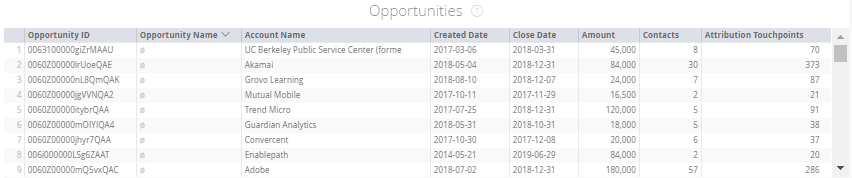
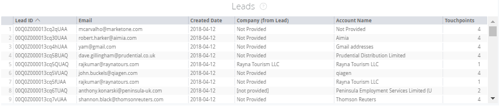

# Marketing Ops Tiles {#marketing-ops-tiles}

Marketing Ops Tiles - Bizible - Product Documentation

Marketing Ops allows you to validate and diagnose Bizible data with complete visibility into individual touchpoints per Leads, Contacts, Accounts, Campaigns, and Opportunities.

### What's in this article? {#whats-in-this-article}

[Account Tile](#account-tile)  
[Opportunity Tile](#opportunity-tile)  
[Contacts Tile](#contacts-tile)  
[Leads Tile](#leads-tile)  
[Campaigns Tile](#campaigns-tile)

<table> 
 <colgroup> 
  <col> 
  <col> 
  <col> 
  <col> 
  <col> 
  <col> 
  <col> 
  <col> 
  <col> 
  <col> 
  <col> 
  <col> 
  <col> 
 </colgroup> 
 <tbody> 
  <tr> 
   <td> </td> 
   <td>
<strong>Account ID</strong>
</td> 
   <td>
<strong>Account Name</strong>
</td> 
   <td>
<strong>Opp ID</strong>
</td> 
   <td>
<strong>Opp Name</strong>
</td> 
   <td>
<strong>Lead or Contact ID</strong>
</td> 
   <td>
<strong>Lead or Contact Email</strong>
</td> 
   <td>
<strong>Campaign ID</strong>
</td> 
   <td>
<strong>Opp Won</strong>
</td> 
   <td>
<strong>Opp Created Date</strong>
</td> 
   <td>
<strong>Opp Close Date</strong>
</td> 
   <td>
<strong>Touchpoint Date</strong>
</td> 
   <td>
<strong>Attribution Model</strong>
</td> 
  </tr> 
  <tr> 
   <td>
<strong>Accounts</strong>
</td> 
   <td><strong>X</strong></td> 
   <td><strong>X</strong></td> 
   <td><strong>X</strong></td> 
   <td><strong>X</strong></td> 
   <td><strong>X</strong></td> 
   <td> </td> 
   <td><strong>X</strong></td> 
   <td><strong>X</strong></td> 
   <td><strong>X</strong></td> 
   <td><strong>X</strong></td> 
   <td><strong>X</strong></td> 
   <td><strong>X</strong></td> 
  </tr> 
  <tr> 
   <td>
<strong>Opportunity</strong>
</td> 
   <td><strong>X</strong></td> 
   <td><strong>X</strong></td> 
   <td><strong>X</strong></td> 
   <td><strong>X</strong></td> 
   <td><strong>X</strong></td> 
   <td> </td> 
   <td><strong>X</strong></td> 
   <td><strong>X</strong></td> 
   <td><strong>X</strong></td> 
   <td><strong>X</strong></td> 
   <td><strong>X</strong></td> 
   <td><strong>X</strong></td> 
  </tr> 
  <tr> 
   <td>
<strong>Contacts</strong>
</td> 
   <td><strong>X</strong></td> 
   <td><strong>X</strong></td> 
   <td><strong>X</strong></td> 
   <td><strong>X</strong></td> 
   <td><strong>X</strong></td> 
   <td><strong>X</strong></td> 
   <td><strong>X</strong></td> 
   <td><strong>X</strong></td> 
   <td><strong>X</strong></td> 
   <td><strong>X</strong></td> 
   <td><strong>X</strong></td> 
   <td><strong>X</strong></td> 
  </tr> 
  <tr> 
   <td>
<strong>Leads</strong>
</td> 
   <td><strong>X</strong></td> 
   <td><strong>X</strong></td> 
   <td><strong>X*</strong></td> 
   <td><strong>X*</strong></td> 
   <td><strong>X</strong></td> 
   <td><strong>X</strong></td> 
   <td><strong>X</strong></td> 
   <td><strong>X*</strong></td> 
   <td><strong>X*</strong></td> 
   <td><strong>X*</strong></td> 
   <td><strong>X</strong></td> 
   <td><strong>X</strong></td> 
  </tr> 
  <tr> 
   <td>
<strong>Campaigns</strong>
</td> 
   <td><strong>X</strong></td> 
   <td><strong>X</strong></td> 
   <td><strong>X</strong></td> 
   <td><strong>X</strong></td> 
   <td><strong>X</strong></td> 
   <td> </td> 
   <td><strong>X</strong></td> 
   <td><strong>X</strong></td> 
   <td><strong>X</strong></td> 
   <td><strong>X</strong></td> 
   <td><strong>X</strong></td> 
   <td><strong>X</strong></td> 
  </tr> 
 </tbody> 
</table>

#### Account Tile {#account-tile}

Displays the following data related to Account(s) specified.

**Accounts must have Touchpoint data (only applicable if you have ABM enabled)**

-Account ID : Account ID in CRM

-Account Name : Account name in CRM

-Created Date : Created date of the Account in the CRM

* Drill-down: See Created Date by Hour, Minute, Time

-Web Site : Value found in the Website field on the Account

-Engagement Rating : Predictive Engagement Score (PES) populated by Bizible^1

-Opportunities : Number of Opportunities connected to the account

* Drill-down: See details for the associated Opportunity(s)

-Contacts : Number of Contacts listed on this account

* Drill-down: See details for the associated contacts

-Leads : Number of leads mapped to this account through lead to account mapping^1

* Drill-down: See details for the leads that have been mapped to the account

-Attribution Touchpoints : Number of Bizible Attribution Touchpoints for the account

* Drill-down: See Bizible Attribution Touchpoint details (ID, Email, Touchpoint Date, Account Name, Campaign, Channel, Subchannel, Marketing Touch Type, Attribution Model)

-Touchpoints : Number of Touchpoints the contacts on this account have^2

* Drill-down: See Touchpoints on the account Touchpoint details (ID, Email, Touchpoint Date, Account Name, Campaign, Channel, Subchannel, Marketing Touch Type)

>[!NOTE]
>
>If you have ABM, it will show Touchpoints related to the leads that have been mapped through Lead to Account Mapping.

#### Opportunity Tile {#opportunity-tile}

Displays the following data related to Opportunity(s) specified.

-Opportunity ID : Opportunity ID in CRM

-Opportunity Name : Opportunity name in CRM

-Account Name : Account name associated to the opportunity

-Created Date : Created date of the Opportunity in the CRM

Drill-down: See Created Date by Hour, Minute, Time

-Close Date : Closed date of the Opportunity in the CRM

Drill-down: See Close Date by Hour, Minute, Time

-Amount : The total amount of the Opportunity

-Contacts : Number of Contacts associated to the Opportunity

Drill-down: See details for the associated contacts

-Attribution Touchpoints : Number of related Bizible Attribution Touchpoints

Drill-down: See Bizible Attribution Touchpoint details (ID, Email, Touchpoint Date, Account Name, Campaign, Channel, Subchannel, Marketing Touch Type, Attribution Model)

#### Contacts Tile {#contacts-tile}

Displays the following data related to Contact(s) specified.

-Contact ID : Contact ID in CRM

-Email : Contact record email address

-Created Date : Created date of the contact in the CRM

* Drill-down: See Created Date by Hour, Minute, Time

-Account Name : Account name associated to the contact

-Attribution Touchpoints : Number of Bizible Attribution Touchpoints for the contact

* Drill-down: See Bizible Attribution Touchpoint details (ID, Email, Touchpoint Date, Account Name, Campaign, Channel, Subchannel, Marketing Touch Type, Attribution Model)

-Touchpoints : Number of Bizible Touchpoints for the contact

* Drill-down: See Contacts on the account Touchpoint details (ID, Email, Touchpoint Date, Account Name, Campaign, Channel, Subchannel, Marketing Touch Type)

#### Leads Tile {#leads-tile}

Displays the following data related to Lead(s) specified.

-Lead ID : Lead ID in CRM

-Email : Lead record email address

-Created Date : When the Lead was created in the CRM

* Drill-down: See Created Date by Hour, Minute, Time

-Company (from Lead) : The company that is listed on the record in the CRM populated by customer

-Account Name : The account name Bizible populates based on our Lead to Account Mapping

-Touchpoints : The number of Touchpoints associated to the lead (s)

* Drill-down: See Contacts on the account Touchpoint details (ID, Email, Touchpoint Date, Account Name, Campaign, Channel, Subchannel, Marketing Touch Type)

#### Campaigns Tile {#campaigns-tile}

Displays the following data related to Campaign(s) specified.

-Campaign ID : Campaign ID in CRM

-Campaign Name : Campaign Name in CRM

-Campaign Spend : The spend Bizible has recorded associated to the campaign

-Attribution Model : This will show the appropriate attribution based on the model selected

-Attribution Touchpoints : The number of Bizible Attribution Touchpoints associated to the campaign (s)

* Drill-down: See Bizible Attribution Touchpoint details (ID, Email, Touchpoint Date, Account Name, Campaign, Channel, Subchannel, Marketing Touch Type, Attribution Model)

-Touchpoints : The number of Touchpoints associated to the campaign(s)

* Drill-down: See Contacts on the account Touchpoint details (ID, Email, Touchpoint Date, Account Name, Campaign, Channel, Subchannel, Marketing Touch Type)

