# Overview Board Tiles {#overview-board-tiles}

Overview Board Tiles - Bizible - Product Documentation

Overview board provides the most comprehensive view of your marketing performance, helping marketing teams make the right decisions when growing your team, budget, or revenue.

### What's in this article? {#whats-in-this-article}

[Revenue Tile](#revenue-tile)  
[Overview (chart) Tile](#overview-chart-tile)  
[Spend Tile](#spend-tile)  
[ROI Tile](#roi-tile)  
[Deals Tile](#deals-tile)  
[Cost Per Deal Tile](#cost-per-deal-tile)  
[Pipeline Revenue Tile](#pipeline-revenue-tile)  
[Deal Size Tile](#deal-size-tile)  
[Channel Summary Tile](#channel-summary-tile)  
[Subchannel Summary Tile](#subchannel-summary-tile)  
[Campaign Summary Tile](#campaign-summary-tile)  
[ROI (chart) Tile](#roi-chart-tile)  
[ROI Summary Tile](#roi-summary-tile)

<table> 
 <colgroup> 
  <col> 
  <col> 
  <col> 
  <col> 
  <col> 
  <col> 
  <col> 
  <col> 
  <col> 
  <col> 
  <col> 
 </colgroup> 
 <tbody> 
  <tr> 
   <td> </td> 
   <td>
<strong>Date Type</strong>
</td> 
   <td>
<strong>Date</strong>
</td> 
   <td>
<strong>Attribution Model</strong>
</td> 
   <td>
<strong>Metric</strong>
</td> 
   <td>
<strong>Dimension</strong>
</td> 
   <td>
<strong>Channel</strong>
</td> 
   <td>
<strong>Subchannel</strong>
</td> 
   <td>
<strong>Campaign</strong>
</td> 
   <td>
<strong>Ad Account ID</strong>
</td> 
   <td>
<strong>CRM Account Name</strong>
</td> 
  </tr> 
  <tr> 
   <td>
<strong>Revenue</strong>
</td> 
   <td><strong>X</strong></td> 
   <td><strong>X</strong></td> 
   <td><strong>X</strong></td> 
   <td> </td> 
   <td> </td> 
   <td><strong>X</strong></td> 
   <td><strong>X</strong></td> 
   <td><strong>X</strong></td> 
   <td><strong>X</strong></td> 
   <td><strong>X</strong></td> 
  </tr> 
  <tr> 
   <td>
<strong>Overview</strong>
</td> 
   <td><strong>X</strong></td> 
   <td><strong>X</strong></td> 
   <td><strong>X</strong></td> 
   <td><strong>X</strong></td> 
   <td><strong>X</strong></td> 
   <td><strong>X</strong></td> 
   <td><strong>X</strong></td> 
   <td><strong>X</strong></td> 
   <td><strong>X</strong></td> 
   <td><strong>X</strong></td> 
  </tr> 
  <tr> 
   <td>
<strong>Spend</strong>
</td> 
   <td> </td> 
   <td><strong>X</strong></td> 
   <td> </td> 
   <td> </td> 
   <td> </td> 
   <td><strong>X</strong></td> 
   <td><strong>X</strong></td> 
   <td><strong>X</strong></td> 
   <td><strong>X</strong></td> 
   <td> </td> 
  </tr> 
  <tr> 
   <td>
<strong>ROI</strong>
</td> 
   <td><strong>X</strong></td> 
   <td><strong>X</strong></td> 
   <td><strong>X</strong></td> 
   <td> </td> 
   <td> </td> 
   <td><strong>X</strong></td> 
   <td><strong>X</strong></td> 
   <td><strong>X</strong></td> 
   <td><strong>X</strong></td> 
   <td><strong>X</strong></td> 
  </tr> 
  <tr> 
   <td>
<strong>Deals</strong>
</td> 
   <td><strong>X</strong></td> 
   <td><strong>X</strong></td> 
   <td><strong>X</strong></td> 
   <td> </td> 
   <td> </td> 
   <td><strong>X</strong></td> 
   <td><strong>X</strong></td> 
   <td><strong>X</strong></td> 
   <td><strong>X</strong></td> 
   <td><strong>X</strong></td> 
  </tr> 
  <tr> 
   <td>
<strong>Cost Per Deal</strong>
</td> 
   <td><strong>X</strong></td> 
   <td><strong>X</strong></td> 
   <td><strong>X</strong></td> 
   <td> </td> 
   <td> </td> 
   <td><strong>X</strong></td> 
   <td><strong>X</strong></td> 
   <td><strong>X</strong></td> 
   <td><strong>X</strong></td> 
   <td><strong>X</strong></td> 
  </tr> 
  <tr> 
   <td>
<strong>Pipeline Revenue</strong>
</td> 
   <td><strong>X</strong></td> 
   <td><strong>X</strong></td> 
   <td><strong>X</strong></td> 
   <td> </td> 
   <td> </td> 
   <td><strong>X</strong></td> 
   <td><strong>X</strong></td> 
   <td><strong>X</strong></td> 
   <td><strong>X</strong></td> 
   <td><strong>X</strong></td> 
  </tr> 
  <tr> 
   <td>
<strong>Deal Size</strong>
</td> 
   <td><strong>X</strong></td> 
   <td><strong>X</strong></td> 
   <td><strong>X</strong></td> 
   <td> </td> 
   <td> </td> 
   <td><strong>X</strong></td> 
   <td><strong>X</strong></td> 
   <td><strong>X</strong></td> 
   <td><strong>X</strong></td> 
   <td><strong>X</strong></td> 
  </tr> 
  <tr> 
   <td>
<strong>Channel Summary</strong>
</td> 
   <td><strong>X</strong></td> 
   <td><strong>X</strong></td> 
   <td><strong>X</strong></td> 
   <td><strong>X</strong></td> 
   <td> </td> 
   <td><strong>X</strong></td> 
   <td><strong>X</strong></td> 
   <td><strong>X</strong></td> 
   <td><strong>X</strong></td> 
   <td><strong>X</strong></td> 
  </tr> 
  <tr> 
   <td>
<strong>Subchannel Summary</strong>
</td> 
   <td><strong>X</strong></td> 
   <td><strong>X</strong></td> 
   <td><strong>X</strong></td> 
   <td><strong>X</strong></td> 
   <td> </td> 
   <td><strong>X</strong></td> 
   <td><strong>X</strong></td> 
   <td><strong>X</strong></td> 
   <td><strong>X</strong></td> 
   <td><strong>X</strong></td> 
  </tr> 
  <tr> 
   <td>
<strong>Campaign Summary</strong>
</td> 
   <td><strong>X</strong></td> 
   <td><strong>X</strong></td> 
   <td><strong>X</strong></td> 
   <td><strong>X</strong></td> 
   <td> </td> 
   <td><strong>X</strong></td> 
   <td><strong>X</strong></td> 
   <td><strong>X</strong></td> 
   <td><strong>X</strong></td> 
   <td><strong>X</strong></td> 
  </tr> 
  <tr> 
   <td>
<strong>ROI</strong>
</td> 
   <td><strong>X</strong></td> 
   <td><strong>X</strong></td> 
   <td><strong>X</strong></td> 
   <td> </td> 
   <td><strong>X</strong></td> 
   <td><strong>X</strong></td> 
   <td><strong>X</strong></td> 
   <td><strong>X</strong></td> 
   <td><strong>X</strong></td> 
   <td><strong>X</strong></td> 
  </tr> 
  <tr> 
   <td>
<strong>ROI Summary</strong>
</td> 
   <td><strong>X</strong></td> 
   <td><strong>X</strong></td> 
   <td><strong>X</strong></td> 
   <td> </td> 
   <td><strong>X</strong></td> 
   <td><strong>X</strong></td> 
   <td><strong>X</strong></td> 
   <td><strong>X</strong></td> 
   <td><strong>X</strong></td> 
   <td><strong>X</strong></td> 
  </tr> 
 </tbody> 
</table>

#### Revenue Tile {#revenue-tile}

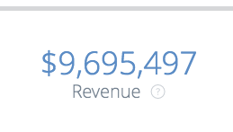

Total attributed revenue from Closed Won opportunities based on attribution model.

-Opportunity Details: Displays a breakdown of the related Opportunity IDs, Created Date, Close Date, ISO Code, and Revenue Attribution.  
-Show Details: A breakdown by month.

#### Overview (chart) Tile {#overview-chart-tile}

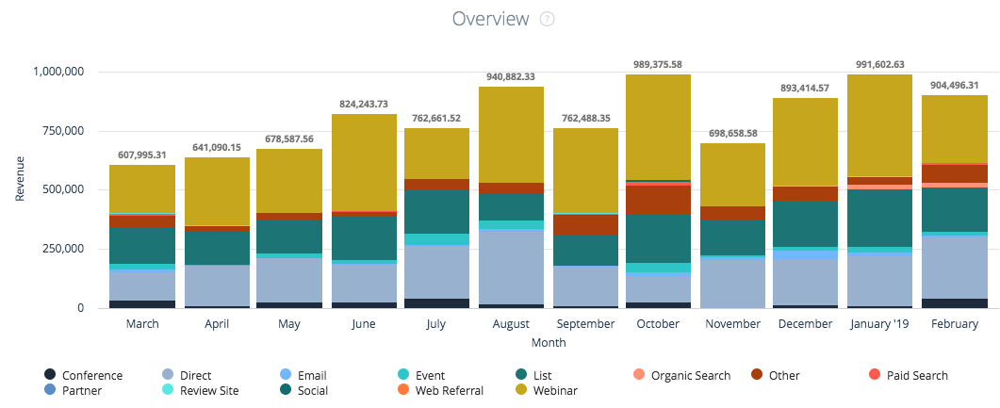

Chart will display revenue attributed to each channel, shown over time.

-Opportunity Details: Displays a breakdown of the related Opportunity IDs, Created Date, Close Date, ISO Code, and Revenue Attribution.  
-Displays a breakdown of the contributing Opp IDs:

* By ROI Week
* By ROI Data
* By ROI Hour
* By ROI Minute
* By ROI Time

#### Spend Tile {#spend-tile}

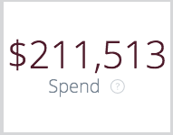

The total amount of spend from both API costs and self-reported costs for the given time period.

>[!NOTE]
>
>When drilling in on less than a month, Bizible will average the spend for that month and allocate that average to each day.

-Spend Details: Displays a breakdown of the related Spend Campaign Unique ID, Campaign Name, Channel, Subchannel, Date, Original Currency, Spend.  -Show Details: A breakdown by month.

#### ROI Tile {#roi-tile}

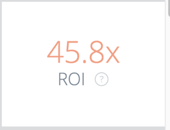

The calculated ROI (return on investment) from the total revenue (from the selected attribution model) and total spend (Revenue Tile ÷ Spend Tile = ROI Tile).

#### Deals Tile {#deals-tile}

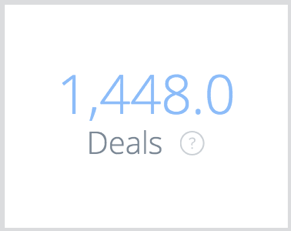

Displays the total number attributed deals (Deals are a count of Closed Won opportunities).

>[!NOTE]
>
>If the date type “Touchpoint Date” is selected, partial counts are possible because there may be certain touchpoints that do not fall within the time range.

-Opportunity Details: Displays a breakdown of the related Opportunity IDs, Created Date, Close Date and Attribution (count).  -Show Details: A breakdown by month.

#### Cost Per Deal Tile {#cost-per-deal-tile}

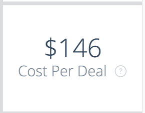

Average cost that it takes to acquire one closed won opportunity. The total spend divided by the total number of deals (Spend Tile ÷ Deals Tile = Cost Per Deal Tile).

#### Pipeline Revenue Tile {#pipeline-revenue-tile}

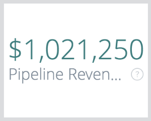

The total potential attributed revenue for open Opportunities

>[!NOTE]
>
>The revenue will be reflected for the attribution model specified.

-Opportunity Details: Displays a breakdown of the related Opportunity IDs, Created Date, Close Date, ISO Code, and Revenue Attribution.  -Show Details: A breakdown by month.

#### Deal Size Tile {#deal-size-tile}

The average revenue of Closed Won opportunities (Revenue Tile ÷ Deals Tile = Deal Size Tile).

#### Channel Summary Tile {#channel-summary-tile}

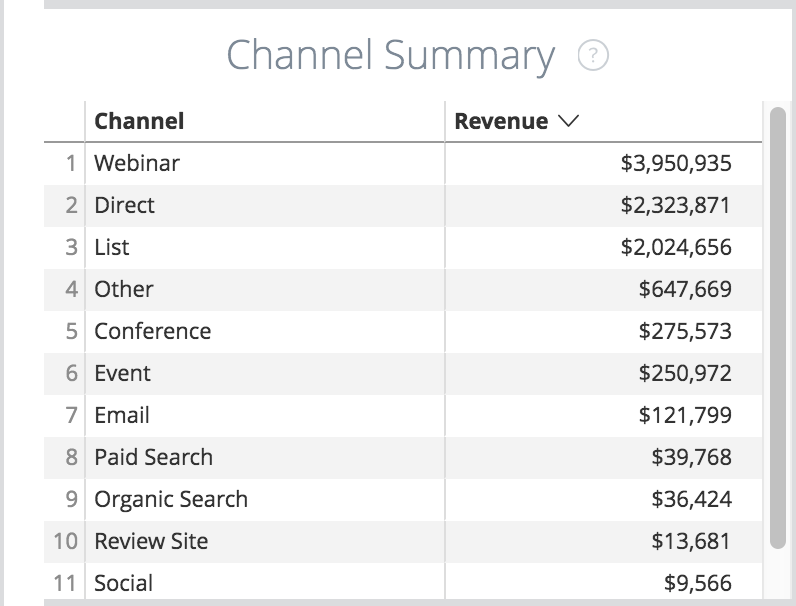

Display a list of channels based on metric selected (revenue, pipeline revenue, spend, deals, opportunities, leads, contacts).

#### Subchannel Summary Tile {#subchannel-summary-tile}

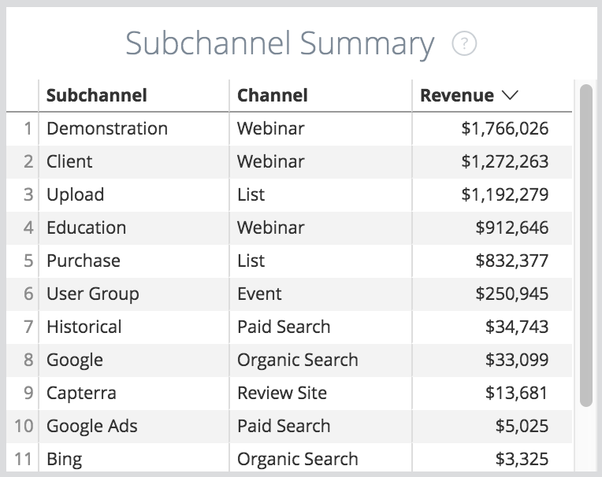

Display a list of sub-channels based on metric selected (revenue, pipeline revenue, spend, deals, opportunities, leads, contacts).

#### Campaign Summary Tile {#campaign-summary-tile}

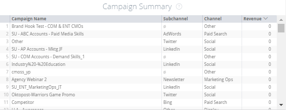

Display a list of Campaigns based on metric selected (revenue, pipeline revenue, spend, deals, opportunities, leads, contacts).

#### ROI (chart) Tile {#roi-chart-tile}

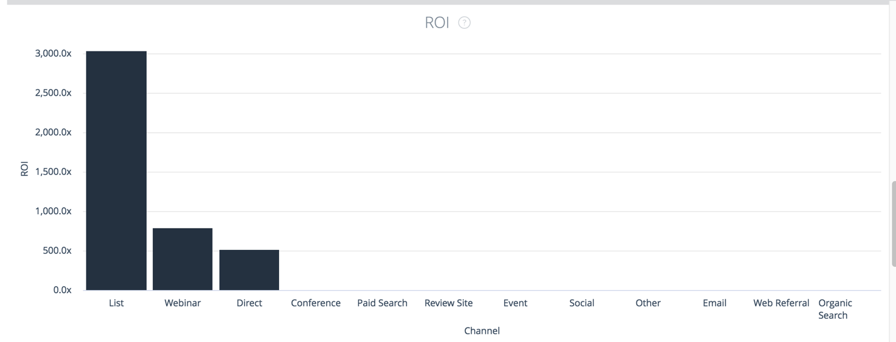

Displays ROI that was attributed to the metric that is selected (channel, sub-channel, campaign, account, adgroup, ad, advertiser, creative, keyword, placement, site) based off the attribution model selected.

#### ROI Summary Tile {#roi-summary-tile}

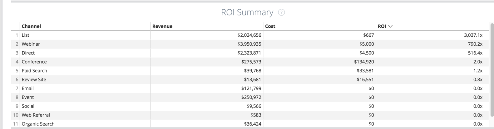

Displays ROI that was attributed to the metric that is selected (channel, subchannel, campaign, account, adgroup, ad, advertiser, creative, keyword, placement, site) based off the attribution model selected.

-Opportunity Details: Displays a breakdown of the related Opportunity IDs, Created Date, Close Date and Attribution (count).

-Show Details: A breakdown by month.
