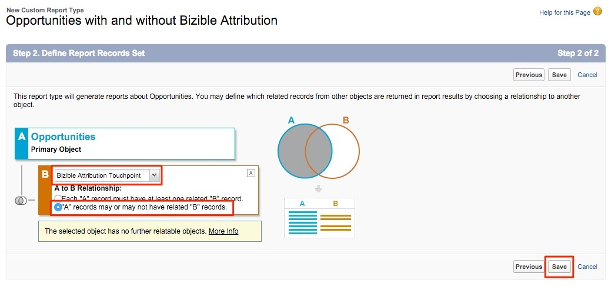

# Reporting on Opportunities with or Without Bizible Attribution Touchpoints {#reporting-on-opportunities-with-or-without-bizible-attribution-touchpoints}

Reporting on Opportunities with or Without Bizible Attribution Touchpoints - Bizible - Product Documentation

Create a new Report Type to include all Opportunities with or without Bizible Attribution Touchpoints.

1. Go to **Setup** > **Create** > **Report Types**.

   

1. Select **New Custom Report Type**.

   

1. Set the Primary Object as "Opportunities."

    * Name the Report Type Label as: "Opportunities with or without Bizible Attribution."
    * Use the same naming for the Report Type Name. Within the description input, “Opportunities with or without Bizible Attribution Touchpoints.”
    * Save the Report within the “Other” and set the report to “Deployed.”

   

1. From there, you will link the Opportunities Object to the Bizible Attribution Touchpoints Object. Ensure that you choose the button "'A' records may or may not have related 'B' records.” Click **Save** when done.

   

>[!NOTE]
>
>**Related Articles**
>
>[Bizible University: Additional SFDC Reports](https://universityonline.marketo.com/courses/bizible-fundamentals-bizible-102/#/page/5c5cb68dfb384d0c9fb96cd0)

