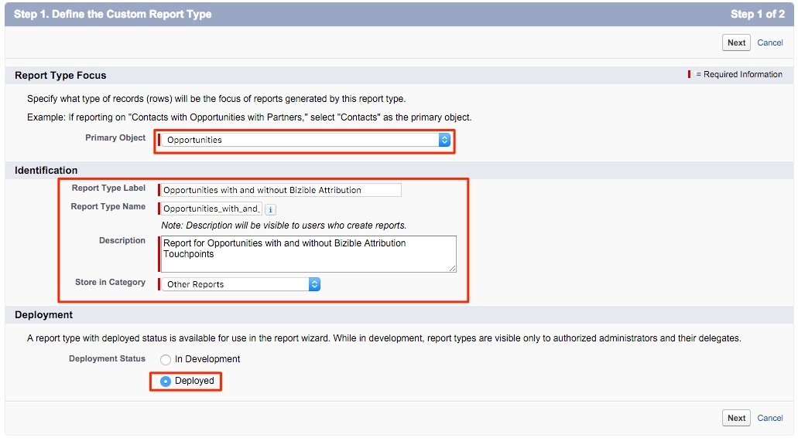

# Report Type for Contacts Without Opportunities {#report-type-for-contacts-without-opportunities}

Report Type for Contacts Without Opportunities - Bizible - Product Documentation

In order to report on Contacts with Bizible Touchpoints that are not associated to an Opportunity, you need to create a custom report type.

1. Go to **Setup** > **Create** > **Report Types**.

   

1. Select **New Custom Report Type**.

   

1. Set the Primary Object as “Contacts.” Name the Report Type Label as “Contacts with Bizible Touchpoints.” Use the same naming for the Report Type Name. Within the description input, “Contacts with Bizible Touchpoints.” Save the Report within the “Other” and set the report to “Deployed.”

   

1. From there, you will link the Contacts Object to the Bizible Touchpoints Object. Ensure that you choose the button "Each "A" record must have at least one related "B" record.”

   

1. Click **Save** and you’re done!

