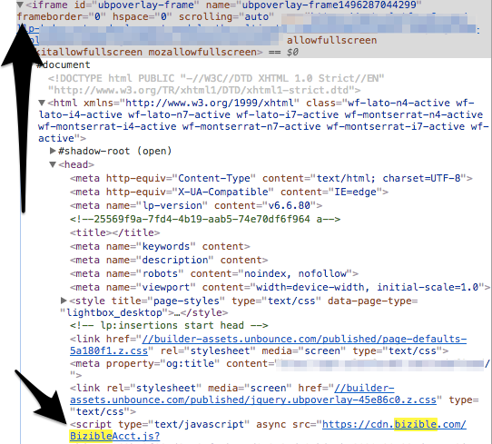

# Adding Bizible Script to Lightbox Forms {#adding-bizible-script-to-lightbox-forms}

Adding Bizible Script to Lightbox Forms - Bizible - Product Documentation

Learn how to properly add Bizible’s JavaScript to a form within a lightbox.

A lightbox opens a form in front of your content when the visitor performs a specific action (IE clicking on a particular portion of the page, spending a certain period of time on the page, etc.). Typically we just ask to have the Bizible JavaScript placed in the head of the landing page, but for forms within a lightbox there’s one extra step needed.

Since a form within a lightbox is basically a form within an IFrame, we’ll need our script placed within that iFrame.

First, locate the IFrame the lightbox form lives in.

Next, place the Bizible JavaScript within the IFrame.

Finally, when the JavaScript is added, we encourage you to validate form submissions are being tracked by following these directions:

1. Copy the URL of the landing page containing the lightbox form.
1. Open an Incognito browser and paste the URL.
1. Submit the form using a unique email address.
1. Confirm the test was tracked by checking your CRM for the unique email address used, ensure Touchpoint data is populating.

