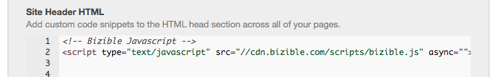

# Adding Bizible to Hubspot {#adding-bizible-to-hubspot}

Adding Bizible to Hubspot - Bizible - Product Documentation

Learn how to add the Bizible JavaScript to track your Hubspot landing pages and form submissions.

Hubspot is a bit different from other marketing automation systems in that it can host your landing pages / forms AND your website. It's important to note that the below instructions are for having Bizible track activity on Hubspot-hosted pages. If you power your website with a CMS other than Hubspot (e.g. Wordpress), you will need to add the Bizible JavaScript to that CMS as well.

>[!NOTE]
>
>If you are deploying the JavaScript through a tag management provider such as Google Tag Manager, you do not need to manually hard code the Bizible JavaScript into your website.

#### Getting Started {#addingbizibletohubspot-gettingstarted}

Once you have logged into your Hubspot account, follow these steps.

1. Navigate to Content.
1. Click **Content Settings**.
1. Within Content Settings, click on the Site Header HTML (see image below).
1. Add the following script within your <header>:

   **

   It should look like this:  
   

>[!TIP]
>
>There may already be other tracking code snippets in this area, such as a Google Analytics code. Be sure to separate them by a semicolon (;) and a single space, like so:  
  
>**; **

