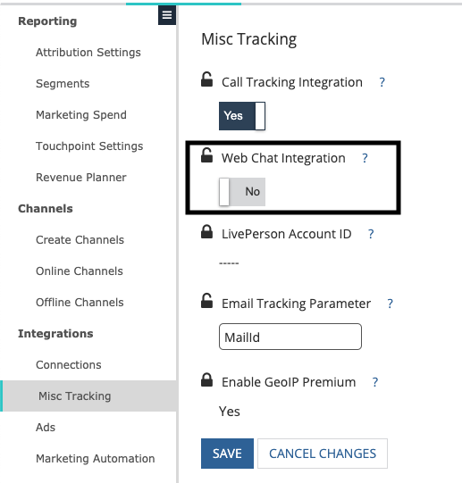

# Drift Integration FAQ {#drift-integration-faq}

Drift Integration FAQ - Bizible - Product Documentation

As a part of Bizible's integration with Drift, we've outlined some of the most frequently asked questions. If there are any questions not outlined below, please reach out to your Customer Success Manager or [`[email protected]`](http://docs.marketo.com/cdn-cgi/l/email-protection#70030500001f02043012190a19121c155e131f1d).

#####

### What's in this article? {#what-s-in-this-article}

[What's in this article? How is the integration enabled?](#driftintegrationfaq-55howistheintegrationenabled)  
[What does the integration do?](#driftintegrationfaq-whatdoestheintegrationdo)  
[What if I track Drift via campaign sync rules?](#driftintegrationfaq-whatifitrackdriftviacampaignsyncrules)  
[What if I track Drift via CRM Campaigns?](#driftintegrationfaq-whatifitrackdriftviacrmcampaigns)  
[What if I track Drift via Activities?](#driftintegrationfaq-whatifitrackdriftviaactivities)

How is the integration enabled? {#driftintegrationfaq-55howistheintegrationenabled}

For customers who utilize Drift's chat services, enabling Bizible's Drift integration is very straight forward. When logged into [apps.bizible.com](http://apps.bizible.com), your account's Bizible admin needs to navigate to Settings > Integrations > Misc Tracking, flip the "Web Chat Integration" toggle to "Yes" and click **Save**.

##### What does the integration do? {#driftintegrationfaq-whatdoestheintegrationdo}

The integration now allows Bizible to track when an end-user provides their email address in a Drift chat. From there we create touchpoints from these interactions with a Touchpoint Type of "Web Chat." This integration allows marketers to understand the performance of their chat interactions, along with the channels/sub-channels/campaigns that drive people to interact with these chats.

##### What if I track Drift via campaign sync rules? {#driftintegrationfaq-whatifitrackdriftviacampaignsyncrules}

If there are any campaign sync rules in place to create touchpoints for Drift chat interactions, you'll need to ensure you stop adding those particular end-users into the corresponding CRM Campaign. Otherwise once the feature bit is enabled we will create a CRM Campaign touchpoint and digital touchpoint for one Drift chat interaction.

##### What if I track Drift via CRM Campaigns? {#driftintegrationfaq-whatifitrackdriftviacrmcampaigns}

If there are CRM campaigns in place to create touchpoints for Drift chat interactions, a Touchpoint End Date will need to be set on those specific campaigns (the Touchpoint End Date should be the date the Web Chat Integration feature bit is enabled).

##### What if I track Drift via Activities? {#driftintegrationfaq-whatifitrackdriftviaactivities}

If there are activity rules in place to create touchpoints for Drift chat interactions, an additional piece of logic will need to be added to the rules. You'll need to add logic using the Task Created Date field to prevent duplication of touchpoints from being created (IE CrmTask.CreatedDate is Less Than the date in which the feature bit was enabled). See screenshot below for example.

