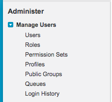
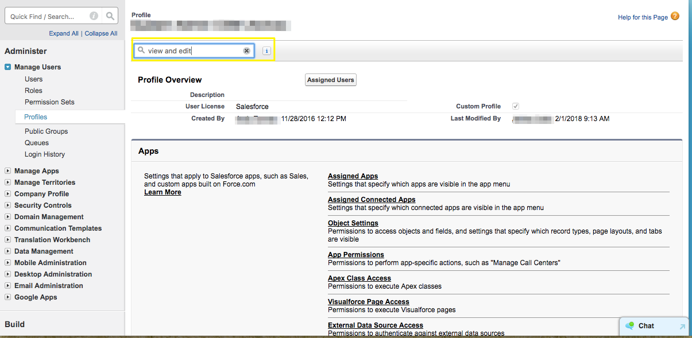
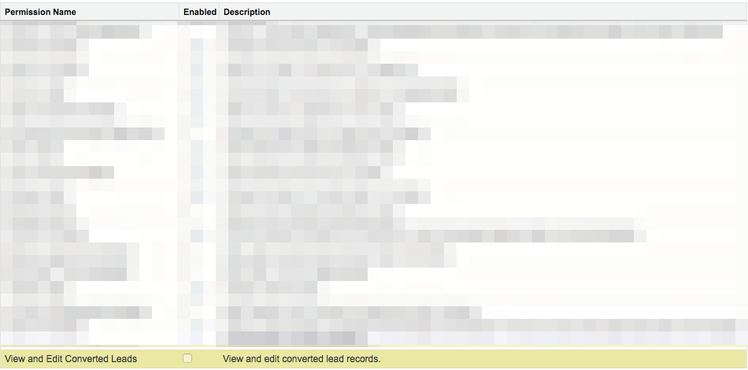

# Enabling the Permission to Edit Converted Leads {#enabling-the-permission-to-edit-converted-leads}

Enabling the Permission to Edit Converted Leads - Bizible - Product Documentation

Learn how to enable the permission to edit converted lead records in Salesforce. Bizible has the ability to push data to your various objects in Salesforce. When pushing to Leads, we find that in some scenarios we may need to re-push to a lead record that has already been converted. In order for us to push data to those records, the user that we are connected through must have the permission to view and edit converted leads at the profile level.

1. Go to Setup and expand the Manage Users grouping to select Profiles.

   

1. Select the Profile of the user we are connected through.
1. Search for the permission to View and Edit Converted Leads.

   

1. Check the box to enable the permission to view and edit converted leads.

   

   And you're done!

