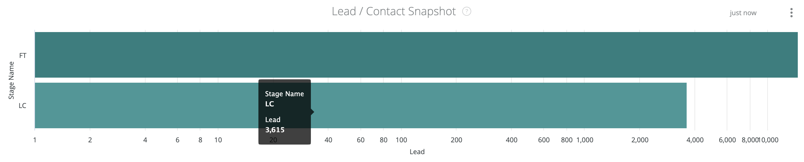
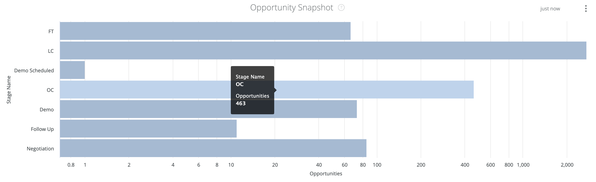

# Snapshot Dashboard Documentation {#snapshot-dashboard-documentation}

Snapshot Dashboard Documentation - Bizible - Product Documentation

Snapshot dashboard enables you to view the state of your CRM at any given point in time, with the distribution of records across Lead/Contact and Opportunity stages.

This dashboard has two tiles:

* **Lead/Contact Snapshot:** The number of Lead or Contact records in each stage on the selected date.

>[!NOTE]
>
>Across all Discover dashboards, only one person object, either Lead or Contact, can be reported. This is set in Settings - Reporting - Attribution Settings - Default Dashboard Object.

* **Opportunity Snapshot:** The number of Opportunity records in each stage on the selected date.

This dashboard supports the following filters (all filters apply to both tiles):

* Snapshot Date: select the snapshot date.
* CRM Account ID/Name: filter the records by CRM Account IDs or Names.

>[!NOTE]
>
>Suggestions show names only.

* Channel: filter the records by channels. A record is associated to a channel if any of its touchpoints are associated to the channel.
* Subchannel: filter the records by subchannels. A record is associated to a subchannel if any of its touchpoints are associated to the subchannel.
* Campaign: filter the records by campaigns. A record is associated to a campaign if any of its touchpoints are associated to the campaign.
* Campaign Source: filter the records by campaign sources. Example campaign sources are Adwords, BingAds, Facebook, LinkedIn etc. A record is associated to a campaign source if any of its touchpoints are associated to the campaign source.
* Ad Account ID/Name: filter the records by Ad Account IDs or Names. A record is associated to an Ad Account if any of its touchpoints is associated to a campaign from the selected Ad Accounts.

>[!NOTE]
>
>Suggestion show names only.

* Segment filters: filter the records by custom segments. A record is associated to a segment if any of its touchpoints are associated to the segment.

Across all filters, "AND" logic is used.

>[!NOTE]
>
>If a record changes stage on the selected date, the record will be counted for the from and to stages, and all pass-through stages.

#### Lead/Contact Snapshot {#snapshotdashboarddocumentation-lead-contactsnapshot}

Stages include FT, LC and selected Funnel stages in Open Lead/Contact Stages (Settings > CRM > Stage Mapping).

You can drill down from each bar to view the Lead/Contact records for each stage.

#### Opportunity Snapshot {#snapshotdashboarddocumentation-opportunitysnapshot}

Stages include FT, LC, selected Funnel stages in Open Lead/Contact Stages (Settings > CRM > Stage Mapping). And OC and selected Funnel stages in Open Opportunity Stages (Settings > CRM > Stage Mapping).

You can drill down from each bar to view the Opportunity records for each stage.
