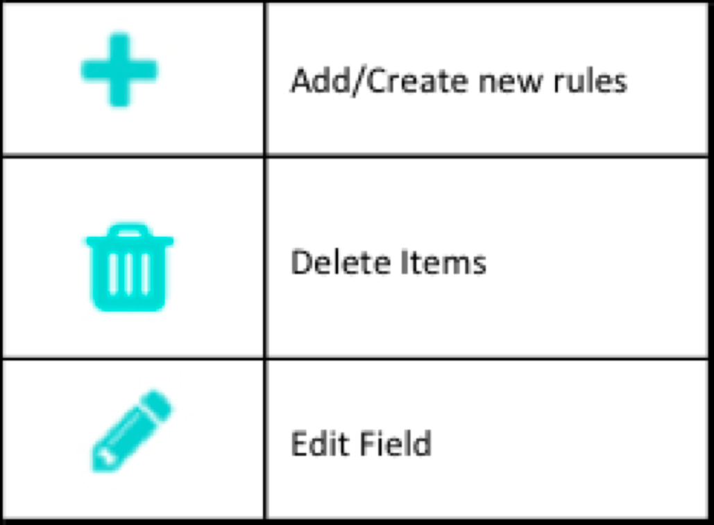

# Custom Segmentation {#custom-segmentation}

Custom Segmentation - Bizible - Product Documentation

Segments provide the ability to filter data in the Bizible ROI Dashboard in order to further drill down on a specific data set. For example, a segment could be defined by geographic territory or a grading system.

**Why Custom Segmentation?**

The Custom Segmentation feature allows you to filter Touchpoints by one category and by up to five segments. Depending on what Object your ROI Dash is pointed to (Lead or Contact), you can create segments based on the fields found on the Lead/Contact Object. As well, you'll be able to create segments based on any fields found on the Opportunity Object.&nbsp;

**When is the Custom Segmentation feature helpful?**

Custom Segmentation can be used to see data for a particular record type. Once you map the filter logic, you should be able to see in the Bizible dashboard’s Demand Waterfall View--the same data you would see in your CRM.

**How do I set it up?* 
***

Step 1 - Determine what information you want to see.

Before you use this feature, figure out what touchpoint information you’d like to filter by. Remember to use the exact values in your CRM for your record types. The setup will filter touchpoints from the top to the bottom of the marketing funnel.

Step 2 - Login and locate the Segments feature.

* Go to apps.bizible.com and log-in
* Under the My Account tab, select Settings
* Select Segments from the options on the sidebar to the left, under the Reporting section

Step 3 - &nbsp;Understand the components.

* Use this legend to understand the various icons found on this page

&nbsp;    
  
Step 4 - &nbsp;Add Filter Rules

* First, enter the category name. Business Type is an example. Click the check mark when you are finished. You need to enter a category name before you can add segments
* Click the plus sign to add a segment
* Enter a Segment name. For example, you could&nbsp;have one segment for New Business, Partners, Renewal, or Upsell

* Click on the plus icon to reveal the rule input fields. The options in the Field&nbsp;picklist pulls fields directly from your CRM

&nbsp; 

>[!NOTE]
>
>Formula fields cannot be used within your rules and will not appear in the picklist. Because formulas calculate in the background and do not modify a record, Bizible cannot detect whether a record fits a rule or not.

* The Value option is not a drop down and its value must be entered manually. Be sure to check the values in your Salesforce org
* Repeat this process for the Opportunities segment rules
* The “Other” category is a default segment that will capture any undefined Touchpoints. You can change the default segment’s name
* Click the trashcan icon to delete a whole category or an individual rule within a category. Alternatively, click the pencil icon to edit the category or rule
* You will notice that you have a “Save” button and a “Save and Process” button. Use the Save button to save your work and changes over time. Use the Save and Process button ONLY once you have made sure that:&nbsp;

    * Your mapping is accurate
    * You added all the segments you want to track within a category
    * The Save and Process button triggers Bizible to sync all your Touchpoints and apply the new information you added. This process takes 7 days and rules cannot be changed during this period

***`Additional Notes:`***

If rules aren’t set up for both Leads/Contacts and Opportunities, you will see only a portion of your data. To elaborate, if you do not set up the Opportunities rules, you will only see Lead/Contact data without the Opportunities associated with it. The same is true if you do not set up rules for Leads/Contacts--you will only see Opportunities without the associated Leads/Contacts.

When you are done, click Save first, double check everything, and then click Save and Process. Remember that you will be unable to edit your settings for seven days when you save and process, as Bizible is reformatting your data during this time.

**How do I save the generated reports?**

You cannot save the generated reports directly in the user interface. However, Bizible saves the segment names in the URL so you can keep a record of each report by bookmarking the page.

