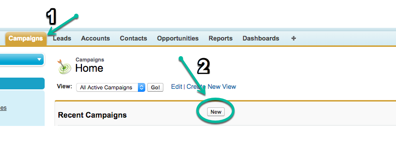

# Syncing Offline Campaigns {#syncing-offline-campaigns}

Syncing Offline Campaigns - Bizible - Product Documentation

It can be difficult to accurately track offline campaigns and understand how they compare to your digital marketing efforts. Bizible enables you to track and attribute Touchpoints to your offline campaigns in Salesforce, even in situations when a Salesforce campaign isn’t created until a few weeks after the event. &nbsp;

### What's in this article? {#what-s-in-this-article}

[Before You Sync](#syncingofflinecampaigns-beforeyousync)  
[Bulk Update Touchpoint Date](#syncingofflinecampaigns-bulkupdatetouchpointdate)  
[How to Create a Campaign and Sync Bizible Touchpoints](#syncingofflinecampaigns-howtocreateacampaignandsyncbizibletouchpoints)

#### Before You Sync {#syncingofflinecampaigns-beforeyousync}

Here are some tips for an efficient syncing process:

* Offline campaigns refer to marketing interactions that do not occur online. These include marketing channels like events, webinars, and tradeshows. Only include offline marketing campaigns.
* If you want to include campaigns that tracked online activity prior to when you installed Bizible, be sure to set the Touchpoint End Date as the date our JavaScript was deployed on your site.
* It is helpful to keep the Bizible app open on the Offline Channels page so that it is easy to identify the different Campaign Types, along with what Marketing Channel the Touchpoints will be bucketed into.
* Double check everything before you hit the “Save” button!

#### Bulk Update Touchpoint Date {#syncingofflinecampaigns-bulkupdatetouchpointdate}

In Salesforce, the Created Date field on the Campaign Member Object notes the date the Campaign Member was added to the campaign. In order for the syncing process to go smoothly, make sure the Bizible Touchpoint Date Field has the same date as the date on the Salesforce Campaign Member Object. This step is performed using the “Bulk Update Touchpoint Date button,” **before** you select the picklist option in the Enable Bizible Touchpoints field.

Why is this important? Imagine for a moment that your company sponsored a booth at a conference in January. At the conference, 100 individuals showed interest in your product and provided their contact information to receive email updates. Three weeks later, you finally created a campaign in Salesforce to track the outcome of the conference.

Your upload date would be three weeks later than the conference date. To fix this difference, the Bulk Update Touchpoint Date button can be used to set the appropriate date. The button is pictured in the image below.

In this case, it would backfill the upload date by three weeks. This step should be done prior to setting the “Enable Bizible Touchpoints” field.

In summary, if you use the Bulk Update Touchpoint Date button and change the Touchpoint date to the date of the event, Bizible will generate Touchpoints for the actual date of the event--not the date of the upload.

You can also update the dates for all campaign members on an existing campaign. When doing this, be sure the date of the Touchpoint is the date of the member’s interaction. Simply click on the Bulk Update Bizible Touchpoint Date, filter the list of campaign members as appropriate, and in the “Select Date” option above the list of campaign members, add the the same date as the date the event took place.

>[!CAUTION]
>
>Make sure you update the Touchpoint date **before** you enable Touchpoints for all campaign members.

` 

` `  
` 

#### How to Create a Campaign and Sync Bizible Touchpoints {#syncingofflinecampaigns-howtocreateacampaignandsyncbizibletouchpoints}

To create a Campaign in Salesforce, navigate to the Campaigns tab and select ‘New’ as shown in the image below. Depending on your Salesforce setup, you might need to add Campaigns to the top bar by clicking the plus (+) icon.

When you are creating this campaign, click the “Enable Bizible Touchpoints” field and select one of the following options from the picklist:

* **Include all campaign members**

    * This option enables Bizible to attribute a Touchpoint to each campaign member.

* **Include “Responded” campaign members.**

    * This option applies Touchpoints to campaign members who have a “Responded” status.

* **Exclude all campaign members.**

    * This option does not attribute Touchpoints to any members in the campaign and acts as a flag that the campaign was deliberately excluded from Bizible. If you ever sync a campaign with Bizible Touchpoints on accident, you can change the status to "Exclude all campaign members," and the Touchpoints will be removed.

Once one of these selections is chosen, Bizible will assign each campaign member a Touchpoint if applicable. The Lead or Contact that is added to the campaign *must *have an email address associated to their record in order for Bizible to create a touchpoint. Without an email address, Bizible will not assign a touchpoint to the campaign member.

>[!NOTE]
>
>**Related Articles**
>
>[Bizible University: Mapping Offline Channels](https://universityonline.marketo.com/courses/bizible-fundamentals-channel-management/#/page/5c630eca34d9f0367662b77f)
>
>[Bizible University: Campaign Object Fields](https://universityonline.marketo.com/courses/bizible-fundamentals-channel-management/#/page/5c63007334d9f0367662b758)

