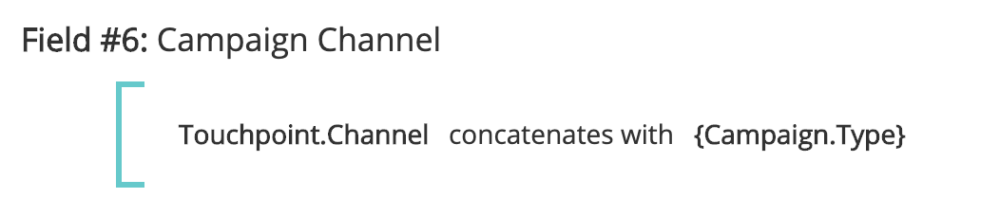

# Touchpoint Fields {#touchpoint-fields}

Touchpoint Fields - Bizible - Product Documentation

Historically, when customers onboard with Bizible and in the case where we don’t have a direct tagging integration, our Customer Success team educates our customers on how to appropriately tag their landing pages so they utilize the correct UTM format and we can resolve their ads. Some of these customers don’t use UTMs but rather use their own tagging parameters, which means it can be very time-consuming to edit all of their landing pages across all of their ad networks with a new tagging structure that Bizible enforces. In order to adapt to their tagging structure, we now accept custom parameters that can be mapped with our rule definitions. The goal is to adapt to customers' use of their custom tracking parameters so we don't have to require them to change their URL structure.&nbsp;

>[!NOTE]
>
>**Availability**
>
>Available now with Full Segmentation in Tier 2 and Tier 3.

>[!NOTE]
>
>This is an advanced feature and should be set up by Professional Services only.

### What's in this article? {#what-s-in-this-article}

[Enabling the Feature](#touchpointfields-enablingthefeature)  
[How To](#touchpointfields-howto)  
[Touchpoint Fields and Segments](#touchpointfields-touchpointfieldsandsegments)  
[FAQ](#touchpointfields-faq)

#### Enabling the Feature {#touchpointfields-enablingthefeature}

From the Bizible Settings menu, navigate to the Touchpoint Fields page. From there, you can enable the feature by selecting **Yes** under **Enable Calculated Fields**. Once that’s enabled, you're free to create Touchpoint Fields.

#### How To {#touchpointfields-howto}

To create a calculated field, keep in mind there are three different actions that a user can take: extracts, maps to, and concatenates. These are also known as the operators for defining a calculated field.

##### Extracts {#touchpointfields-extracts}

The extracts operator pulls the value out of a field from another location, such as: a Campaign field, Lead field, or in a more advanced use case, [extract custom parameters from the landing page](http://docs.google.com/document/d/1NRViyCsXvPKbCTfGW32Yi2vWBjMDRF7bzkzKj9s2DDA/edit?ts=5e20b482#heading=h.xxwtissvw4). It then places it onto a Touchpoint Field (See [Maps To Example](http://docs.google.com/document/d/1NRViyCsXvPKbCTfGW32Yi2vWBjMDRF7bzkzKj9s2DDA/edit?ts=5e20b482#heading=h.xxwtissvw4) #2).

**Example #1**

There’s a custom field on the Contact, campaign_source__c, that the customer wishes to drop onto the Touchpoint for reporting purposes. You can define a rule to create a Calculated Field called “Campaign Source” and drop the value into that field.

Goal: Use the value of a custom field and put it onto the Touchpoint object for easier reporting.

* Create a Calculated Field and label it “Campaign Source”
* Define the rule by starting out with searching for the Contact.Campaign_Source__c field
* Use the operator “extracts” since we need to pull out the value from the parameter
* To extract the full string from the field, we will use the expression “(.&#42;)”

    * **(** marks the start of the extraction
    * **)** marks the end of the extraction
    * **.&#42;** tells us that we are extracting the full string

**Example #2**

A common use case this feature enables is to pull out values from custom parameters of a URL string. This is useful if you use parameters other than UTMs but want to parse out the values onto touchpoint fields.   
  
**Link:** * `https://www.bizible.com/blog/marketing-revenue-reporting-overview?promo=5OFF`* or *https://www.bizible.com/blog/marketing-revenue-reporting-overview?promo=25OFF*.  
**Goal:** Create a custom field called “Discount Code” and drop in the value “5OFF” or “25OFF,” whatever value gets passed.

* Create a Calculated Field and label it “Discount Code”
* Define the rule by starting out with searching for the Touchpoint.Session.LandingPage field
* Use the operator “extracts” since we need to pull out the value from the parameter
* To extract the value of the promo, we will define the value as “promo=(\w+)”

    * **(** marks the start of the extraction
    * **)** marks the end of the extraction
    * **\w** tells us that we are extracting a “word” which includes 0-9
    * **+** will extract the full value of the parameter with no limit on characters
    * Take note that you’re using a forward slash and not a back slash

**Example #3**

Let’s try a similar example where we extract a tracking code such as: *https://www.bizible.com/blog/marketing-revenue-reporting-overview?cid=123456*.  
  
**Goal:** Create a Calculated Field and label it “Adobe Campaign Id” with the value from the cid parameter

* Create a Calculated Field and label it “Adobe Campaign Id”
* Define the rule by starting out with searching for the Touchpoint.Session.LandingPage field
* Use the operator “extracts” since we need to pull out the value from the parameter
* To extract the “123456” value, we will define the value as “cid=(\d{6})”

    * **(** marks the start of the extraction
    * **)** marks the end of the extraction
    * **\d** tells us that we are extracting a “digit”
    * **{6}** is the number of characters we are extracting

**Example #4**

As your landing pages get more complicated and you have multiple tracking parameters, you might need to build multiple touchpoint fields and extract values multiple times, such as:   
*https://www.bizible.com/blog/marketing-revenue-reporting-overview?trackID=123456&country=US&campaign_ID=7890*.  
  
**Goal:** Create multiple Calculated Fields for “Target Country” and “Custom Campaign Id” with the respective values from the parameters.

* Create a Calculated Field and label it “Target Country”
* Define the rule by starting out with searching for the Touchpoint.Session.LandingPage field
* Use the operator “extracts” since we need to pull out the value from the parameter
* To extract the “US” value, we will define the value as “country=(\w{2})”

    * **(** marks the start of the extraction
    * **)** marks the end of the extraction
    * **\w** tells us that we are extracting a “word”
    * **{2}** is the number of characters we are extracting

* Create a Calculated Field and label it “Custom Campaign Id”
* Define the rule by starting out with searching for the Touchpoint.Session.LandingPage field
* Use the operator “extracts” since we need to pull out the value from the parameter
* To extract the “123456” value, we will define the value as “campaign_ID=(\d{6})”

    * **(** marks the start of the extraction
    * **)** marks the end of the extraction
    * **\d** tells us that we are extracting a “digit”
    * **{6}** is the number of characters we are extracting

##### Maps to {#touchpointfields-mapsto}

The maps to operator creates a table of values that need to be translated or bucketed into another value. Usually, this takes the form of a key value where a code represents a friendly name and needs to be mapped to that friendly name.

**Example #1**

There are campaigns that you’ve created for an “End of summer promotion” and “Black Friday promotion” that run across multiple channels. You want to create a Calculated Field called “Initiative” and you want to map any touchpoints with an “End of summer promotion” or “Black Friday promotion” to an Initiative value such as “Promotions,” in addition to other possible values.

**Example #2**

Now that we’ve learned how to extract and map to fields, let’s combine those actions in order to first extract a value from a parameter, then map it to a friendly name that makes a little more sense. So let’s start with this landing page: `*https://www.bizible.com/blog/marketing-revenue-reporting-overview?BZ=04-01-09-03-10*.`  
  
**Goal:** Create multiple Calculated Fields, where the first number maps to a Region, the second maps to a Product, the third maps to an Initiative, the fourth maps to a Persona, and the fifth maps to a Media Platform. Then, map the numerical value to a “friendly name.”

* Create a Calculated Field and label it “Region”
* Define the rule by starting out with searching for the Touchpoint.Session.LandingPage field
* Use the operator “extracts” since we need to pull out the value from the parameter
* To extract the “04” value, we will define the value as “BZ=(\d{2})-\d{2}-\d{2}-\d{2}-\d{2}”

    * **(** marks the start of the extraction

        * Notice that since we are only extracting the 4, only the first digits have the open parenthesis

    * **)** marks the end of the extraction

        * Notice that since we are only extracting the 4, only the first digits have the closed parenthesis

    * **\d** tells us that we are extracting a “digit”
    * **{2}** is the number of characters we are extracting

* Click Save. You must Save your new field before it can be available to use for the next rule!
* Next, we will want to map all the possible values for the first digits to its friendly names
* Create a Calculated Field and label it “Region_Name”
* Define the rule by starting out with searching for your extracted field. In this case, Touchpoint.Region
* Use the operator “maps to” since we want to create a mapping for each number to its value
* You will be presented with a table to list each mapping. In the end, it will look something like this:
* Based off the mapping and the URL above, the “Region_Value” for a touchpoint with this landing page would be “EMEA”
* Repeat the extraction and the mapping for the remaining 4 sets of digits

    * To extract the 01, you would define the value as “BZ=\d{2}-**(\d{2})**-\d{2}-\d{2}-\d{2}”
    * To extract the 09, you would define the value as “BZ=\d{2}-\d{2}-**(\d{2})**-\d{2}-\d{2}”
    * To extract the 03, you would define the value as “BZ=\d{2}-\d{2}-\d{2}-**(\d{2})**-\d{2}”
    * To extract the 10, you would define the value as “BZ=\d{2}-\d{2}-\d{2}-\d{2}-**(\d{2})**”

##### Concatenates {#touchpointfields-concatenates}

The concatenates operator combines values from multiple fields into a single field. This is useful to create a custom value that pulls data across various fields in order to make

**Example #1**

There are separate fields on the Opportunity object for Segment__c and Grade__c that the user wants to combine into a single field on the Touchpoint object for reporting purposes. By concatenating the fields, you will see values such as Enterprise_A or Mid-Market_B.

#### Touchpoint Fields and Segments {#touchpointfields-touchpointfieldsandsegments}

Now that the values from your URL have been parsed out and exist on the Touchpoint, you will see the new fields wherever Touchpoint fields are used such as creating Segments or defining Touchpoint Deletion rules.

The ability to create Segments using Touchpoint fields is available with this product release. Segments could not be built with Touchpoint fields prior.

To make building out Segments easier, it’s now possible to create dynamic Segments from the Touchpoint Fields that were created. For example, if you created a Touchpoint Field that parsed out a geographic region, rather than creating a segment for each possible region, you can set up one segment and we’ll create segments for every instance a new value appears. This is extremely helpful if an attribute such as zip code needed to be parsed and used as a segment!

Your setup would look something like the screenshot below. The Segment Name dynamically pulls in the Touchpoint Field value using the curly brackets to search for your field.

The rule references the same Touchpoint Field and searches for values that are “not equal to null.”

#### FAQ {#touchpointfields-faq}

##### Is there a maximum number of Touchpoint Fields that we can create? {#touchpointfields-isthereamaximumnumberoftouchpointfieldsthatwecancreate}

There is a limit of 100 fields.

##### I don’t see my new Touchpoint Field that I just created in the picklist. Where is it? {#touchpointfields-idon’tseemynewtouchpointfieldthatijustcreatedinthepicklist-whereisit}

Don’t forget to Save your rules after you create it. If you don’t see your new field, check to see if you Saved. You must Save your new field before it can be available to use for the next rule.

>[!NOTE]
>
>Due to the level of complexity, a Touchpoint Field that uses the “maps to” operator is not available to be used in another Touchpoint Field.

##### What expression do I use to extract multiple parameters from a single landing page? {#touchpointfields-whatexpressiondoiusetoextractmultipleparametersfromasinglelandingpage}

Like in the Extract Example #4, you’ll need to create multiple fields to extract each of the parameters. So if you have five different values, you will create five Touchpoint Fields to extract each of them.

##### Why don’t I see my new fields in the Bizible schema? {#touchpointfields-whydon’tiseemynewfieldsinthebizibleschema}

There is additional work needed to expose the new fields in the Bizible Data Warehouse schema. At the moment, fields are exposed through settings and configuration so you can use the Touchpoint Fields in building Segments or creating Touchpoint Deletion rules.

##### How can I validate that my extract expression is valid and pulling the correct value? {#touchpointfields-howcanivalidatethatmyextractexpressionisvalidandpullingthecorrectvalue}

There’s an online tool ([https://regex101.com/](http://regex101.com/)) that you can run and test out the expression. The expression will appear green if it’s valid or red if it’s invalid. Also, the explanation box at the top right is helpful and tells you what you’re extracting.

