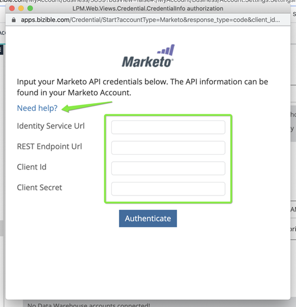

# Set Up Marketo Connection {#set-up-marketo-connection}

Set Up Marketo Connection - Bizible - Product Documentation

Here's how to set up your connection to Marketo.

1. In Bizible, click the **My Account** drop-down and select **Settings**.

   

1. Under Integrations, click **Connections**.

   

1. Click **Set Up New CRM Connection**.

   

1. Click the **Connect** button next to Marketo.

   

1. Follow the steps to add your Base URLs, Client Id, and Client Secret. We strongly recommend that you follow the Marketo instructions to set up a dedicated Bizible API user for the purposes of this integration. In the case that we need to debug or troubleshoot the connection through the API, we can pinpoint any issues through the dedicated Bizible API user.
1. Utilize the Marketo **Need help?** link to generate these values (if needed): [https://developers.marketo.com/rest-api/base-url/](https://developers.marketo.com/rest-api/base-url/) and [https://developers.marketo.com/rest-api/custom-services/.](https://developers.marketo.com/rest-api/custom-services/)

     

1. After you enter the values, click **Authenticate**. Your Marketo account will then be connected to Bizible.

   

   **Optional Step:** If your Person Sync has not yet been enabled, you can turn it on now. For each instance of Marketo, there is a daily cap of 50,000 REST API calls and 500MB of the Bulk API. You'll want to consider other partners and integrations that you may have with Marketo and allocate some to Bizible. To do this, navigate down to the Marketing Automation tab in the left-hand menu.

