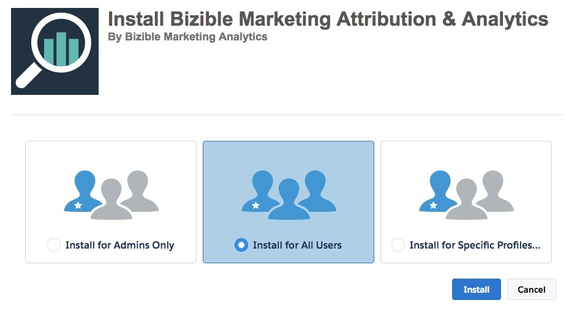
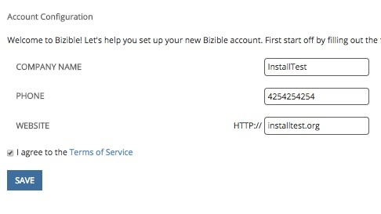
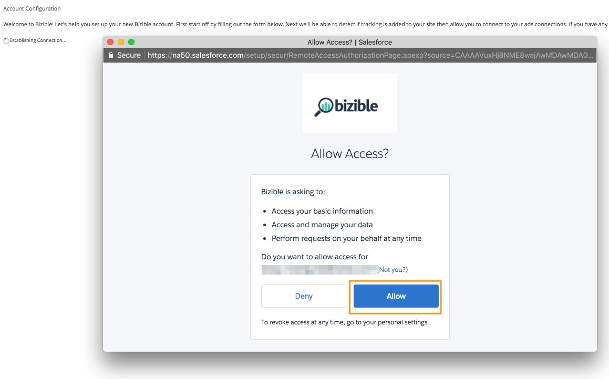
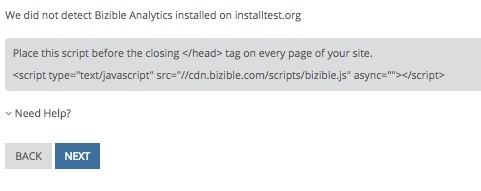
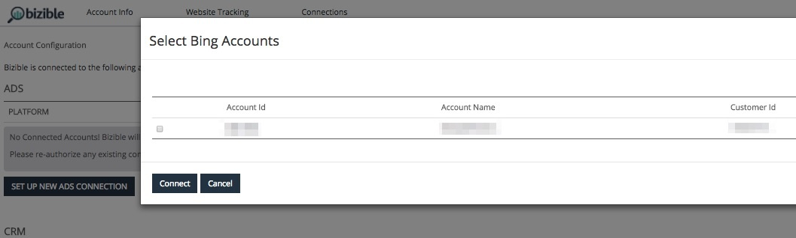

# Bizible Installation Guide {#bizible-installation-guide}

Bizible Installation Guide - Bizible - Product Documentation

In this guide we will be walking you through how to install and set up Bizible. For implementation we will need admin level access to the following:

* Salesforce
* Integrated Ad Platforms - AdWords, Bing Ads, and Facebook
* Website

#### Salesforce Packages to Install {#bizibleinstallationguide-salesforcepackagestoinstall}

We will be installing two packages within your Salesforce environment and then completing additional configuration for full visibility into Bizible.  
  
[Bizible.com/sf](http://Bizible.com/sf): This is our base package which includes our custom objects and fields. We recommend installing within Production for all users.  
  
[Bizible.com/dashboard-mt](http://Bizible.com/dashboard-mt): This is our Dashboard Extension Package, which contains 3 pre-built dashboards. We recommend installing within Production for all users.

#### Salesforce Configuration {#bizibleinstallationguide-salesforceconfiguration}

[Page Layouts](http://docs.marketo.com/x/rwEgAQ): This is not necessary, but making these page layout updates allows Bizible Touchpoints to be visible on an individual record.

[Bizible Permission Sets](http://docs.marketo.com/x/pQEgAQ): These are assigned to the users of the Bizible product based on the level of accessibility you’d like the users to have.

[Sharing Reports and Dashboard Folders](http://help.salesforce.com/articleView?id=analytics_share_folder.htm&type=0): Out of the box, the reports and dashboard folders we create are only visible to the install user. These will need to be shared with additional Bizible users.

[Hide Report Types](http://docs.marketo.com/x/oQEgAQ): Many of the Report Types we create within our product are not needed. To avoid confusion when learning to report on the product, we recommend hiding those that you don't need.

[Custom Amount Field Workflow](http://docs.marketo.com/x/qQEgAQ) (if necessary): If you are using a custom amount field to record revenue in Salesforce, we will need a workflow created to map this field value to our Bizible Opportunity Amount field for revenue attribution reporting. Please be sure to let your Success Manager know if you're using a custom amount.

#### Creating the Bizible Account {#bizibleinstallationguide-creatingthebizibleaccount}

Once the packages are downloaded and Salesforce has been configured, we will then move forward with creating the Bizible Account at which point we will connect Ad Platforms.

[Sf.bizible.com/signup](http://Sf.bizible.com/signup), or [sf.bizible.com/salesforce/sandboxsignup](http://sf.bizible.com/salesforce/sandboxsignup) if installing in Sandbox.

1. You will begin adding in Account Details: Company Name, Phone Number, and Website. After the fields are populated, you will select to agree to the terms of service and save. 

1. This will generate a pop-up window for you to authenticate the connection to your Salesforce org at which point you will select **Allow**.

   

1. Once the connection is established, you will be brought to the next page which contains our JavaScript. The [JavaScript](http://docs.marketo.com/x/qwEgAQ) needs to be placed across the entire site and landing pages. We recommend hardcoding the script within the head of your landing pages or adding through a Tag Management System such as [Google Tag Manager](http://docs.marketo.com/x/rQEgAQ).

   

   Within the next page, you will connect the API integrated Ads accounts: AdWords, Bing Ads, and Facebook.

1. Select **Set Up New Ads Connection** and log-in with your Ad account's credentials. A window will pop-up for you to select the account you’d like to connect. After connecting all accounts, click **Finish**.

   

   Once you complete all of the above steps, you're good to go. If you run into any issues along the way, please don’t hesitate to reach out to your Bizible representative or [`[email protected]`](http://docs.marketo.com/cdn-cgi/l/email-protection#d0a3a5a0a0bfa2a490b2b9aab9b2bcb5feb3bfbd).

