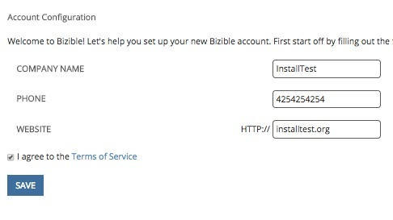
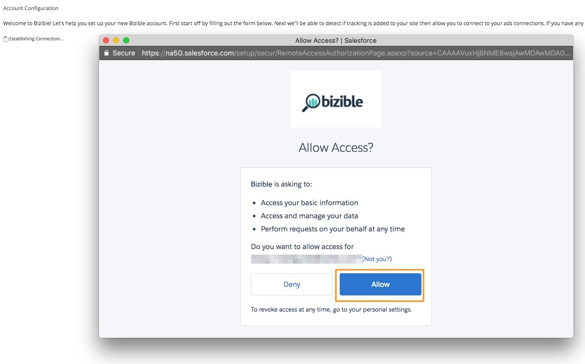
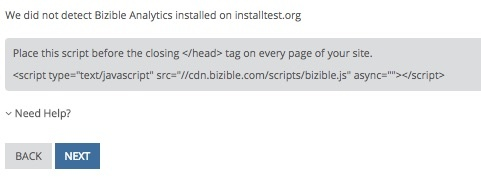
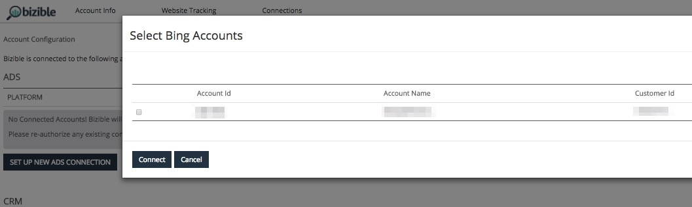

# Bizible Quick Start {#bizible-quick-start}

Bizible Quick Start - Bizible - Product Documentation

We understand that not all Marketing teams want (or have access) to run marketing reporting out of the CRM, whether it’s because of limited access, CRM ownership, longer time to value, or legal implications. Going down the path of Bizible Quick Start gives you the ability to effectively implement and run Bizible with as little reliance on the CRM as possible.

### What's in this article? {#what-s-in-this-article}

[Standard Bizible Installation](#biziblequickstart-standardbizibleinstallation)  
[How It Works](#biziblequickstart-howitworks)  
[Permissions](#biziblequickstart-permissions)  
[Setup](#biziblequickstart-setup)

#### Standard Bizible Installation {#biziblequickstart-standardbizibleinstallation}

Through the standard Bizible installation, you're required to install a Salesforce Package or a Microsoft Dynamics Managed Solution. The installation includes custom objects/entities and custom fields that are added to the CRM that Bizible can then write data to. This ultimately leads to a longer onboarding time due to tracking down the appropriate owner/administrator, creating new users and profiles, and getting through security clearances to install to a production instance—and sometimes creating a separate workstream to test out the installation in a sandbox instance.

Although having a package presents Bizible data in its full capacity inside the CRM, we find it’s not always necessary given the various use cases. If reporting can be conducted outside of the CRM (such as within Bizible Discover or an external Data Warehouse), Bizible Quick Start is a fast and easy way to get set up with Bizible without having to install the Bizible package.

#### How It Works {#biziblequickstart-howitworks}

* Robust JavaScript & Integrations

    * High quality data straight from the source
    * Bizible.js for on-site behavior, reading UTM parameters, referral sources, and more
    * Integrations with prominent ad networks and martech providers for for streamlined, granular data

* CRM Authorization

    * Still need authorization to read data from the CRM for lead, contact, and opp data

* Customization in apps.bizible.com

    * Customize configuration in apps.bizible.com instead of in the CRM

        * Channels and subchannels
        * Segments
        * Stages
        * Attribution model weighting

* CRM Campaign Sync

    * One of those customizations enables customers to connect CRM campaign data to the right fields through the Campaign Sync feature
    * Write rules in apps.bizible.com to determine which campaigns and conditions receive touchpoints
    * Far less effort required compared to CRM package installation

* Reporting in Discover & Data Warehouse

    * Report where you want:

        * Bizible Discover — couples unparalleled performance data with impactful visualizations
        * Data Warehouse — connect your attribution data with other datasets and report in your BI tool

#### Permissions {#biziblequickstart-permissions}

Bizible requires access to standard Salesforce objects such as Leads and Contacts. We strongly recommend having an integration user or a dedicated Bizible Administrator Salesforce user serve as the connected user, as they will have the proper data access privileges.

In order to ensure that all data is properly pulling from Salesforce, we require the following security and accessibility settings: View All Data for the Profile of the dedicated user. This permission set gives Bizible the access needed to download data from standard objects. This permission set is at profile level.

#### Setup {#biziblequickstart-setup}

We begin by creating the Bizible Account to set up the CRM connection, which will be followed up with connecting all the ad connections.

1. Go to `https://sf.bizible.com/signup`, or `https://sf.bizible.com/salesforce/sandboxsignup` if installing in Sandbox.
1. Add account details: Company Name, Phone Number, and Website. After the fields are populated, select **I agree to the Terms of Service** and click **Save**.

   

1. This will generate a pop-up window for you to authenticate the connection to your Salesforce org. Click **Allow**.

   

1. Once the connection is established, you will be brought to the next page which contains our JavaScript. The JavaScript needs to be placed across the entire site and landing pages. We recommend hardcoding the script within the head of your landing pages or adding through a Tag Management System such as Google Tag Manager.

   

1. Within the next page, you will connect the API integrated Ads accounts: AdWords, Bing Ads, and Facebook.
1. Select **Set Up New Ads Connection** and log-in with your Ad account's credentials. A window will pop-up for you to select the account you’d like to connect. After connecting all accounts, click **Finish**.

   

   Once you complete all of the above steps, you're good to go. If you run into any issues along the way, please don’t hesitate to reach out to your Bizible representative or [`[email protected]`](http://docs.marketo.com/cdn-cgi/l/email-protection#7a090f0a0a15080e3a1813001318161f54191517).

>[!NOTE]
>
>If you go through Bizible Quick Start then later decide to install the package into your CRM, that won't be an issue.

