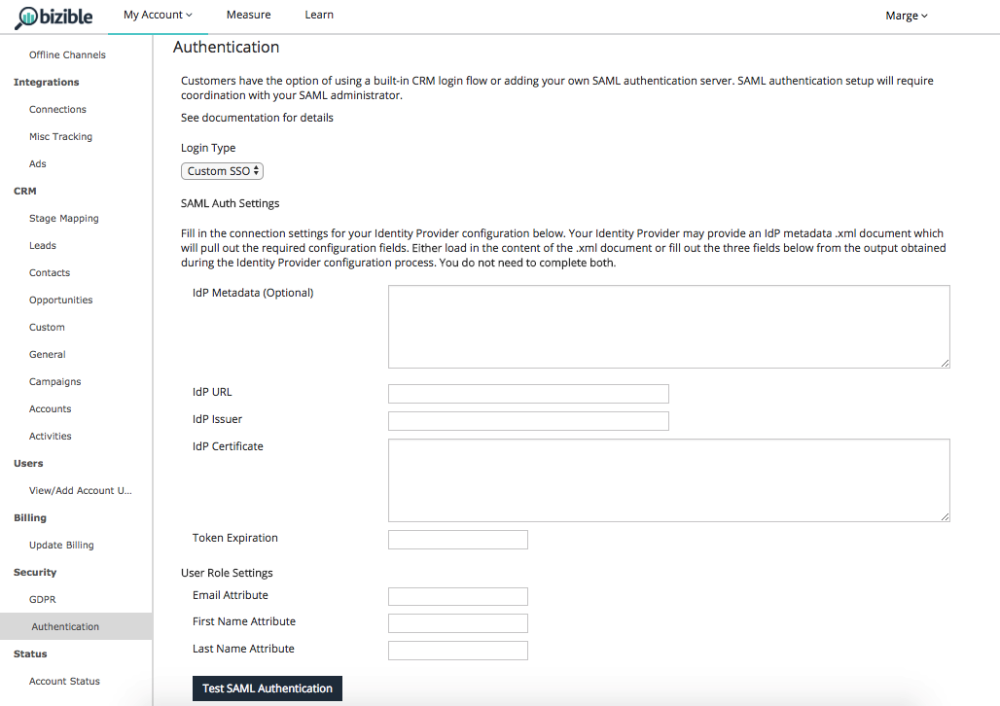
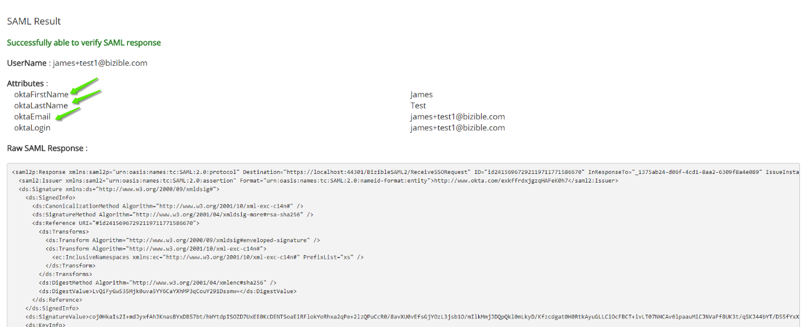
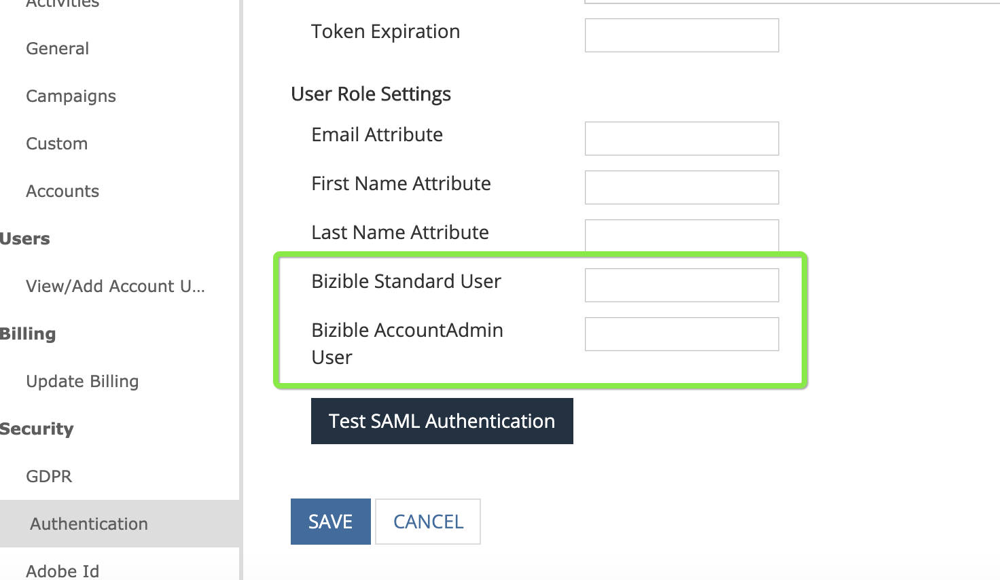
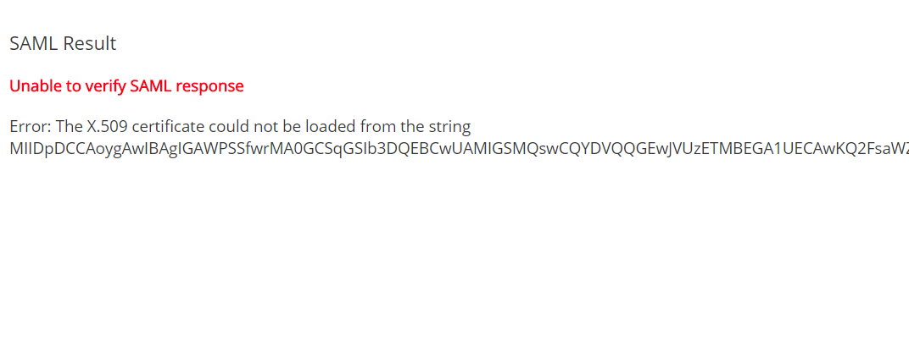
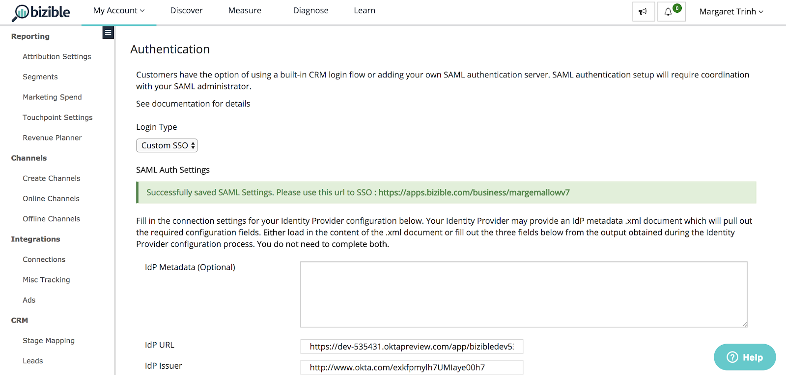
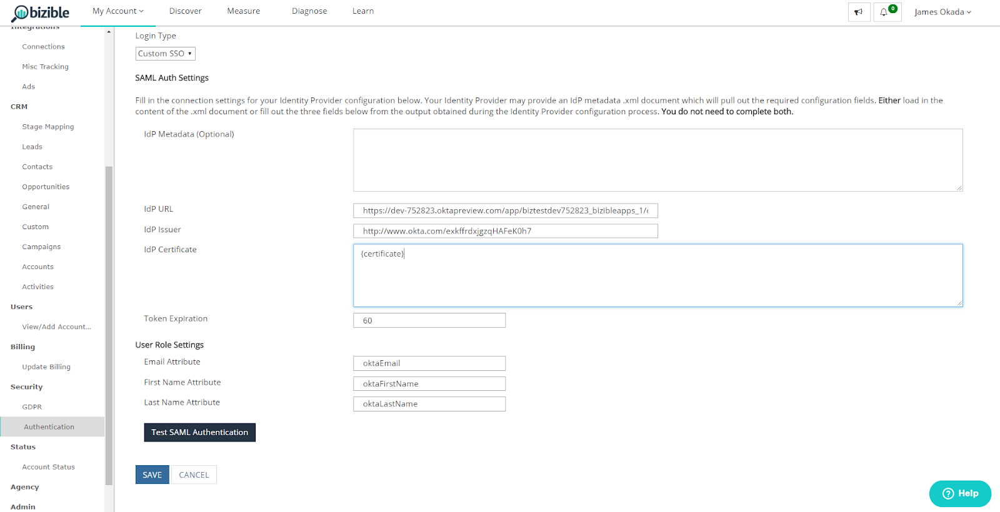
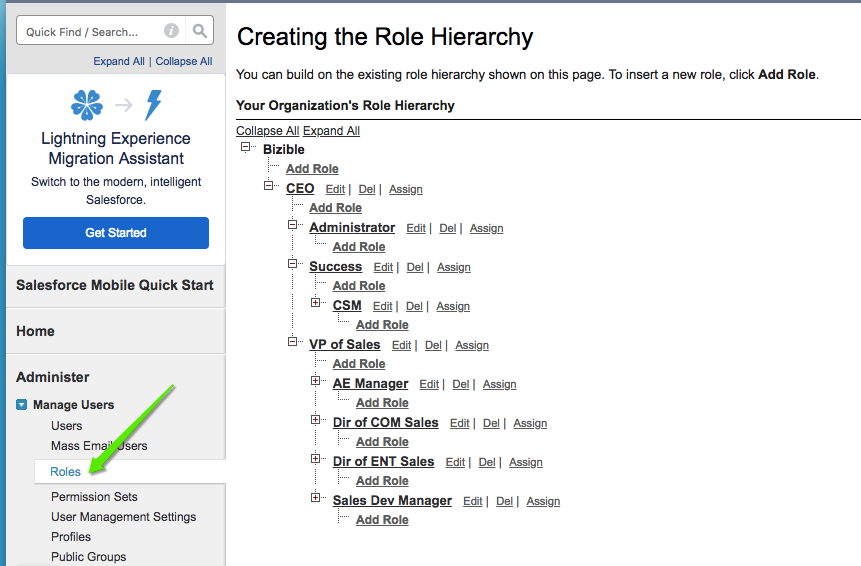
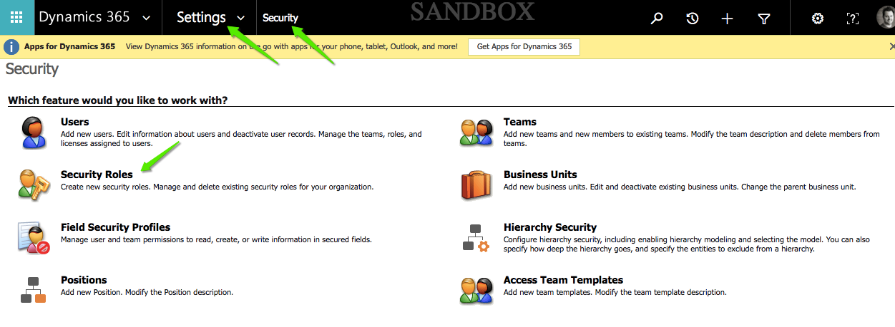
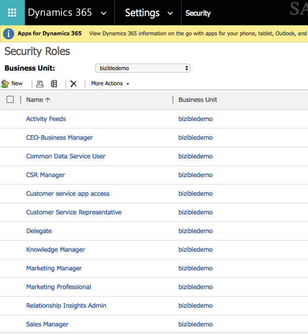
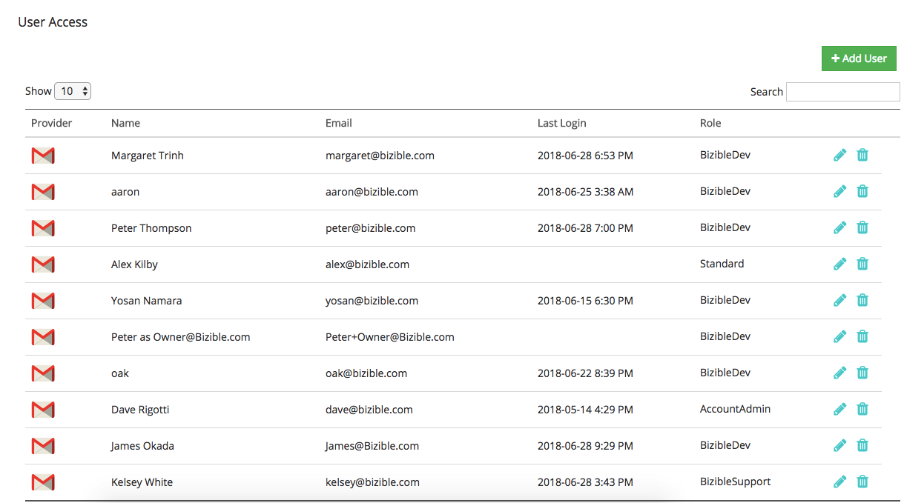

# Single Sign On {#single-sign-on}

Single Sign On - Bizible - Product Documentation

SAML (security assertion markup language) for SSO (single sign-on) makes it possible for users to authenticate through a company's identity provider when they log-in to the Bizible app. SSO allows a user to authenticate just once, without needing to authenticate separate apps.&nbsp;SAML is a necessity for enterprise customers because not all users will have a Salesforce or Google account within their organization. In order to scale, Bizible has developed an SAML solution that can support company identity providers.

>[!NOTE]
>
>It's likely that companies use different Identity Providers (e.g., Ping Identity, Okta). The terms used in the following set-up instructions and in the UI may not directly match those used by your Identity Provider.

### What's in this article? {#what-s-in-this-article}

[Requirements](#singlesignon-requirements)  
[Getting Started](#singlesignon-gettingstarted)  
[Process](#singlesignon-process)  
[CRM Users (Advanced Setup)](#singlesignon-crmusers-advancedsetup)  
[External Links](#singlesignon-externallinks)

#### Requirements {#singlesignon-requirements}

* User with AccountAdmin permissions in the Bizible App
* User with administrative access to the customer’s Identity Provider

#### Getting Started {#singlesignon-gettingstarted}

To get started, navigate to Settings > Security > Authentication page in the Bizible application. Then switch the Login Type to Custom SSO to see the configuration options. Changes will not take effect until you test your authentication and click the **Save** button at the bottom of the page.

#### Process {#singlesignon-process}

Bizible Single Sign On requires configuring your Authentication settings in a series of steps that is important to follow so that you don’t risk getting locked out of your Bizible account.

1. Set up the Bizible Application in your Identity Provider. See external documentation listed below for walkthroughs.

    1. `<li>When prompted for the Single Sign On URL or Recipient URL or Destination URL, SAML Assertion Customer Service (ACS) URL, use <a href="https://apps.bizible.com/BizibleSAML2/ReceiveSSORequest" rel="nofollow">https://apps.bizible.com/BizibleSAML2/ReceiveSSORequest</a></li>` `<li>When prompted for the Audience Restriction URL or application-defined unique identifier, use <a href="https://biziblelpm/" rel="nofollow">https://BizibleLPM</a></li>`

1. Switch to Custom SSO in the Bizible Application

    1. `<li>Once the Billing Group has been enabled for your Account, you can now navigate to Settings >> Security >> Authentication</li>` `<li>By default, your Login Type will be set to “CRM Users.”</li>` `<li>Switch the Login Type to “Custom SSO” to begin the configuration process.</li>`

1. Fill in the connection settings for your Identity Provider configuration

    1.

        1. Your Identity Provider might give an IdP metadata .xml document which will pull out the required configuration fields. Either load in the content of the .xml document or fill out the three fields below from the output obtained during the Identity Provider configuration process. **You do not need to complete both.**

            1. IdP URL: The URL that Bizible needs to point to in order to authenticate your users into the Bizible application. Sometimes referred to as the “Redirect URL.”
            1. IdP Issuer: A unique identifier of the Identity Provider. Sometimes referred to as the “External Key.”
            1. IdP Certificate: A public key that allows Bizible to verify and validate the signature of all Identity Provider responses.

1. Set the token expiration for your users in minutes.

    1. `<li>Bizible allows a whole number from 1 to 1440 minutes. After a user’s session time has been exceeded, the user will get logged off once they navigate to a new page.</li>`

1. Set up and map your User Attribute settings to the respective First Name, Last Name, and Email Address.

    1. `<li>By entering the SAML attributes, Bizible will be able to recognize your users by the information passed through.  <ol>   <li>Email Attribute: Provide the attribute name that your Identity Provider uses for the user’s email address.</li>   <li>First Name Attribute: Provide the attribute name that your Identity Provider uses for the user’s first name.</li>   <li>Last Name Attribute: Provide the attribute name that your Identity Provider uses for the user’s last name.</li>  </ol></li>` `<li>Hint: If you test your SAML configuration now, we will parse out the Email, First Name, and Last Name attributes that you can use for this section.</li>`

   

1. Set up and map your User Role settings to the respective roles or groups classified from your IdP.

    1.

        1. Customers have the option of assigning Bizible user roles based on groups defined in their Identity Provider. By entering your SAML attributes, Bizible will be able to map your user’s roles and groups to Bizible user permissions. We highly recommend that you set up these roles so that your Bizible administrator has sufficient rights to update your account.
        1. If no roles or groups are mapped, the default setting is that all employees in the Identity Provider will have Standard user access.

            1. Bizible Standard User: Provide the role or group value for users that should have read-only access to the Bizible application.
            1. Bizible Account Admin User: Provide the role or group value for users that should have administrative access to the Bizible application. This means that the role has access to change configurations and settings related to your Account.

        1. If multiple roles or groups should be mapped to a role, enter each value separated by a comma.

   

1. Test the Single Sign On configuration

    1.

        1. Before you can hit Save, you will be required to click the Test SAML Authentication button to verify that your settings were configured properly.
        1. If you see a “failure” error, please follow the message and attempt again.

   

1. Save your settings and direct your colleagues to use Single Sign On with your new custom Sign In URL.

    1.

        1. Important: Once you Save your new Authentication settings, it is possible your session will end once you navigate to a new page because you have disabled login by CRM Users and enabled Custom SSO.

   

1. Try it out!

    1.

        1. Use your new custom Sign In URL and attempt to log back in to the Bizible Application with your Identity Provider credentials.
        1. The format will look like https://apps.bizible.com/business/[accountName `]`
        
        1. Congratulations! You’ve successfully set up Single Sign On into the Bizible Application for your account!

   

   >[!NOTE]
   >
   >After you configure SSO, you’ll no longer need to add users within the Bizible application. User provisioning should be handled directly within your Identity Provider.

#### CRM Users (Advanced Setup) {#singlesignon-crmusers-advancedsetup}

By default, all accounts can access the Bizible application using their CRM credentials. Sometimes, account owners need to limit access to certain roles and not open it to all users with an active CRM license. The Advanced setup will allow you to map your CRM roles and groups to Bizible user permissions.

If no roles or groups are mapped, the default setting is that all active licenses in your CRM will have Standard user access.

* Bizible Standard User: Provide the role or group value for users that should have read-only access to the Bizible application.
* Bizible Account Admin User: Provide the role or group value for users that should have administrative access to the Bizible application. This means that the role has access to change configurations and settings related to your Account.

If multiple roles or groups should be mapped to a role, enter each value separated by a comma.

**Salesforce Roles**

For Salesforce Roles, use the name of each Role. All Roles can be found under the Setup > Manage Users > Roles menu.

**`Dynamics Roles`**

For Dynamics Roles, use the name of each Security Role. All Security Roles can be found under the Settings > Security > Security Roles menu.

**Google Users**

Once Custom SSO has been set up, the Users page will be updated to only show external users that have been added with Google logins. Because all users with access are defined through the SSO configuration, additional external users are listed here.

Only valid Google accounts can be added and must have a User Role defined.

#### &nbsp;External Links {#singlesignon-externallinks}

* [Okta](http://developer.okta.com/standards/SAML/setting_up_a_saml_application_in_okta)
* [Ping Identity](http://docs.pingidentity.com/bundle/p1_enterpriseConfigSsoSaml_cas/page/enableAppWithoutURL.html)
* [OneLogin](http://onelogin.service-now.com/support?id=kb_article&sys_id=b2c91143db109700d5505eea4b9619d5)
* [Active Directory](http://docs.microsoft.com/en-us/azure/active-directory/active-directory-saas-custom-apps)

