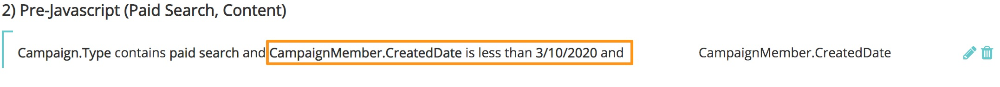

# Syncing Historical Data {#syncing-historical-data}

Syncing Historical Data - Bizible - Product Documentation

Bizible is a solution that provides the most granular, actionable data. We understand, however, that you might have existing data you’d like to have attribution for. It's possible to generate Touchpoints for historical data, but it's important to take a few factors into consideration before moving forward with this process.

### What's in this article? {#what-s-in-this-article}

[Factors to Consider](#syncinghistoricaldata-factorstoconsider)  
[Syncing Historic Campaigns in Salesforce](#syncinghistoricaldata-syncinghistoriccampaignsinsalesforce)  
[Syncing Historic Campaigns in Dynamics](#syncinghistoricaldata-syncinghistoriccampaignsindynamics)

####   
Factors to Consider {#syncinghistoricaldata-factorstoconsider}

**Is the data already organized into campaigns?**

a. The data needs to be organized into Campaigns to be synced to Bizible in order to have Touchpoints generated. If it's not currently organized into Campaigns, you’ll want to evaluate if it's worth the time and resources needed to segment the data into the appropriate campaigns.

b. The date the member was added to the campaign or marked as responded will be used for the Touchpoint date, so this needs to be accurate as well. Bizible offers workarounds in both SFDC and MSD to update the dates, but this could be time-consuming depending on the volume.

**Do you have a fairly equal amount of data organized into campaigns for all Channels (paid search, events, organic, etc)?**

It’s important to have a balanced picture of attribution in order to have accurate and “fair” reporting. For example, if you only have data for historic offline channel efforts like Events, the data will be inherently biased without historic online data to complement it.

**What level of granularity are you expecting?**

You'll essentially know the Channel, Subchannel, and Campaign name only.

**What are your reporting goals in the future?**

This data is going to be limited, so it’s important to consider how you plan on using it. It might not make the most sense to compare historical data to future data.

**How far back are you wanting to go?**

Bizible strongly recommends not going past the previous year.

This is a topic we strongly encourage discussing with your Bizible contact first. If you’ve considered the above and would like to proceed, general instructions (separate for Salesforce and Microsoft Dynamics) are below.

####   
Syncing Historic Campaigns in Salesforce {#syncinghistoricaldata-syncinghistoriccampaignsinsalesforce}

**Online:**

To sync historical online data, the data must be organized into Salesforce Campaigns that you would then sync to Bizible via Salesforce Campaign Sync rules in the Bizible app. It's important to make sure touchpoints are not generated from any of these campaigns after the date your JavaScript went live. The reason for this is to avoid duplicate touchpoint. After the JavaScript is live, online efforts are being automatically tracked, so we don’t want to also track them via an SFDC campaign. To avoid this problem, be sure to add a sense of time to the rule. Maybe something like “Campaign Member Created Date is less than [JavaScript go-live date]”.

The channel mapping component for historical online data can be a bit tricky. We want it to match your current online channel rules (from the online rule sheet) as closely as possible for clean reporting. Below is an example of ideal channel mapping.

>[!NOTE]
>
>This channel mapping is done in the Offline Channels section of the Bizible app since we are using SFDC campaigns.

| Salesforce Campaign Type |Channel |Subchannel |
|---|---|---|
| Paid Search - AdWords |Paid Search |AdWords |
| Paid Search - Bing |Paid Search |Bing |
| Paid Search - Yahoo |Paid Search |Yahoo |

Online data added in this way will inherently be less granular than online data Bizible tracks via JavaScript. For example, fields such as Form URL, Landing Page, Referrer Page, etc will not be populated. Therefore, it is recommended to break out the campaigns into each source if possible. As seen in the example above, you’d need to have multiple Campaign Types for each source in order to have granularity in reporting.

It might not be possible or reasonable to have the number of SFDC Campaign Types to support granular channel mapping, so you may resort to just mapping to the Channel level and ignoring subchannels. If the Channel level isn’t known either, you could set up a proxy channel like “Historic Digital” so that you at least know it was an online touch.

If you need to mass edit the touchpoint date that will be pushed for these historical online efforts, please use Bizible’s custom “Bulk Update Touchpoint Date” button (this is available as a custom field on the Campaign Object in SFDC). If the Campaign has a short time span, perhaps it would be worthwhile to mass edit the Touchpoint date on a day by day interval, while it might make sense to mass update on a weekly basis if the Campaign has a longer time span. If you do leverage the Bulk Update Touchpoint Date functionality, make sure to update the Campaign Sync Rule to use the Bizible Touchpoint Date on the date field. Note that this could require getting creative with your Campaign Sync rules if this will only apply to a Campaign or two and not all.**Offline:**

Historical data of offline marketing efforts (those that cannot be tracked via JavaScript) will also need to be organized into SFDC campaigns. SFDC campaigns are the way Bizible tracks offline efforts regardless of if the activity is “historical” or “current/post-Bizible implementation” so please follow the same channel mapping decided on in the original Offline Channel Configuration training.

If necessary, use the “Bulk Update Touchpoint Date” button to mass edit the touchpoint date for campaign members. For example, if you are creating SFDC campaigns after the event occurred--you’d want to mass edit for the correct date. If you do leverage the Bulk Update Touchpoint Date functionality, make sure to update the Campaign Sync Rule to use the Bizible Touchpoint Date on the date field. Note that this could require getting creative with your Campaign Sync rules if this will only apply to a Campaign or two and not all.

####   
Syncing Historic Campaigns in Dynamics {#syncinghistoricaldata-syncinghistoriccampaignsindynamics}

Bizible is able to retroactively generate touchpoints for interactions that occurred in the past, as long as they're organized into Campaigns within Dynamics.   
  
This usually involves work in the CRM to account for historical dates. The handling will also be different for online efforts (tracked by JS) and offline efforts (not able to be tracked by JS).   
  
Please follow the instructions below for organizing historical data in Dynamics in a format that can be synced to Bizible.   
  
**Online:**

Historic digital data needs to be organized into Dynamics campaigns in order to be backfilled. Ideally, this structure is already in place.   
  
If the data is housed elsewhere (such as still living in Marketing Automation) it will need to be pushed into Dynamics and organized into the appropriate campaigns. Then you’ll need to account for the Touchpoint Date as you want it to reflect the date from the past, not the date you pushed it into Dynamics. To override this date, you can use the custom “Bizible Touchpoint Date” field to change the date. You will need to add this to the Marketing List Form.

  
  
As a result, you can mass set the date for everyone in that Marketing List that will be used for the Touchpoint Date. To have more accurate historical dates, create multiple Marketing Lists for the same campaign--each with its own Touchpoint Date. If the Campaign has a short time span, perhaps it would be worthwhile to create a Marketing List for each day. If the Campaign has a longer time span, it might make sense to create a Marketing List on a weekly basis.   
  
More information on Syncing Marketing Lists can be found here: [Dynamics Campaigns and Marketing Lists](http://docs.marketo.com/x/8gAgAQ)

>[!NOTE]
>
>If for any reason you have a campaign tracking online activity that is active past the JavaScript live date, be sure to set the “Touchpoint End Date” field to the date the JS went live. This is to avoid having duplicate touchpoints for the same interaction.

Considerations: Online data added in this way will inherently be less granular than online data Bizible tracks via JavaScript. For example, fields such as: Form URL, Landing Page, Referrer Page, etc., will not be populated. Therefore, it is recommended to break out the campaigns into each source if possible. Below is an example of ideal mapping. 

| Dynamics Campaign Type |Channel |Subchannel |
|---|---|---|
| Paid Search - AdWords |Paid Search |AdWords |
| Paid Search - Bing |Paid Search |Bing |
| Paid Search - Yahoo |Paid Search |Yahoo |

If you don’t have a way of identifying a source or it is not worth the time and effort, you can use one Campaign Type mapped to a channel called something like “Legacy Digital” or “Historic Website.  
  
**Offline:**

To have touchpoints for offline marketing efforts from the past, the data must be organized into Dynamics campaigns and synced to Bizible. The process is the same as for current offline channels (sync the campaign via Marketing Lists or Campaign Responses). Below is an example of channel mapping.

| Dynamics Campaign Type |Channel |Subchannel |
|---|---|---|
| Events - Sponsored Conferences |Events |Sponsored Conferences |
| Events - Partner Events |Events |Partner Events |
| Events - Hosted Events |Events |Hosted Events |
| Webinar - Partner Webinar |Webinar |Partner Webinar |

If this data is not already organized into Campaigns with the correct dates set, you can use the “Bizible Touchpoint Date” field to reflect the accurate date from the offline activity in the past
