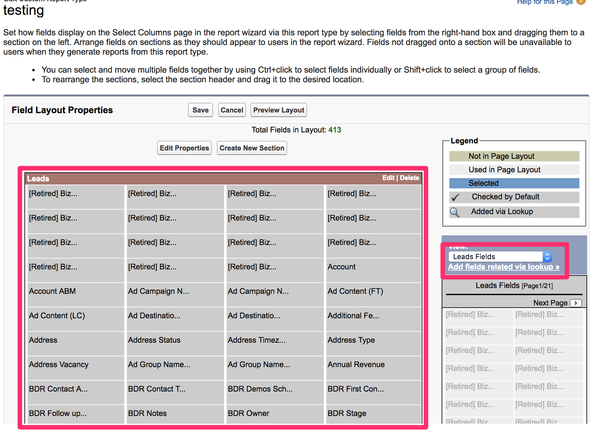

# Creating Custom Bizible Report Types {#creating-custom-bizible-report-types}

Creating Custom Bizible Report Types - Bizible - Product Documentation

Learn how to create custom Bizible Salesforce report types. There are three different report types we recommend creating: Leads with Bizible Touchpoints (Custom), Bizible Person with Bizible Touchpoints (Custom), Opportunities with Bizible Attribution Touchpoint (Custom).&nbsp;

### What's in this article? {#what-s-in-this-article}

[Leads with Bizible Touchpoints (Custom)](#creatingcustombiziblereporttypes-leadswithbizibletouchpoints-custom)  
[Bizible Person with Bizible Touchpoints (Custom)](#creatingcustombiziblereporttypes-biziblepersonwithbizibletouchpoints-custom)  
[Opportunities with Bizible Attribution Touchpoint (Custom)](#creatingcustombiziblereporttypes-opportunitieswithbizibleattributiontouchpoint-custom)  
[Adding Custom Fields to Custom Report Types](#creatingcustombiziblereporttypes-addingcustomfieldstocustomreporttypes)

#### Leads with Bizible Touchpoints (Custom) {#creatingcustombiziblereporttypes-leadswithbizibletouchpoints-custom}

1. Go to **Setup** > **Build** > **Report Types** > **New Custom Report Types**.

   

1. Define the Custom Report Type.

    * Report Type Focus > Primary Object: Lead
    * Identification > Report Type Label: Leads with Bizible Touchpoints (Custom)
    * Store in Category: Other Reports
    * Deployment > Deployment Status: Deployed

   

1. Define the Object Relationships.

    * Relate the Lead object (A) to the Bizible Person Object (B) and then to the Bizible Touchpoint Object (C)
    * Ensure that “Each A/B record must have at least one B/C” record is selected
    * Save

   

#### Bizible Person with Bizible Touchpoints (Custom) {#creatingcustombiziblereporttypes-biziblepersonwithbizibletouchpoints-custom}

1. Go to **Setup** > **Build** > **Report Types** > **New Custom Report Types**.

   

1. Define the Custom Report Type.

    * Report Type Focus > Primary Object: Bizible Persons
    * Identification > Report Type Label: Bizible Person with Bizible Touchpoints (Custom)
    * Store in Category: Other Reports
    * Deployment > Deployment Status: Deployed

   

1. Define the Object Relationships.

    * Relate the Bizible Person object (A) to the Bizible Touchpoint Object (B)
    * Ensure that “Each A record must have at least one B” record is selected
    * Save

   

#### Opportunities with Bizible Attribution Touchpoint (Custom) {#creatingcustombiziblereporttypes-opportunitieswithbizibleattributiontouchpoint-custom}

1. Go to **Setup** > **Build** > **Report Types** > **New Custom Report Types**.

   

1. Define the Custom Report Type.

    * Report Type Focus > Primary Object: Opportunities
    * Identification > Report Type Label: Opportunities with Bizible Attribution Touchpoint (Custom)
    * Store in Category: Other Reports
    * Deployment > Deployment Status: Deployed

   

1. Define the Object Relationships.

    * Relate the Opportunities object (A) to the Bizible Attribution Touchpoint Object (B)
    * Ensure that “Each A record must have at least one B” record is selected
    * Save

   

#### Adding Custom Fields to Custom Report Types {#creatingcustombiziblereporttypes-addingcustomfieldstocustomreporttypes}

1. Once the reports are created, you’ll be redirected to an overview of the report type. Click **Edit Layout**.

   

1. Ensure that the custom fields you wish to add to the report appear in the Field Layout Properties section. If there are any other fields you’d like to add, use the “Add fields related via lookup” option.

   

