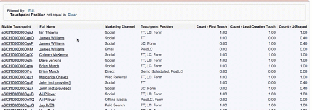

# Duplicate Records in My Report {#duplicate-records-in-my-report}

Duplicate Records in My Report - Bizible - Product Documentation

As you dive into the Bizible Reports in Salesforce, you may start to find 'duplicate' records in your reports. You will likely experience this feeling when you review Bizible's out-of-the-box reports.

When reporting with the Bizible Touchpoints object or the Bizible Attribution Touchpoint object, it's important to understand that you're no longer reporting on the count of leads, contacts, or opportunities but rather you'll be reporting on the number of Bizible Touchpoints or Bizible Attribution Touchpoints associated to those standard objects (leads, contacts, opportunities).

Let's take the following report as an example:

This is a **Contacts with Bizible Touchpoints** report. Again, this means that we're looking at the count of touchpoints associated to an individual contact.

As you can see, it looks like there are three James Williams contacts in the report, and therefore you might be thinking, "duplicates!"

However, this report is showing the number of touchpoints related to James. Within the report, you can see that James has an individual FT (First Touch), an individual LC, Form (Lead Creation Touch), and a PostLC touchpoint (a form submission that takes place after the LC touchpoint).

If you want to understand the 'count of contacts' you can then use the fields 'Count - First Touch', 'Count-Lead Creation Touch' or 'Count-U-Shaped' to understand how many contacts have had marketing interactions.

>[!NOTE]
>
>**Related Articles**
>
>[Bizible University: Stock SFDC Reports](https://universityonline.marketo.com/courses/bizible-fundamentals-bizible-102/#/page/5c5cb68dfb384d0c9fb96cc4)

