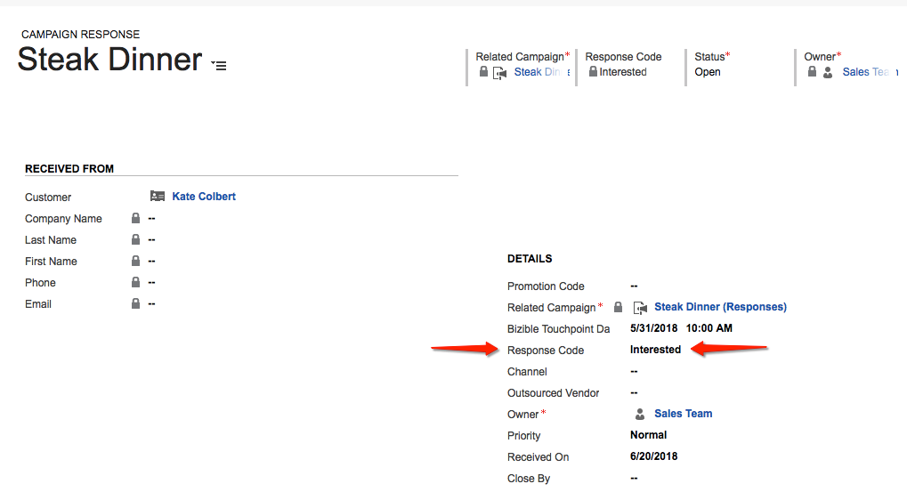
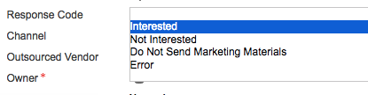
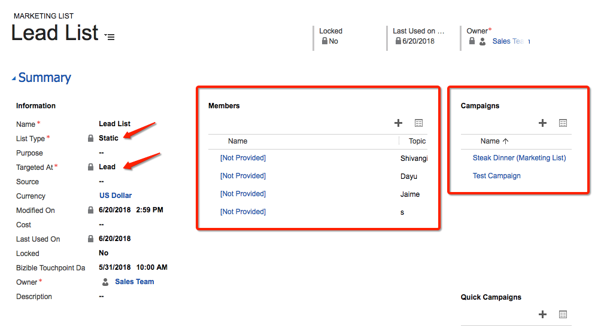
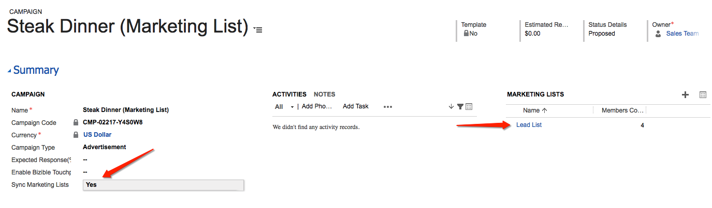
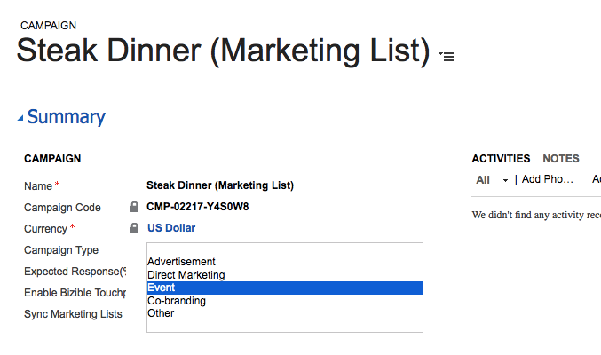
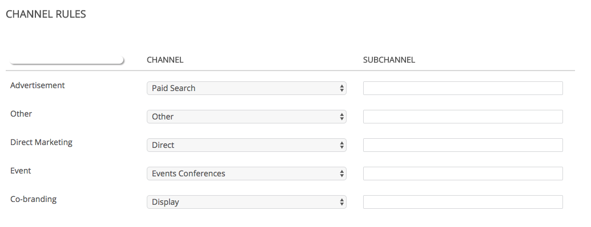

# Dynamics Campaigns and Marketing Lists {#dynamics-campaigns-and-marketing-lists}

Dynamics Campaigns and Marketing Lists - Bizible - Product Documentation

### What's in this article? {#what-s-in-this-article}

[Campaigns](#dynamicscampaignsandmarketinglists-campaigns)  
[Campaign Responses](#dynamicscampaignsandmarketinglists-campaignresponses)  
[Enable Touchpoints](#dynamicscampaignsandmarketinglists-enabletouchpoints)  
[Touchpoint Date](#dynamicscampaignsandmarketinglists-touchpointdate)  
[Marketing Lists](#dynamicscampaignsandmarketinglists-marketinglists)  
[Enable Touchpoints](#dynamicscampaignsandmarketinglists-enabletouchpoints-1)  
[Touchpoint Date](#dynamicscampaignsandmarketinglists-touchpointdate-1)  
[Channel Mapping](#dynamicscampaignsandmarketinglists-channelmapping)  
[Campaign Sync Date](#dynamicscampaignsandmarketinglists-campaignsyncdate)  
[FAQ](#dynamicscampaignsandmarketinglists-faq)

#### Campaigns {#dynamicscampaignsandmarketinglists-campaigns}

Dynamics Campaigns are good for tracking offline marketing activity and including them in the omni-channel journey. Campaigns have to relate to Leads or Contacts and can either roll up to the Campaign through either Campaign Responses or Marketing Lists.

#### Campaign Responses {#dynamicscampaignsandmarketinglists-campaignresponses}

When Leads or Contacts get added to a Campaign directly, they’re entered as a Campaign Response record.

#### Enable Touchpoints {#dynamicscampaignsandmarketinglists-enabletouchpoints}

To include these records in the touchpoint journey, there are a few options for the types of Campaign Responses to sync. On the Campaign record, there should be a custom field from the installed solution labeled, “Enable Bizible Touchpoints.” If you do not see this, the field will need to be added via Form Editor.

You can select to include all records that have a Campaign Response in the Campaign, or only those with a Response of “Interested,” or by default, you can not include the Campaign Responses at all. You can either leave the field blank or explicitly choose to exclude it.

Bizible does not support custom Response values.

These are the stock response values for the Campaign Response:

Based off your selection, these records are now eligible for touchpoints in the Lead, Contact, or Opportunity journey. If they qualify, a “Dynamics Campaign” touchpoint will appear in the journey.

One reason that a Campaign Response might not show up is because a First Touch and/or Lead Creation Touch activity had already been recorded for the Lead/Contact and the “PostLC” feature is disabled or has hit its maximum number of touchpoints.

#### Touchpoint Date {#dynamicscampaignsandmarketinglists-touchpointdate}

The Touchpoint Date for a Campaign is usually on the date that the Campaign Response was added to the Campaign. It can be overridden if the custom field from the installed solution labeled, “Bizible Touchpoint Date,” is populated. If you do not see this, the field will need to be added via Form Editor.

One common example using this field is for events where a list of badge scans from an event is added to the CRM days after the event occurred, so the user can actually change the Bizible Touchpoint Date back to when the event occurred.

#### Marketing Lists {#dynamicscampaignsandmarketinglists-marketinglists}

Marketing Lists are another way to include Leads or Contacts into a marketing journey. Marketing Lists are unique for a group of Leads or Contacts, meaning that the user has to select whether their list is a set of Leads or a set of Contacts.

Bizible only supports Static Marketing Lists. We do not support Dynamic Marketing Lists because our processing requires that we check on a record’s Modified Date but because a Dynamic List is frequently changing, there is no Modified Date for Bizible to check against. This would require a constant download of the full data set throughout the day.

The screenshot above is a Marketing List for Leads. Marketing Lists are associated to Campaigns and can be associated to multiple Campaigns. Unless you only ever create one Marketing List for one Campaign, Bizible does not recommend that customers use Marketing Lists to track their Campaigns. It is unlikely that the same exact list of Leads/Contacts would be eligible for touchpoints across multiple Campaigns.

#### Enable Touchpoints {#dynamicscampaignsandmarketinglists-enabletouchpoints-1}

To enable a Marketing List for touchpoints, there is a separate setting on the Campaign record labeled, “Sync Marketing Lists,” which is a simple yes/no switch. If you do not see this, the field will need to be added via Form Editor. While on the Campaign record, you can see which Marketing Lists are related to the Campaign so you know how many Lists you are enabling.

#### Touchpoint Date {#dynamicscampaignsandmarketinglists-touchpointdate-1}

The Touchpoint Date for a Marketing List is typically the ListMember created date, so the date that the Lead or Contact was added to the Marketing List. It can be overridden if the custom field from the installed solution labeled, “Bizible Touchpoint Date,” is populated. If you do not see this, the field will need to be added via Form Editor.

#### Channel Mapping {#dynamicscampaignsandmarketinglists-channelmapping}

Dynamics Campaigns are bucketed in your custom Marketing Channels using the Campaign Type field. These can be changed in your Dynamics Customizations menu.

The values in the Campaign Type menu are pulled into the Bizible Application. My Account >> Settings >> Offline Channels.

For each Campaign Type, it can be mapped to a Channel and Subchannel combination so that each touchpoint that derives from the Campaign will have the correct mapped Channel and Subchannel.

#### Campaign Sync Date {#dynamicscampaignsandmarketinglists-campaignsyncdate}

This is not available for Dynamics customers

#### FAQ {#dynamicscampaignsandmarketinglists-faq}

##### Can we enable touchpoints on Marketing Lists or only campaigns in Dynamics? {#dynamicscampaignsandmarketinglists-canweenabletouchpointsonmarketinglistsoronlycampaignsindynamics}

You can enable a Marketing List but it needs to be related to a Campaign because the option to sync a Marketing List lives on the Campaign.

##### Can we use Campaign Responses AND Marketing Lists on a Campaign? {#dynamicscampaignsandmarketinglists-canweusecampaignresponsesandmarketinglistsonacampaign}

Yes.
