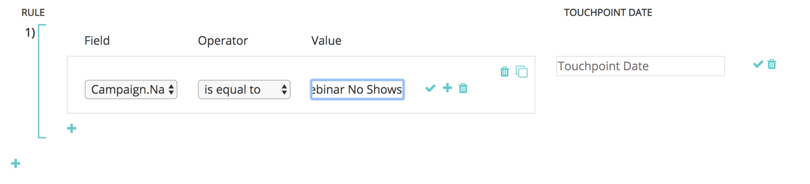
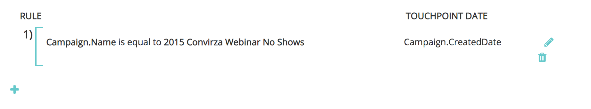
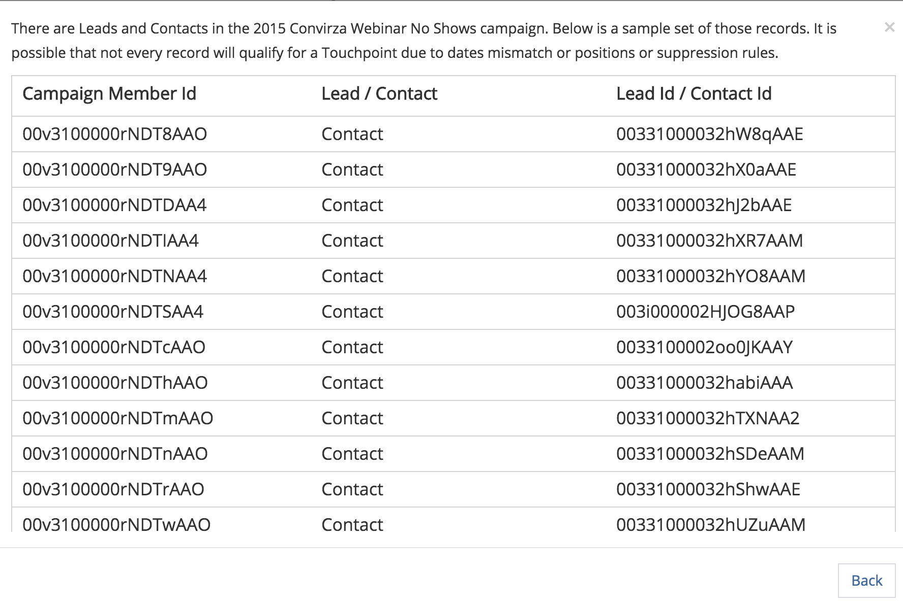

# Custom Campaign Sync {#custom-campaign-sync}

Custom Campaign Sync - Bizible - Product Documentation

Today, with the installed Bizible package, you are able to indicate which Campaigns to include as an eligible touchpoint. There are multiple hurdles to this as it previously existed. Once the Bizible package is installed in the CRM, it can take time to be approved by your security team. Additionally, there is a lack of flexibility in using a single picklist on the Campaign object. With this new feature, a package install is not required to begin using Campaign and Campaign Member records. Rules can be build to define exactly which records can be built to define exactly which records are eligible.

### What's in this article? {#whats-in-this-article}

[Requirements](#requirements)  
[How it Works](#how-it-works)  
[Validation](#validation)  
[Testing](#testing)

#### Requirements {#requirements}

* Campaign Sync is available in all tiers
* In order to import data, you are still required to connect your CRM to your Bizible account

#### How it Works {#how-it-works}

1. With AccountAdmin permissions, you can navigate to Settings > Campaigns and see the Sync Campaign Members rules UI.
1. Click the + icon to start creating a rule.

   

1. You have the option of creating a rule from Campaign or Campaign Member fields. Fill out the remainder of the rule with the Operator and Value that we are expected to validate. In the example below, we are checking for a specific Campaign by its name.

   

   >[!NOTE]
   >
   >Formula fields cannot be used within your rules and will not appear in the picklist. Because formulas calculate in the background and do not modify a record, Bizible cannot detect whether a record fits a rule or not.

1. Choose the Touchpoint Date. The list of possible dates will appear after you enter a curly bracket “ { “ - then you can select the date that you want to choose to apply to all Touchpoints created from the rule.

   

   >[!NOTE]
   >
   >If you are using Custom Campaign Sync rules, Bizible will not read any updates you’ve made using the Bulk Update Touchpoint Date button.

1. Click the checkmark, then add additional rules for additional campaigns as needed.

   

   >[!NOTE]
   >
   >Now that rules are defined alongside the CRM Sync, the rules that are stated will naturally begin to conflict. If choosing to continue to use both the custom Campaign Sync **and** the CRM Sync Type, it is critical to create rules so your CRM Sync Types do not get ignored.

   

   >[!NOTE]
   >
   >If you are considering eventually stopping the user of the CRM Sync Type, it's ideal to create rules that do not reference the "Sync Type" but&nbsp;*still* maintain the current CRM Touchpoints. That way the rules still work if/when that switch is made.

Here's an example of what that would look like, so that no existing CRM touchpoints are lost: 

#### Validation {#validation}

You can easily check the Bizible Touchpoints and Bizible Attribution Touchpoint records within the Campaign to ensure that the rules are working properly. Here's a BAT that Bizible created with the appropriate dynamic Touchpoint Date, pulled from the Campaign. Created Date field is in the image below it.

#### Testing {#testing}

##### 1. The Campaign Sync feature comes with a testing feature so that you can check if the rules you’ve created actually fit the Campaign criteria. Begin by clicking the Test button. The rules must be saved first before you can begin testing.  {#the-campaign-sync-feature-comes-with-a-testing-feature-so-that-you-can-check-if-the-rules-you-ve-created-actually-fit-the-campaign-criteria-begin-by-clicking-the-test-button-the-rules-must-be-saved-first-before-you-can-begin-testing}

A pop-up will appear where you can enter a Campaign Id (either 15 or 18 characters from the CRM) to test. The point is to enter the Campaign Id from the CRM that you were trying to sync to ensure it matches up with the rule you created.

##### 2. After you click Test, you’ll see the name of the Campaign and the number of Campaign Members that are eligible for touchpoints. A table will appear below that shows all of the rules that match to your Campaign Id. Only the matches will appear. {#after-you-click-test-you-ll-see-the-name-of-the-campaign-and-the-number-of-campaign-members-that-are-eligible-for-touchpoints-a-table-will-appear-below-that-shows-all-of-the-rules-that-match-to-your-campaign-id-only-the-matches-will-appear}

##### 3. You can also click on the Member count to see a list of the Leads and Contacts and their Ids that are part of the Campaign rule eligibility. This is just a sample set and will display up to 50 so that you can get an idea of which records qualify.  {#you-can-also-click-on-the-member-count-to-see-a-list-of-the-leads-and-contacts-and-their-ids-that-are-part-of-the-campaign-rule-eligibility-this-is-just-a-sample-set-and-will-display-up-to-so-that-you-can-get-an-idea-of-which-records-qualify}

  

