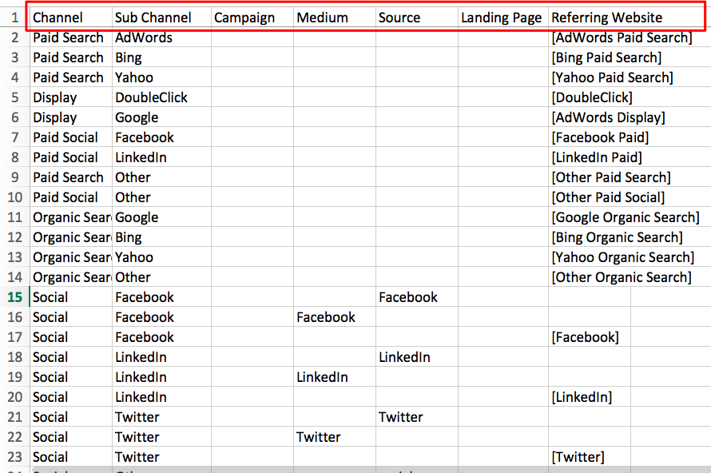

# Online Custom Channel Setup {#online-custom-channel-setup}

Online Custom Channel Setup - Bizible - Product Documentation

In order to have accurate reporting, marketing channels must be set up in a particular way. This guide will take you through the best way to configure your custom channel rules.

### What's in this article? {#whats-in-this-article}

[Before You Begin](#before-you-begin)  
[Bizible Logic and Priorities](#bizible-logic-and-priorities)  
[Setting Up Your Custom Channels Rules](#setting-up-your-custom-channels-rules)  
[Uploading Your Custom Channels Rules](#uploading-your-custom-channels-rules)

#### Before You Begin {#before-you-begin}

Before you begin creating your channel rules for Bizible, take some time to think about the organization of your marketing campaigns and how they fit into Bizible’s framework. You should determine which channels, subchannels, campaigns and referring websites you want to track.

Things to keep in mind:

* Your organization can create a maximum of 40 custom marketing channels. This includes both offline and online channels.
* Your organization can create up to 200 subchannels.
* Each collection, or bucket, of data needs its own rule (row in the spreadsheet) to specify how the data will be organized. Be as specific as possible. 
* Bizible’s logic prioritizes data in descending order starting with the top row of the spreadsheet and making its way down. It reads each bucket, or cell, in row by row looking for the first fit. The data is then sorted according to the values in these buckets. More on this below.
* Do not sort your sheet in alphabetical order as this will interfere with the logic rules.
* Once the file is uploaded, you cannot change any of the rules for seven days. Bizible utilizes this time to process and update the Touchpoints.

#### Bizible Logic and Priorities {#bizible-logic-and-priorities}

The first step is to download the custom channel spreadsheet from the Bizible app. Navigate to **Settings **under the **My Account **tab and select **Online**. You can select either **Download Original Template **or **Download Current Rules.**

The spreadsheet has 7 columns:

* **Channel:** add your various marketing channels here
* **Subchannel:** add the corresponding subchannels here
* **Campaign:** add campaign names here, whether the value is coming from UTMs or Salesforce Campaigns for Bizible's Activities funcionality
* **Medium:** the medium column represents the value of the utm_medium parameter
* **Source:** the source column represents the value of the utm_source parameter
* **Landing Page:** add landing page here
* **Referring Website:** the URLs of websites that refer traffic to your pages

The 8th column notes which rules you cannot delete from the spreadsheet with “Do Not Remove.” The top of the spreadsheet has default channel rules that Bizible recommends you do not change or remove even if you do not use these channels. Bizible has deep integrations with these platforms so they are included by default.

The rows represent rules and the order in which Bizible prioritizes the data. The first row has priority over the second row, the second row has priority over the third row, and so on. When determining what Marketing Channel & Subchannel to bucket touchpoints into, Bizible reads top-down, left to right, until it finds a row that meets the criteria of the touchpoint. (IE if a touchpoint has a utm_source=Facebook, the touchpoint will get bucketed into the Social.Facebook channel due to rule 15 in the screenshot).

Bizible comes with 12 default channels for your use. These channels correlate to platforms with which Bizible is fully integrated. Whether you use them or not, please do not remove them. If you do use one of these platforms, Bing Ads for example, but prefer to use a different naming convention for the channel or subchannel, you are able to update the name. An example is shown in the image below.

The structure of the rules is also important. The rules may look like repeated information and missing data but this structure is intentional. For accurate data sorting, it’s necessary to map each individual source to the appropriate channel separately--even sources sharing subchannels and channels. The more detailed and granular the rules are, the more insightful the results will be. Basically, it is best practice to write a detailed rule for every single marketing effort you want to track.

Consider the following situation: you have other ads that you do not want to track for some reason, or you receive visits to your website from a familiar channel, but not a familiar source. This situation could lead to data loss if Bizible cannot find the appropriate rule to use to sort the data. To prevent this from happening, Bizible advises you to break your rule over several rows.

Each parameter or component of the rule is separately mapped to the channel. For instance, when Bizible has Facebook data to sort, it looks for rules related to Facebook. It scans from top to bottom. In the example pictured below, Bizible would understand that for the first Facebook subchannel, all it has to read is the source parameter to drop data into that rule’s bucket.

The next rule only asks for the medium parameter, so any data with that parameter will be bucketed into this channel. Lastly for Facebook, any data coming from the Facebook URL will be placed in the last Facebook bucket.

The default channel ‘Other’ exists to catch data that does not meet any rule's criteria. Notice that some of the buckets in the Other channel contain asterisks (&#42;). These asterisks represent wildcards that act as a catch-all.

Due to Bizible’s logic working from top to bottom, please note that the wildcard rule, indicated with an asterisk (&#42;), should be placed at the very end of your rule sheet. All data that isn’t caught or sorted by the other rules will automatically be added to this wildcard bucket.

Below are more examples of wildcard logic:

* &#42;email&#42; = contains “email”
* &#42;email = ends with “email”
* email&#42; = starts with email

In addition, note that if you create a subchannel for one of your channels, you'll need to create a subchannel for all rules under that channel. In other words, if you create one subchannel, you cannot leave the rest of the columns blank.

#### Setting Up Your Custom Channels Rules {#setting-up-your-custom-channels-rules}

Once you have decided how you want to organize and prioritize your data, you're ready to add your rules to the spreadsheet. Below are some best practices:

* Keep your rules as simple as possible from the start. You can always build on the rules as you go along.
* Do not add any special characters in the channel names (e.g., $%#&&#42;@)
* Do not edit the rules associated with BingAds and AdWords. These rules are crucial for bucketing the data that automatically comes from Bizible’s API integration with these platforms. Changing the subchannel and channel name to fit your needs is not a problem though. 
* Do not remove the rules that contain a "Do Not Remove” note. 
* Organic Search rules are always placed after the Paid Search rules
* You cannot create rules based on different sub-domains.
* If you have more than one value to add in a cell in the spreadsheet, be sure to separate the values with a semicolon (;) only. No commas or spaces.
* You do not have to add dot com (.com) to the end of the referring URL. 
* When adding a referring URL, don't put it in brackets like the other API-related rules.

#### Uploading Your Custom Channels Rules {#uploading-your-custom-channels-rules}

Once you have edited and updated the spreadsheet with your custom rules, you can send it to your Customer Success Manager for his or her review. If you are familiar with rules logic, you are welcome to upload it yourself using the Upload CSV button in the Online Channels page. Bizible will upload the changes and reprocess the data.

>[!NOTE]
>
>**Related Articles**
>
>[Bizible University: Creating Channels & Subchannels](https://universityonline.marketo.com/courses/bizible-fundamentals-channel-management/#/page/5c63007334d9f0367662b747)

