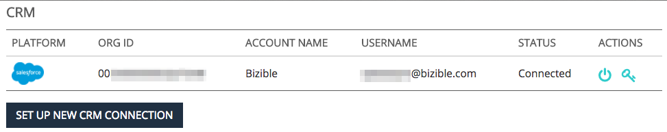

# How Bizible and Salesforce Interact {#how-bizible-and-salesforce-interact}

How Bizible and Salesforce Interact - Bizible - Product Documentation

Let's take a high-level look at the relationship between Bizible and Salesforce.

### What's in this article? {#whats-in-this-article}

[Salesforce and Bizible](#salesforce-and-bizible)  
[Salesforce Standard Objects and Access](#salesforce-standard-objects-and-access)  
[Bizible Custom Objects in Salesforce](#bizible-custom-objects-in-salesforce)  
[Bizible Attribution Touchpoint](#bizible-attribution-touchpoint)

#### Salesforce and Bizible&nbsp; {#salesforce-and-bizible}

Once the Bizible account is created and Salesforce is connected, Bizible will begin pushing marketing data&nbsp;into the CRM instance as long as the Bizible managed package is installed. If it's not, Bizible will not write any data, but it will read information from your SFDC instance.

#### Salesforce Standard Objects and Access {#salesforce-standard-objects-and-access}

This lists the Salesforce Standard Objects that Bizible interacts with, as well as the custom fields that we add to these objects once the connection is established and the Bizible package is installed. Out of the box, Bizible will NOT write into any standard Salesforce Object fields.

##### Lead {#lead}

<table> 
 <tbody> 
  <tr> 
   <th>
Fields
</th> 
   <th>
Standard/Custom
</th> 
   <th>
Read
</th> 
   <th>
Write
</th> 
  </tr> 
  <tr> 
   <td colspan="1">
Id
</td> 
   <td colspan="1">
Standard
</td> 
   <td colspan="1">
x
</td> 
   <td colspan="1"> </td> 
  </tr> 
  <tr> 
   <td colspan="1">
Email
</td> 
   <td colspan="1">
Standard
</td> 
   <td colspan="1">
x
</td> 
   <td colspan="1"> </td> 
  </tr> 
  <tr> 
   <td colspan="1">
Status
</td> 
   <td colspan="1">
Standard
</td> 
   <td colspan="1">
x
</td> 
   <td colspan="1"> </td> 
  </tr> 
  <tr> 
   <td colspan="1">
CreatedDate
</td> 
   <td colspan="1">
Standard
</td> 
   <td colspan="1">
x
</td> 
   <td colspan="1"> </td> 
  </tr> 
  <tr> 
   <td colspan="1">
LastModifiedDate
</td> 
   <td colspan="1">
Standard
</td> 
   <td colspan="1">
x
</td> 
   <td colspan="1"> </td> 
  </tr> 
  <tr> 
   <td colspan="1">
ConvertedDate
</td> 
   <td colspan="1">
Standard
</td> 
   <td colspan="1">
x
</td> 
   <td colspan="1"> </td> 
  </tr> 
  <tr> 
   <td colspan="1">
ConvertedContactId
</td> 
   <td colspan="1">
Standard
</td> 
   <td colspan="1">
x
</td> 
   <td colspan="1"> </td> 
  </tr> 
  <tr> 
   <td colspan="1">
ConvertedOpportunityId
</td> 
   <td colspan="1">
Standard
</td> 
   <td colspan="1">
x
</td> 
   <td colspan="1"> </td> 
  </tr> 
  <tr> 
   <td colspan="1">
IsConverted
</td> 
   <td colspan="1">
Standard
</td> 
   <td colspan="1">
x
</td> 
   <td colspan="1"> </td> 
  </tr> 
  <tr> 
   <td colspan="1">
IsDeleted
</td> 
   <td colspan="1">
Standard
</td> 
   <td colspan="1">
x
</td> 
   <td colspan="1"> </td> 
  </tr> 
  <tr> 
   <td colspan="1">
Website
</td> 
   <td colspan="1">
Standard
</td> 
   <td colspan="1">
x
</td> 
   <td colspan="1"> </td> 
  </tr> 
  <tr> 
   <td colspan="1">
Company
</td> 
   <td colspan="1">
Standard
</td> 
   <td colspan="1">
x
</td> 
   <td colspan="1"> </td> 
  </tr> 
  <tr> 
   <td colspan="1">
bizible2__Account__c
</td> 
   <td colspan="1">
Custom
</td> 
   <td colspan="1">
x
</td> 
   <td colspan="1">
x
</td> 
  </tr> 
  <tr> 
   <td colspan="1">
bizible2__Ad_Campaign_Name_FT__c
</td> 
   <td colspan="1">
Custom
</td> 
   <td colspan="1">
x
</td> 
   <td colspan="1">
x
</td> 
  </tr> 
  <tr> 
   <td colspan="1">
bizible2__Ad_Campaign_Name_LC__c
</td> 
   <td colspan="1">
Custom
</td> 
   <td colspan="1">
x
</td> 
   <td colspan="1">
x
</td> 
  </tr> 
  <tr> 
   <td>
bizible2__Landing_Page_FT__c
</td> 
   <td>
Custom
</td> 
   <td>
x
</td> 
   <td>
x
</td> 
  </tr> 
  <tr> 
   <td>
bizible2__Landing_Page_LC__c
</td> 
   <td>
Custom
</td> 
   <td>
x
</td> 
   <td>
x
</td> 
  </tr> 
  <tr> 
   <td>
bizible2__Marketing_Channel_FT__c
</td> 
   <td>
Custom
</td> 
   <td>
x
</td> 
   <td>
x
</td> 
  </tr> 
  <tr> 
   <td>
bizible2__Marketing_Channel_LC__c
</td> 
   <td>
Custom
</td> 
   <td>
x
</td> 
   <td>
x
</td> 
  </tr> 
  <tr> 
   <td>
bizible2__Touchpoint_Date_FT__c
</td> 
   <td>
Custom
</td> 
   <td>
x
</td> 
   <td>
x
</td> 
  </tr> 
  <tr> 
   <td>
bizible2__Touchpoint_Date_LC__c
</td> 
   <td>
Custom
</td> 
   <td>
x
</td> 
   <td>
x
</td> 
  </tr> 
  <tr> 
   <td>
bizible2__Touchpoint_Source_FT__c
</td> 
   <td>
Custom
</td> 
   <td>
x
</td> 
   <td>
x
</td> 
  </tr> 
  <tr> 
   <td>
bizible2__Touchpoint_Source_LC__c
</td> 
   <td>
Custom
</td> 
   <td>
x
</td> 
   <td>
x&nbsp;
</td> 
  </tr> 
 </tbody> 
</table>

##### Contact {#contact}

<table> 
 <tbody> 
  <tr> 
   <th>
Fields
</th> 
   <th>
Standard/Custom
</th> 
   <th>
Read
</th> 
   <th>
Write
</th> 
  </tr> 
  <tr> 
   <td>
Account
</td> 
   <td>
Standard
</td> 
   <td>x</td> 
   <td> </td> 
  </tr> 
  <tr> 
   <td>
Id
</td> 
   <td>
Standard
</td> 
   <td>
x
</td> 
   <td> </td> 
  </tr> 
  <tr> 
   <td>
Email
</td> 
   <td>
Standard
</td> 
   <td>
x
</td> 
   <td> </td> 
  </tr> 
  <tr> 
   <td>
Created Date
</td> 
   <td>
Standard
</td> 
   <td>
x
</td> 
   <td> </td> 
  </tr> 
  <tr> 
   <td>
IsDeleted
</td> 
   <td>
Standard
</td> 
   <td>
x
</td> 
   <td> </td> 
  </tr> 
  <tr> 
   <td>
LastModifiedDate
</td> 
   <td>
Standard
</td> 
   <td>
x
</td> 
   <td> </td> 
  </tr> 
  <tr> 
   <td>
bizible2__Ad_Campaign_Name_FT__c
</td> 
   <td>
Custom
</td> 
   <td>
x
</td> 
   <td>
x
</td> 
  </tr> 
  <tr> 
   <td>
bizible2__Ad_Campaign_Name_LC__c
</td> 
   <td>
Custom
</td> 
   <td>
x
</td> 
   <td>
x
</td> 
  </tr> 
  <tr> 
   <td>
bizible2__Landing_Page_FT__c
</td> 
   <td>
Custom
</td> 
   <td>
x
</td> 
   <td>
x
</td> 
  </tr> 
  <tr> 
   <td>
bizible2__Landing_Page_LC__c
</td> 
   <td>
Custom
</td> 
   <td>
x
</td> 
   <td>
x
</td> 
  </tr> 
  <tr> 
   <td>
bizible2__Marketing_Channel_FT__c
</td> 
   <td>
Custom
</td> 
   <td>
x
</td> 
   <td>
x
</td> 
  </tr> 
  <tr> 
   <td>
bizible2__Marketing_Channel_LC__c
</td> 
   <td>
Custom
</td> 
   <td>
x
</td> 
   <td>
x
</td> 
  </tr> 
  <tr> 
   <td>
bizible2__Touchpoint_Date_FT__c
</td> 
   <td>
Custom
</td> 
   <td>
x
</td> 
   <td>
x
</td> 
  </tr> 
  <tr> 
   <td>
bizible2__Touchpoint_Date_LC__c
</td> 
   <td>
Custom
</td> 
   <td>
x
</td> 
   <td>
x
</td> 
  </tr> 
  <tr> 
   <td>
bizible2__Touchpoint_Source_FT__c
</td> 
   <td>
Custom
</td> 
   <td>
x
</td> 
   <td>
x
</td> 
  </tr> 
  <tr> 
   <td>
bizible2__Touchpoint_Source_LC__c
</td> 
   <td>
Custom
</td> 
   <td>
x
</td> 
   <td>
x&nbsp;
</td> 
  </tr> 
 </tbody> 
</table>

##### Case {#case}

<table> 
 <tbody> 
  <tr> 
   <th>
Fields
</th> 
   <th>
Standard/Custom
</th> 
   <th>
Read
</th> 
   <th>
Write
</th> 
  </tr> 
  <tr> 
   <td>
Id
</td> 
   <td>
Standard
</td> 
   <td>
x
</td> 
   <td> </td> 
  </tr> 
  <tr> 
   <td>
CreatedDate
</td> 
   <td>
Standard
</td> 
   <td>
x
</td> 
   <td> </td> 
  </tr> 
  <tr> 
   <td>
LastModifiedDate
</td> 
   <td>
Standard
</td> 
   <td>
x
</td> 
   <td> </td> 
  </tr> 
  <tr> 
   <td>
SuppliedEmail
</td> 
   <td>
Standard
</td> 
   <td>
x
</td> 
   <td> </td> 
  </tr> 
  <tr> 
   <td>
IsDeleted
</td> 
   <td>
Standard
</td> 
   <td>
x
</td> 
   <td> </td> 
  </tr> 
  <tr> 
   <td>
bizible2__Ad_Campaign_Name_FT__c
</td> 
   <td>
Custom
</td> 
   <td>
x
</td> 
   <td>
x
</td> 
  </tr> 
  <tr> 
   <td>
bizible2__Ad_Campaign_Name_LC__c
</td> 
   <td>
Custom
</td> 
   <td>
x
</td> 
   <td>
x
</td> 
  </tr> 
  <tr> 
   <td>
bizible2__Landing_Page_FT__c
</td> 
   <td>
Custom
</td> 
   <td>
x
</td> 
   <td>
x
</td> 
  </tr> 
  <tr> 
   <td>
bizible2__Landing_Page_LC__c
</td> 
   <td>
Custom
</td> 
   <td>
x
</td> 
   <td>
x
</td> 
  </tr> 
  <tr> 
   <td>
bizible2__Marketing_Channel_FT__c
</td> 
   <td>
Custom
</td> 
   <td>
x
</td> 
   <td>
x
</td> 
  </tr> 
  <tr> 
   <td>
bizible2__Marketing_Channel_LC__c
</td> 
   <td>
Custom
</td> 
   <td>
x
</td> 
   <td>
x
</td> 
  </tr> 
  <tr> 
   <td>
bizible2__Touchpoint_Date_FT__c
</td> 
   <td>
Custom
</td> 
   <td>
x
</td> 
   <td>
x
</td> 
  </tr> 
  <tr> 
   <td>
bizible2__Touchpoint_Date_LC__c
</td> 
   <td>
Custom
</td> 
   <td>
x
</td> 
   <td>
x
</td> 
  </tr> 
  <tr> 
   <td>
bizible2__Touchpoint_Source_FT__c
</td> 
   <td>
Custom
</td> 
   <td>
x
</td> 
   <td>
x
</td> 
  </tr> 
  <tr> 
   <td>
bizible2__Touchpoint_Source_LC__c
</td> 
   <td>
Custom
</td> 
   <td>
x
</td> 
   <td>
x&nbsp;
</td> 
  </tr> 
 </tbody> 
</table>

##### Account {#account}

<table> 
 <tbody> 
  <tr> 
   <th>
Fields
</th> 
   <th>
Standard/Custom
</th> 
   <th>
Read
</th> 
   <th>
Write
</th> 
  </tr> 
  <tr> 
   <td>
Id
</td> 
   <td>
Standard
</td> 
   <td>
x
</td> 
   <td> </td> 
  </tr> 
  <tr> 
   <td>
Website
</td> 
   <td>
Standard
</td> 
   <td>
x
</td> 
   <td> </td> 
  </tr> 
  <tr> 
   <td>
LastModifiedDate
</td> 
   <td>
Standard
</td> 
   <td>
x
</td> 
   <td> </td> 
  </tr> 
  <tr> 
   <td>
IsDeleted
</td> 
   <td>
Standard
</td> 
   <td>
x
</td> 
   <td> </td> 
  </tr> 
  <tr> 
   <td>
bizible2__Engagement_Score__c
</td> 
   <td>
Custom
</td> 
   <td>
x
</td> 
   <td>
x&nbsp;
</td> 
  </tr> 
 </tbody> 
</table>

##### Opportunity {#opportunity}

<table> 
 <tbody> 
  <tr> 
   <th>
Fields
</th> 
   <th>
Standard/Custom
</th> 
   <th>
Read
</th> 
   <th>
Write
</th> 
  </tr> 
  <tr> 
   <td>
Account
</td> 
   <td>
Standard
</td> 
   <td>
x
</td> 
   <td> </td> 
  </tr> 
  <tr> 
   <td>
Id
</td> 
   <td>
Standard
</td> 
   <td>
x
</td> 
   <td> </td> 
  </tr> 
  <tr> 
   <td>
CreatedDate
</td> 
   <td>
Standard
</td> 
   <td>
x
</td> 
   <td> </td> 
  </tr> 
  <tr> 
   <td>
LastModifiedDate
</td> 
   <td>
Standard
</td> 
   <td>
x
</td> 
   <td> </td> 
  </tr> 
  <tr> 
   <td>
IsWon
</td> 
   <td>
Standard
</td> 
   <td>
x
</td> 
   <td> </td> 
  </tr> 
  <tr> 
   <td>
IsClosed
</td> 
   <td>
Standard
</td> 
   <td>
x
</td> 
   <td> </td> 
  </tr> 
  <tr> 
   <td>
IsDeleted
</td> 
   <td>
Standard
</td> 
   <td>
x
</td> 
   <td> </td> 
  </tr> 
  <tr> 
   <td>
CloseDate
</td> 
   <td>
Standard
</td> 
   <td>
x
</td> 
   <td> </td> 
  </tr> 
  <tr> 
   <td>
StageName
</td> 
   <td>
Standard
</td> 
   <td>
x
</td> 
   <td> </td> 
  </tr> 
  <tr> 
   <td>
Amount
</td> 
   <td>
Standard
</td> 
   <td>
x
</td> 
   <td> </td> 
  </tr> 
  <tr> 
   <td>
bizible2__Bizible_Opportunity_Amount__c
</td> 
   <td>
Custom
</td> 
   <td>
x
</td> 
   <td>
x&nbsp;
</td> 
  </tr> 
 </tbody> 
</table>

##### Campaign {#campaign}

<table> 
 <colgroup> 
  <col> 
  <col> 
  <col> 
  <col> 
 </colgroup> 
 <tbody> 
  <tr> 
   <th>
Fields
</th> 
   <th>
Standard/Custom
</th> 
   <th>
Read
</th> 
   <th>
Write
</th> 
  </tr> 
  <tr> 
   <td>
Id
</td> 
   <td>
Standard
</td> 
   <td>
x
</td> 
   <td> </td> 
  </tr> 
  <tr> 
   <td>
Email
</td> 
   <td>
Standard
</td> 
   <td>
x
</td> 
   <td> </td> 
  </tr> 
  <tr> 
   <td>
Status
</td> 
   <td>
Standard
</td> 
   <td>
x
</td> 
   <td> </td> 
  </tr> 
  <tr> 
   <td>
CreatedDate
</td> 
   <td>
Standard
</td> 
   <td>
x
</td> 
   <td> </td> 
  </tr> 
  <tr> 
   <td>
LastModifiedDate
</td> 
   <td>
Standard
</td> 
   <td>
x
</td> 
   <td> </td> 
  </tr> 
  <tr> 
   <td>
ConvertedDate
</td> 
   <td>
Standard
</td> 
   <td>
x
</td> 
   <td> </td> 
  </tr> 
  <tr> 
   <td>
ConvertedContactId
</td> 
   <td>
Standard
</td> 
   <td>
x
</td> 
   <td> </td> 
  </tr> 
  <tr> 
   <td>
ConvertedOpportunityId
</td> 
   <td>
Standard
</td> 
   <td>
x
</td> 
   <td> </td> 
  </tr> 
  <tr> 
   <td>
IsConverted
</td> 
   <td>
Standard
</td> 
   <td>
x
</td> 
   <td> </td> 
  </tr> 
  <tr> 
   <td>
IsDeleted
</td> 
   <td>
Standard
</td> 
   <td>
x
</td> 
   <td> </td> 
  </tr> 
  <tr> 
   <td>
Website
</td> 
   <td>
Standard
</td> 
   <td>
x
</td> 
   <td> </td> 
  </tr> 
  <tr> 
   <td>
Company
</td> 
   <td>
Standard
</td> 
   <td>
x
</td> 
   <td> </td> 
  </tr> 
  <tr> 
   <td>
Type
</td> 
   <td>
Standard
</td> 
   <td>
x
</td> 
   <td> </td> 
  </tr> 
 </tbody> 
</table>

##### Campaign Member {#campaign-member}

<table> 
 <tbody> 
  <tr> 
   <th>
Fields
</th> 
   <th>
Standard/Custom
</th> 
   <th>
Read
</th> 
   <th>
Write
</th> 
  </tr> 
  <tr> 
   <td>
Id
</td> 
   <td>
Standard
</td> 
   <td>
x
</td> 
   <td> </td> 
  </tr> 
  <tr> 
   <td>
CreatedDate
</td> 
   <td>
Standard
</td> 
   <td>
x
</td> 
   <td> </td> 
  </tr> 
  <tr> 
   <td>
LastModifiedDate
</td> 
   <td>
Standard
</td> 
   <td>
x
</td> 
   <td> </td> 
  </tr> 
  <tr> 
   <td>
IsDeleted
</td> 
   <td>
Standard
</td> 
   <td>
x
</td> 
   <td> </td> 
  </tr> 
  <tr> 
   <td>
FirstRespondedDate
</td> 
   <td>
Standard
</td> 
   <td>
x
</td> 
   <td> </td> 
  </tr> 
  <tr> 
   <td>
HasResponded
</td> 
   <td>
Standard
</td> 
   <td>
x
</td> 
   <td> </td> 
  </tr> 
  <tr> 
   <td>
ContactId
</td> 
   <td>
Standard
</td> 
   <td>
x
</td> 
   <td> </td> 
  </tr> 
  <tr> 
   <td>
LeadId
</td> 
   <td>
Standard
</td> 
   <td>
x
</td> 
   <td> </td> 
  </tr> 
  <tr> 
   <td>
IsConverted
</td> 
   <td>
Standard
</td> 
   <td>
x
</td> 
   <td> </td> 
  </tr> 
  <tr> 
   <td>
CampaignId
</td> 
   <td>
Standard
</td> 
   <td>
x
</td> 
   <td> </td> 
  </tr> 
  <tr> 
   <td>
bizible2__Bizible_Touchpoint_Date__c
</td> 
   <td>
Custom
</td> 
   <td>
x
</td> 
   <td>
x
</td> 
  </tr> 
  <tr> 
   <td>
bizible2__Touchpoint_Status_Date__c
</td> 
   <td>
Custom
</td> 
   <td>
x
</td> 
   <td>
x
</td> 
  </tr> 
  <tr> 
   <td>
bizible2__Touchpoint_Status_Contact__c
</td> 
   <td>
Custom
</td> 
   <td>
x
</td> 
   <td>
x
</td> 
  </tr> 
  <tr> 
   <td>
bizible2__Touchpoint_Status_Leade__c
</td> 
   <td>
Custom
</td> 
   <td>
x
</td> 
   <td>
x
</td> 
  </tr> 
  <tr> 
   <td>
bizible2__Touchpoint_Status_Opportunity__c
</td> 
   <td>
Custom
</td> 
   <td>
x
</td> 
   <td>
x&nbsp;
</td> 
  </tr> 
 </tbody> 
</table>

#### Bizible Custom Objects in Salesforce&nbsp; {#bizible-custom-objects-in-salesforce}

Apart from creating custom fields on SFDC's Standard Objects, once the Bizible package is installed,&nbsp;it will create a couple of Custom Objects. Below is a list of these Custom Objects along with a table denoting the fields that Bizible will&nbsp;write to.

##### Bizible Touchpoint {#bizible-touchpoint}

The Bizible Touchpoint is a Bizible Custom Object to encapsulate the marketing interactions for Contacts, Leads, and Cases. 

<table> 
 <tbody> 
  <tr> 
   <th>
Fields
</th> 
   <th>
Standard/Custom
</th> 
   <th>
Read
</th> 
   <th>
Write
</th> 
  </tr> 
  <tr> 
   <td>
bizible2__Bizible_Person__c
</td> 
   <td>
Custom
</td> 
   <td>
x
</td> 
   <td>
x
</td> 
  </tr> 
  <tr> 
   <td>
bizible2__SF_Campaign__c
</td> 
   <td>
Custom
</td> 
   <td>
x
</td> 
   <td>
x
</td> 
  </tr> 
  <tr> 
   <td>
bizible2__UniqueId__c
</td> 
   <td>
Custom
</td> 
   <td>
x
</td> 
   <td>
x
</td> 
  </tr> 
  <tr> 
   <td>
bizible2__Marketing_Channel__c
</td> 
   <td>
Custom
</td> 
   <td>
x
</td> 
   <td>
x
</td> 
  </tr> 
  <tr> 
   <td colspan="1">
bizible2__Marketing_Channel_Path__c
</td> 
   <td colspan="1">
Custom
</td> 
   <td colspan="1">
x
</td> 
   <td colspan="1">
x
</td> 
  </tr> 
  <tr> 
   <td colspan="1">
bizible2__Touchpoint_Type__c
</td> 
   <td colspan="1">
Custom
</td> 
   <td colspan="1">
x
</td> 
   <td colspan="1">
x
</td> 
  </tr> 
  <tr> 
   <td colspan="1">
bizible2__Ad_Id__c
</td> 
   <td colspan="1">
Custom
</td> 
   <td colspan="1">
x
</td> 
   <td colspan="1">
x
</td> 
  </tr> 
  <tr> 
   <td colspan="1">
bizible2__Ad_Content__c
</td> 
   <td colspan="1">
Custom
</td> 
   <td colspan="1">
x
</td> 
   <td colspan="1">
x
</td> 
  </tr> 
  <tr> 
   <td colspan="1">
bizible2__Ad_Group_Id__c
</td> 
   <td colspan="1">
Custom
</td> 
   <td colspan="1">
x
</td> 
   <td colspan="1">
x
</td> 
  </tr> 
  <tr> 
   <td colspan="1">
bizible2__Ad_Group_Name__c
</td> 
   <td colspan="1">
Custom
</td> 
   <td colspan="1">
x
</td> 
   <td colspan="1">
x
</td> 
  </tr> 
  <tr> 
   <td colspan="1">
bizible2__Ad_Campaign_Id__c
</td> 
   <td colspan="1">
Custom
</td> 
   <td colspan="1">
x
</td> 
   <td colspan="1">
x
</td> 
  </tr> 
  <tr> 
   <td colspan="1">
bizible2__Ad_Campaign_Name__c
</td> 
   <td colspan="1">
Custom
</td> 
   <td colspan="1">
x
</td> 
   <td colspan="1">
x
</td> 
  </tr> 
  <tr> 
   <td colspan="1">
bizible2__Placement_Id__c
</td> 
   <td colspan="1">
Custom
</td> 
   <td colspan="1">
x
</td> 
   <td colspan="1">
x
</td> 
  </tr> 
  <tr> 
   <td colspan="1">
bizible2__Placement_Name__c
</td> 
   <td colspan="1">
Custom
</td> 
   <td colspan="1">
x
</td> 
   <td colspan="1">
x
</td> 
  </tr> 
  <tr> 
   <td colspan="1">
bizible2__Site_Id__c
</td> 
   <td colspan="1">
Custom
</td> 
   <td colspan="1">
x
</td> 
   <td colspan="1">
x
</td> 
  </tr> 
  <tr> 
   <td colspan="1">
bizible2__Site_Name__c
</td> 
   <td colspan="1">
Custom
</td> 
   <td colspan="1">
x
</td> 
   <td colspan="1">
x
</td> 
  </tr> 
  <tr> 
   <td colspan="1">
bizible2__Form_URL__c
</td> 
   <td colspan="1">
Custom
</td> 
   <td colspan="1">
x
</td> 
   <td colspan="1">
x
</td> 
  </tr> 
  <tr> 
   <td colspan="1">
bizible2__Form_URL_Raw__c
</td> 
   <td colspan="1">
Custom
</td> 
   <td colspan="1">
x
</td> 
   <td colspan="1">
x
</td> 
  </tr> 
  <tr> 
   <td colspan="1">
bizible2__Platform__c
</td> 
   <td colspan="1">
Custom
</td> 
   <td colspan="1">
x
</td> 
   <td colspan="1">
x
</td> 
  </tr> 
  <tr> 
   <td colspan="1">
bizible2__Browser__c
</td> 
   <td colspan="1">
Custom
</td> 
   <td colspan="1">
x
</td> 
   <td colspan="1">
x
</td> 
  </tr> 
  <tr> 
   <td colspan="1">
bizible2__Geo_City__c
</td> 
   <td colspan="1">
Custom
</td> 
   <td colspan="1">
x
</td> 
   <td colspan="1">
x
</td> 
  </tr> 
  <tr> 
   <td colspan="1">
bizible2__Geo_Country__c
</td> 
   <td colspan="1">
Custom
</td> 
   <td colspan="1">
x
</td> 
   <td colspan="1">
x
</td> 
  </tr> 
  <tr> 
   <td colspan="1">
bizible2__Geo_Region__c
</td> 
   <td colspan="1">
Custom
</td> 
   <td colspan="1">
x
</td> 
   <td colspan="1">
x
</td> 
  </tr> 
  <tr> 
   <td colspan="1">
bizible2__Keyword_Id__c
</td> 
   <td colspan="1">
Custom
</td> 
   <td colspan="1">
x
</td> 
   <td colspan="1">
x
</td> 
  </tr> 
  <tr> 
   <td colspan="1">
bizible2__Keyword_MatchType__c
</td> 
   <td colspan="1">
Custom
</td> 
   <td colspan="1">
x
</td> 
   <td colspan="1">
x
</td> 
  </tr> 
  <tr> 
   <td colspan="1">
bizible2__Touchpoint_Position__c
</td> 
   <td colspan="1">
Custom
</td> 
   <td colspan="1">
x
</td> 
   <td colspan="1">
x
</td> 
  </tr> 
  <tr> 
   <td colspan="1">
bizible2__Keyword_Text__c
</td> 
   <td colspan="1">
Custom
</td> 
   <td colspan="1">
x
</td> 
   <td colspan="1">
x
</td> 
  </tr> 
  <tr> 
   <td colspan="1">
bizible2__Landing_Page__c
</td> 
   <td colspan="1">
Custom
</td> 
   <td colspan="1">
x
</td> 
   <td colspan="1">
x
</td> 
  </tr> 
  <tr> 
   <td colspan="1">
bizible2__Landing_Page_Raw__c
</td> 
   <td colspan="1">
Custom
</td> 
   <td colspan="1">
x
</td> 
   <td colspan="1">
x
</td> 
  </tr> 
  <tr> 
   <td>
bizible2__Medium__c
</td> 
   <td>
Custom
</td> 
   <td>
x
</td> 
   <td>
x
</td> 
  </tr> 
  <tr> 
   <td>
bizible2__Referrer_Page__c
</td> 
   <td>
Custom
</td> 
   <td>
x
</td> 
   <td>
x
</td> 
  </tr> 
  <tr> 
   <td>
bizible2__Referrer_Page_Raw__c
</td> 
   <td>
Custom
</td> 
   <td>
x
</td> 
   <td>
x
</td> 
  </tr> 
  <tr> 
   <td>
bizible2__Search_Phrase__c
</td> 
   <td>
Custom
</td> 
   <td>
x
</td> 
   <td>
x
</td> 
  </tr> 
  <tr> 
   <td>
bizible2__Touchpoint_Date__c
</td> 
   <td>
Custom
</td> 
   <td>
x
</td> 
   <td>
x
</td> 
  </tr> 
  <tr> 
   <td>
bizible2__Touchpoint_Source__c
</td> 
   <td>
Custom
</td> 
   <td>
x
</td> 
   <td>
x
</td> 
  </tr> 
  <tr> 
   <td>
bizible2__Segment__c
</td> 
   <td>
Custom
</td> 
   <td>
x
</td> 
   <td>
x
</td> 
  </tr> 
  <tr> 
   <td>
bizible2__Count_First_Touch__c
</td> 
   <td>
Custom
</td> 
   <td>
x
</td> 
   <td>
x
</td> 
  </tr> 
  <tr> 
   <td>
bizible2__Count_Lead_Creation_Touch__c
</td> 
   <td>
Custom
</td> 
   <td>
x
</td> 
   <td>
x
</td> 
  </tr> 
  <tr> 
   <td>
bizible2__Count_U_Shaped__c
</td> 
   <td>
Custom
</td> 
   <td>
x
</td> 
   <td>
x
</td> 
  </tr> 
  <tr> 
   <td>
bizible2__Ad_Destination_URL__c
</td> 
   <td>
Custom
</td> 
   <td>
x
</td> 
   <td>
x
</td> 
  </tr> 
  <tr> 
   <td>
bizible2__Case__c
</td> 
   <td>
Custom
</td> 
   <td>
x
</td> 
   <td>
x
</td> 
  </tr> 
  <tr> 
   <td>
bizible2__Contact__c
</td> 
   <td>
Custom
</td> 
   <td>
x
</td> 
   <td>
x
</td> 
  </tr> 
 </tbody> 
</table>

##### Bizible Person {#bizible-person}

The Bizible Person is a Bizible Custom Object that is related to both the Lead, Contact, and Case Objects.

<table> 
 <tbody> 
  <tr> 
   <th>
Fields
</th> 
   <th>
Standard/Custom
</th> 
   <th>
Read
</th> 
   <th>
Write
</th> 
  </tr> 
  <tr> 
   <td>
bizible2__UniqueId__c
</td> 
   <td>
Custom
</td> 
   <td>
x
</td> 
   <td>
x
</td> 
  </tr> 
  <tr> 
   <td>
bizible2__Lead__c
</td> 
   <td>
Custom
</td> 
   <td>
x
</td> 
   <td>
x
</td> 
  </tr> 
  <tr> 
   <td>
bizible2__Case__c
</td> 
   <td>
Custom
</td> 
   <td>
x
</td> 
   <td>
x
</td> 
  </tr> 
  <tr> 
   <td>
bizible2__Contact__c
</td> 
   <td>
Custom
</td> 
   <td>
x
</td> 
   <td>
x&nbsp;
</td> 
  </tr> 
 </tbody> 
</table>

#### Bizible Attribution Touchpoint {#bizible-attribution-touchpoint}

The Bizible Attribution Touchpoint is a Bizible Custom Object to encapsulate marketing's influence on Opportunities.&nbsp;

##### Bizible Attribution Touchpoint {#bizible-attribution-touchpoint-1}

<table> 
 <tbody> 
  <tr> 
   <th>
Fields
</th> 
   <th>
Standard/Custom
</th> 
   <th>
Read
</th> 
   <th>
Write
</th> 
  </tr> 
  <tr> 
   <td>
bizible2__Account__c
</td> 
   <td>
Custom
</td> 
   <td>
x
</td> 
   <td>
x
</td> 
  </tr> 
  <tr> 
   <td colspan="1">
bizible2__SF_Campaign__c
</td> 
   <td colspan="1">
Custom
</td> 
   <td colspan="1">
x
</td> 
   <td colspan="1">
x
</td> 
  </tr> 
  <tr> 
   <td colspan="1">
bizible2__Contact__c
</td> 
   <td colspan="1">
Custom
</td> 
   <td colspan="1">
x
</td> 
   <td colspan="1">
x
</td> 
  </tr> 
  <tr> 
   <td colspan="1">
bizible2__Opportunity__c
</td> 
   <td colspan="1">
Custom
</td> 
   <td colspan="1">
x
</td> 
   <td colspan="1">
x
</td> 
  </tr> 
  <tr> 
   <td colspan="1">
bizible2__UniqueId__c
</td> 
   <td colspan="1">
Custom
</td> 
   <td colspan="1">
x
</td> 
   <td colspan="1">
x
</td> 
  </tr> 
  <tr> 
   <td colspan="1">
bizible2__Marketing_Channel__c
</td> 
   <td colspan="1">
Custom
</td> 
   <td colspan="1">
x
</td> 
   <td colspan="1">
x
</td> 
  </tr> 
  <tr> 
   <td colspan="1">
bizible2__Marketing_Channel_Path__c
</td> 
   <td colspan="1">
Custom
</td> 
   <td colspan="1">
x
</td> 
   <td colspan="1">
x
</td> 
  </tr> 
  <tr> 
   <td colspan="1">
bizible2__Touchpoint_Type__c
</td> 
   <td colspan="1">
Custom
</td> 
   <td colspan="1">
x
</td> 
   <td colspan="1">
x
</td> 
  </tr> 
  <tr> 
   <td colspan="1">
bizible2__Ad_Id__c
</td> 
   <td colspan="1">
Custom
</td> 
   <td colspan="1">
x
</td> 
   <td colspan="1">
x
</td> 
  </tr> 
  <tr> 
   <td colspan="1">
bizible2__Ad_Content__c
</td> 
   <td colspan="1">
Custom
</td> 
   <td colspan="1">
x
</td> 
   <td colspan="1">
x
</td> 
  </tr> 
  <tr> 
   <td colspan="1">
bizible2__Ad_Group_Id__c
</td> 
   <td colspan="1">
Custom
</td> 
   <td colspan="1">
x
</td> 
   <td colspan="1">
x
</td> 
  </tr> 
  <tr> 
   <td colspan="1">
bizible2__Ad_Group_Name__c
</td> 
   <td colspan="1">
Custom
</td> 
   <td colspan="1">
x
</td> 
   <td colspan="1">
x
</td> 
  </tr> 
  <tr> 
   <td colspan="1">
bizible2__Ad_Campaign_Id__c
</td> 
   <td colspan="1">
Custom
</td> 
   <td colspan="1">
x
</td> 
   <td colspan="1">
x
</td> 
  </tr> 
  <tr> 
   <td colspan="1">
bizible2__Ad_Campaign_Name__c
</td> 
   <td colspan="1">
Custom
</td> 
   <td colspan="1">
x
</td> 
   <td colspan="1">
x
</td> 
  </tr> 
  <tr> 
   <td colspan="1">
bizible2__Placement_Id__c
</td> 
   <td colspan="1">
Custom
</td> 
   <td colspan="1">
x
</td> 
   <td colspan="1">
x
</td> 
  </tr> 
  <tr> 
   <td colspan="1">
bizible2__Placement_Name__c
</td> 
   <td colspan="1">
Custom
</td> 
   <td colspan="1">
x
</td> 
   <td colspan="1">
x
</td> 
  </tr> 
  <tr> 
   <td colspan="1">
bizible2__Site_Id__c
</td> 
   <td colspan="1">
Custom
</td> 
   <td colspan="1">
x
</td> 
   <td colspan="1">
x
</td> 
  </tr> 
  <tr> 
   <td colspan="1">
bizible2__Site_Name__c
</td> 
   <td colspan="1">
Custom
</td> 
   <td colspan="1">
x
</td> 
   <td colspan="1">
x
</td> 
  </tr> 
  <tr> 
   <td colspan="1">
bizible2__Form_URL__c
</td> 
   <td colspan="1">
Custom
</td> 
   <td colspan="1">
x
</td> 
   <td colspan="1">
x
</td> 
  </tr> 
  <tr> 
   <td colspan="1">
bizible2__Form_URL_Raw__c
</td> 
   <td colspan="1">
Custom
</td> 
   <td colspan="1">
x
</td> 
   <td colspan="1">
x
</td> 
  </tr> 
  <tr> 
   <td colspan="1">
bizible2__Platform__c
</td> 
   <td colspan="1">
Custom
</td> 
   <td colspan="1">
x
</td> 
   <td colspan="1">
x
</td> 
  </tr> 
  <tr> 
   <td colspan="1">
bizible2__Browser__c
</td> 
   <td colspan="1">
Custom
</td> 
   <td colspan="1">
x
</td> 
   <td colspan="1">
x
</td> 
  </tr> 
  <tr> 
   <td colspan="1">
bizible2__Geo_City__c
</td> 
   <td colspan="1">
Custom
</td> 
   <td colspan="1">
x
</td> 
   <td colspan="1">
x
</td> 
  </tr> 
  <tr> 
   <td colspan="1">
bizible2__Geo_Country__c
</td> 
   <td colspan="1">
Custom
</td> 
   <td colspan="1">
x
</td> 
   <td colspan="1">
x
</td> 
  </tr> 
  <tr> 
   <td colspan="1">
bizible2__Geo_Region__c
</td> 
   <td colspan="1">
Custom
</td> 
   <td colspan="1">
x
</td> 
   <td colspan="1">
x
</td> 
  </tr> 
  <tr> 
   <td colspan="1">
bizible2__Keyword_Id__c
</td> 
   <td colspan="1">
Custom
</td> 
   <td colspan="1">
x
</td> 
   <td colspan="1">
x
</td> 
  </tr> 
  <tr> 
   <td colspan="1">
bizible2__Keyword_MatchType__c
</td> 
   <td colspan="1">
Custom
</td> 
   <td colspan="1">
x
</td> 
   <td colspan="1">
x
</td> 
  </tr> 
  <tr> 
   <td colspan="1">
bizible2__Touchpoint_Position__c
</td> 
   <td colspan="1">
Custom
</td> 
   <td colspan="1">
x
</td> 
   <td colspan="1">
x
</td> 
  </tr> 
  <tr> 
   <td colspan="1">
bizible2__Keyword_Text__c
</td> 
   <td colspan="1">
Custom
</td> 
   <td colspan="1">
x
</td> 
   <td colspan="1">
x
</td> 
  </tr> 
  <tr> 
   <td colspan="1">
bizible2__Landing_Page__c
</td> 
   <td colspan="1">
Custom
</td> 
   <td colspan="1">
x
</td> 
   <td colspan="1">
x
</td> 
  </tr> 
  <tr> 
   <td>
bizible2__Landing_Page_Raw__c
</td> 
   <td>
Custom
</td> 
   <td>
x
</td> 
   <td>
x
</td> 
  </tr> 
  <tr> 
   <td>
bizible2__Medium__c
</td> 
   <td>
Custom
</td> 
   <td>
x
</td> 
   <td>
x
</td> 
  </tr> 
  <tr> 
   <td>
bizible2__Referrer_Page__c
</td> 
   <td>
Custom
</td> 
   <td>
x
</td> 
   <td>
x
</td> 
  </tr> 
  <tr> 
   <td>
bizible2__Referrer_Page_Raw__c
</td> 
   <td>
Custom
</td> 
   <td>
x
</td> 
   <td>
x
</td> 
  </tr> 
  <tr> 
   <td>
bizible2__Search_Phrase__c
</td> 
   <td>
Custom
</td> 
   <td>
x
</td> 
   <td>
x
</td> 
  </tr> 
  <tr> 
   <td>
bizible2__Touchpoint_Date__c
</td> 
   <td>
Custom
</td> 
   <td>
x
</td> 
   <td>
x
</td> 
  </tr> 
  <tr> 
   <td>
bizible2__Touchpoint_Source__c
</td> 
   <td>
Custom
</td> 
   <td>
x
</td> 
   <td>
x
</td> 
  </tr> 
  <tr> 
   <td>
bizible2__Segment__c
</td> 
   <td>
Custom
</td> 
   <td>
x
</td> 
   <td>
x
</td> 
  </tr> 
  <tr> 
   <td>
bizible2__Attribution_First_Touch__c
</td> 
   <td>
Custom
</td> 
   <td>
x
</td> 
   <td>
x
</td> 
  </tr> 
  <tr> 
   <td>
bizible2__Attribution_Lead_Conversion_Touch__c
</td> 
   <td>
Custom
</td> 
   <td>
x
</td> 
   <td>
x
</td> 
  </tr> 
  <tr> 
   <td>
bizible2__Attribution_U_Shaped__c
</td> 
   <td>
Custom
</td> 
   <td>
x
</td> 
   <td>
x
</td> 
  </tr> 
  <tr> 
   <td>
bizible2__Attribution_W_Shaped__c
</td> 
   <td>
Custom
</td> 
   <td>
x
</td> 
   <td>
x
</td> 
  </tr> 
  <tr> 
   <td>
bizible2__Attribution_Custom_Model__c
</td> 
   <td>
Custom
</td> 
   <td>
x
</td> 
   <td>
x
</td> 
  </tr> 
  <tr> 
   <td>
bizible2__Attribution_Custom_Model_2__c
</td> 
   <td>
Custom
</td> 
   <td>
x
</td> 
   <td>
x
</td> 
  </tr> 
  <tr> 
   <td>
bizible2__Count_First_Touch__c
</td> 
   <td>
Custom
</td> 
   <td>
x
</td> 
   <td>
x
</td> 
  </tr> 
  <tr> 
   <td>
bizible2__Count_Lead_Creation_Touch__c
</td> 
   <td>
Custom
</td> 
   <td>
x
</td> 
   <td>
x
</td> 
  </tr> 
  <tr> 
   <td>
bizible2__Count_U_Shaped__c
</td> 
   <td>
Custom
</td> 
   <td>
x
</td> 
   <td>
x
</td> 
  </tr> 
  <tr> 
   <td>
bizible2__Count_W_Shaped__c
</td> 
   <td>
Custom
</td> 
   <td>
x
</td> 
   <td>
x
</td> 
  </tr> 
  <tr> 
   <td colspan="1">
bizible2__Count_Custom_Model__c
</td> 
   <td colspan="1">
Custom
</td> 
   <td colspan="1">
x
</td> 
   <td colspan="1">
x
</td> 
  </tr> 
  <tr> 
   <td colspan="1">
bizible2__Count_Custom_Model_2__c
</td> 
   <td colspan="1">
Custom
</td> 
   <td colspan="1">
x
</td> 
   <td colspan="1">
x
</td> 
  </tr> 
  <tr> 
   <td colspan="1">
bizible2__Ad_Destination_URL__c
</td> 
   <td colspan="1">
Custom
</td> 
   <td colspan="1">
x
</td> 
   <td colspan="1">
x
</td> 
  </tr> 
  <tr> 
   <td colspan="1">
bizible2__Revenue_First_Touch__c
</td> 
   <td colspan="1">
Custom
</td> 
   <td colspan="1">
x
</td> 
   <td colspan="1">
x
</td> 
  </tr> 
  <tr> 
   <td colspan="1">
bizible2__Revenue_Lead_Creation_Touch__c
</td> 
   <td colspan="1">
Custom
</td> 
   <td colspan="1">
x
</td> 
   <td colspan="1">
x
</td> 
  </tr> 
  <tr> 
   <td colspan="1">
bizible2__Revenue_U_Shaped__c
</td> 
   <td colspan="1">
Custom
</td> 
   <td colspan="1">
x
</td> 
   <td colspan="1">
x
</td> 
  </tr> 
  <tr> 
   <td colspan="1">
bizible2__Revenue_W_Shaped__c
</td> 
   <td colspan="1">
Custom
</td> 
   <td colspan="1">
x
</td> 
   <td colspan="1">
x
</td> 
  </tr> 
  <tr> 
   <td colspan="1">
bizible2__Revenue_Custom_Model__c
</td> 
   <td colspan="1">
Custom
</td> 
   <td colspan="1">
x
</td> 
   <td colspan="1">
x
</td> 
  </tr> 
  <tr> 
   <td colspan="1">
bizible2__Revenue_Custom_Model_2__c
</td> 
   <td colspan="1">
Custom
</td> 
   <td colspan="1">
x
</td> 
   <td colspan="1">
x
</td> 
  </tr> 
 </tbody> 
</table>

**`  
`**

