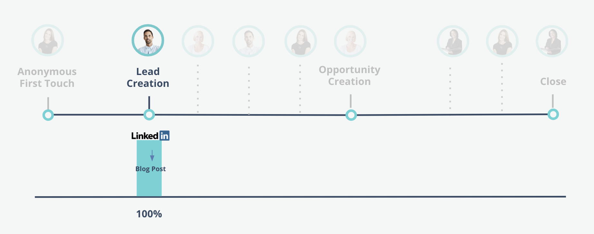
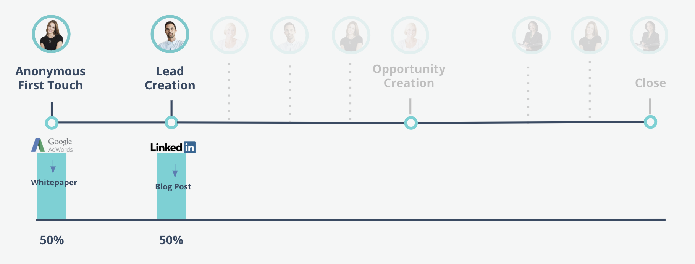

# Bizible Attribution Models {#bizible-attribution-models}

Bizible Attribution Models - Bizible - Product Documentation

Bizible offers six types of attribution models:

* First Touch
* Lead Creation
* U-Shaped
* W-Shaped
* Full Path
* Custom Model

These models vary in complexity. First Touch and Lead Creation are our simple, single-touch models. The remaining four are our more complex, multi-touch models. The structure of Bizible’s attribution models reflects the four major touchpoints that occur in the customer journey:

* First Touch (FT)
* Lead Creation (LC)
* Opportunity Creation (OC)
* Closed-Won deal (CW)

  
  
In the **single-touch models**, attribution credit is only attributed to one milestone touchpoint-- hence the name ‘single-touch’.   
In the **multi-touch models**, most of the attribution credit is assigned to two or more milestone touchpoints. The remaining credit is attributed to touchpoints that occur in-between the milestone touchpoints.   
  
The next few sections covers each attribution model and how attribution credit is assigned.

#### Single-touch Models {#single-touch-models}

**First Touch Model** 
  
The First Touch model only focuses on the very first interaction a lead has with your organization. This model attributes 100% of the attribution credit to the first time the lead became aware of your company, the First Touch (FT).  
  
Say Kate visits www.bizible.com for the first time via an Adwords Ad and views a whitepaper. The Adwords channel would receive 100% of the attribution credit from that Opportunity.

**Lead Creation Model** 
  
The Lead Creation model attributes 100% of the attribution credit to the LC touchpoint, when a prospect provides their contact information and becomes a lead.   
  
Continuing from the previous example, after Kate’s first visit to www.bizible.com via Adwords, Austin visits the website via a Linkedin post. Austin fills out a form and becomes a Lead. In this model, Linkedin would receive 100% of the attribution credit.

#### Multi-touch Models {#multi-touch-models}

Multi-touch models are used for longer, more complicated sales cycles. These models are especially useful if several people from an account/company are involved in the buyer’s journey.  
  
**U-Shaped Model** 
  
The U-Shaped model focuses on both the FT and LC touchpoints. In this model, the FT and LC touchpoint each receive 50% of the revenue credit.  
  
Kate’s first visit to [www.bizible.com](http://www.bizible.com) via an Adwords ad would receive 50% of the attribution credit. The remaining 50% would be attributed to the Linkedin post that drove Austin to fill out a form and become a lead.

  
  
**W-Shaped Model** 
  
Three of the milestone touchpoints are included in the W-Shaped model. In this model, the FT, LC, and OC touchpoints are each attributed 30% of the attribution credit. The remaining 10% is attributed proportionally to any intermediary touchpoints that occur between the three milestone touchpoints.  
  
Kate and Austin mention Bizible to their coworker, Hillary. She finds a piece of content through a google search, and fills out a form. Later, Austin receives an email for a webinar registration, and fills out the registration form on the website. Kate has a conversation with a Sales rep about the Bizible product.   
  
Hillary receives an email with a link to the pricing page and visits the page. Then an Opportunity is created for their account. Hillary's web visit to the pricing page receives credit for the Opportunity Creation because it was the closest marketing interaction to the Opportunity Creation date. Each of the milestone touchpoints are assigned 30% of the attribution credit, and the intermediary touchpoints are attributed the remaining 10%.

**Full Path Model** 
  
The full path model includes all four milestone touchpoints. FT, LC, OC and CW are each given 22.5% of the revenue credit, and the remaining 10% is distributed equally among the intermediary touches.  
  
After the opportunity creation, Kate, Austin, and Hillary decide to pitch Bizible to their CMO, Elizabeth. Elizabeth attends a conference where Bizible is hosting an event. Kate sees a Linkedin post about a case study and fills out a form to download the content. Elizabeth attends a sales dinner hosted by Bizible. After the dinner, she decides to purchase Bizible and becomes a customer. In this scenario, the sales dinner would be attributed 22.5% of the revenue credit from the closed deal. The FT, LC, and OC touchpoints also each receive 22.5% of the credit. The intermediary touchpoints are equally assigned the remaining 10% of revenue credit.

**Custom Attribution Model** 
  
Bizible also offers a Custom Attribution model that allows users to choose which touchpoints or custom stages to include in their model. Additionally, users are able to control the percentage of attribution credit attributed to these touchpoints and stages.
