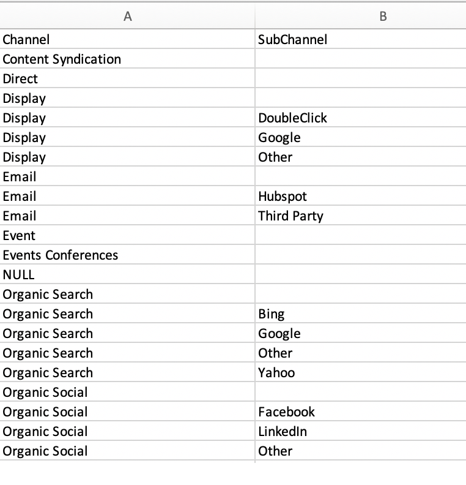

# Marketing Channel Costs {#marketing-channel-costs}

Marketing Channel Costs - Bizible - Product Documentation

One of the most fundamental benefits of using Bizible is the ability to connect marketing efforts directly to the impact on revenue--with as much granularity as desired. It is possible to see return on investment at the touchpoint level. To take advantage of this benefit, channel costs simply need to be uploaded to the Bizible app. ROI reports are automatically created and available in the **Marketing ROI Dashboard** in apps.bizible.com.

[Click here to navigate directly to instructions.](#marketingcosts)

Bizible’s Marketing Spend feature allows customers to upload their spend across all Channels, Subchannels, and Campaigns. The more data that is added by customers, the more ROI reporting we can surface in the Revenue Attribution Dashboard.

Costs that are reported and imported from direct ad connections are automatically pulled in at the most granular level and do not need to be uploaded. This includes our current integrations with Google AdWords, Bing Ads, Doubleclick, and Facebook.

[Click here to navigate directly to the FAQ.](#faq)

#### Definitions {#definitions}

**Spend by Campaign**

At the most granular level, customers can enter spend by individual Campaigns, grouped within its respective Channel. For CRM Campaigns, Bizible has pulled in the Campaign ID into a separate column that will help you map offline campaign spend from your CRM into this table. Adding spend at this level will enable customers to view Campaign ROI and optimize performance by Campaign.

The total of all Campaigns does not need to sum up to any values entered at the Subchannel or Channel, but it cannot be more than any values entered at the Subchannel or Channel. If the sum is less than the value entered at the Subchannel or Channel, Bizible will automatically add a row for “Other” to cover the difference and fill in any gaps.

**Spend by Subchannel**

At a higher level, customers can enter spend by Subchannel, grouped underneath its Channel. Adding spend at this level will enable customers to view Subchannel ROI and optimize performance by Subchannel.

The total of all Subchannels does not need to sum up to any values entered at the Channel, but it cannot be more than any values entered at the Channel. If the sum is less than the value entered at the Channel, Bizible will automatically add a row for “Other” to cover the difference and fill in any gaps.

**Spend by Channel**

At the highest level, customers can enter spend by Channel. Adding spend at this level will enable customers to view Channel ROI and optimize performance by Channel.

**Date Picker**

The default date range will start from your start date with Bizible up to the current month. To ensure costs remain correct, you are unable to enter costs for future months, but you can enter costs for months prior to your partnership with Bizible.

**Filter**

To narrow down your results in the Marketing Spend table, select a Channel at the top to filter out other channels. This is helpful when you have a team focused on a singular channel.

**Search**

Use the Search box to find matched text from Channels, Subchannels, or Campaigns.

**Download Current Costs**

The downloaded CSV will pull the results from your current screen, meaning that any dates, filters, or search that’s applied will get downloaded as is.

**Upload CSV**

Regardless of which view is sitting in the browser, if it’s a filtered view or the default view with all dates and channels, you can upload any CSV.

The most common error we face is the format of the date columns, which happens if the date format is changed and could happen intentionally if moving between Excel and/or Google Sheets. Please keep in mind that the date should be Mmm-YY, so Sep-12 and not Sept-12, or May-12 and not 05-12.

#### Before You Begin {#before-you-begin}

Bizible comes with 13 default channels that can be used or expanded upon. In addition, up to 40 online and offline channels can be created to accommodate your unique marketing structure. Building on this, a total of 200 subchannels may be created to support these online and offline channels as well.

Bizible will automatically download marketing channel costs from platforms that it has an API integration with, such as Bing Ads and Google AdWords. Costs for platforms that are not integrated with Bizible will need to be uploaded manually. The marketing channels should be set up before the cost data is uploaded.

####  Uploading Marketing Costs {#uploading-marketing-costs}

Once marketing channels and rules have been set up or updated, the associated costs may be uploaded. To do this, follow the steps below:

**Step 1: Navigate to the Marketing Spend page in the Bizible App.**

Go to the **My Account** menu, click on **Settings** and then navigate to the **Marketing Spend** option on the left sidebar under the **Reporting **section.

**Step 2: Download the Current Costs CSV**

Navigate to the right of the screen and click on **Download Current Costs.** This option allows you to download a spreadsheet in CSV format.

**Step 3: Open the CSV File and Make Changes**

You can import the file and open it utilizing Google Sheets, Apple Numbers, Microsoft Excel or your choice of software. Bizible recommends using Google Sheets.

After you import the sheet, make the desired changes, such as adding costs to channels and subchannels or updating existing information.

Check the logic rules in your sheet. Each row should contain a channel and one of its subchannels separated by a (.) dot at the end. Using this format consistently is important.

For example, to indicate Facebook as the subchannel and social as the channel, the rule should be written as follows: “Social.Facebook.” Similarly, to track an offline event, the channel syntax should be: “Events.Big Conference.” Examples are shown in the image below:

*   
*

*Additional Notes:*

Do not modify the dates in the spreadsheet because this can cause problems when the document is uploaded.

Do not leave any field blank. Even if there is not a dollar value to add, enter $0 as the dollar amount.

Bing Ads and Google AdWords costs do not need to be entered or updated because Bizible automatically pulls this data from its API connection with these platforms.

**Step 4: Save file in CSV format**

If you are working in Google Sheets, be sure to download the file first. Do not exclude or delete any monthly data as it will cause difficulties when trying to upload the CSV file to Bizible later.

**Step 5: Upload the CSV file**

Go to the **Cost** section of the Bizible app and click **Upload.CSV**. The system will refresh and reflect the new information.

####  FAQ {#faq}

##### Why are numbers appearing in the CSV {#why-are-numbers-appearing-in-the-csv}

If no value is entered at a higher level like Channel or Subchannel, Bizible will automatically sum of the child levels for you, which will be presented once your file is uploaded. Also, if the sum of the children is less than a value entered for the parent, Bizible will add an “Other” row to show the difference in the total.

##### How are the Campaigns determined in the list that I’m seeing? {#how-are-the-campaigns-determined-in-the-list-that-i-m-seeing}

At the moment, our results list out Campaigns that we’ve seen get credited with a Touchpoint. If there was activity from a Campaign, we’ll show that Campaign based on the Touchpoint Date that it occurred.

##### There are too many rows and columns to sift through - can you consolidate the view? {#there-are-too-many-rows-and-columns-to-sift-through-can-you-consolidate-the-view}

With the ability to change the date range, or filter the channel, or search for values, you can consolidate the results of the table to better fit your needs.

##### Why can’t I upload a file? {#why-can-t-i-upload-a-file}

We have different permission sets within the Bizible App. In order to upload a file, you need to be an “AccountAdmin.” To get around this, please request access from your AccountAdmin or have your AccountAdmin upload the file on your behalf. A list of users and their roles can be found under My Account > Settings > View/Add Account Users.

