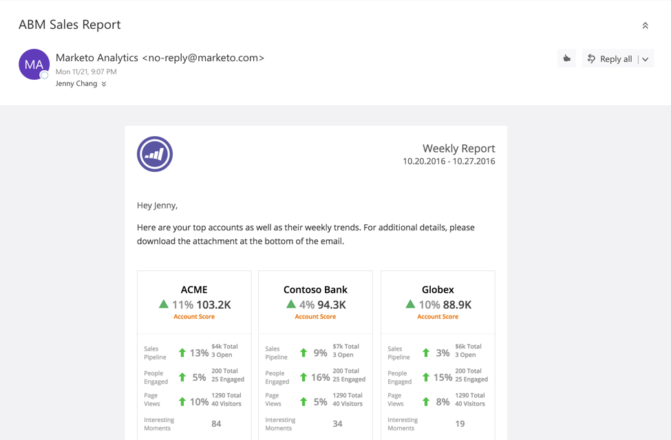

# ABM Sales Report {#abm-sales-report}

ABM Sales Report - Marketo Docs - Product Documentation

Receive a weekly email containing your top accounts and their weekly trends.

>[!NOTE]
>
>Learn how to set up this report [here](https://docs.marketo.com/x/drat).

The report shares:

* Named accounts sorted by the account score you choose
* Top engaged people
* Key trends and interesting moments
* A link to download a CSV file containing additional details

### Sales Report Key {#sales-report-key}

| **Account Score** |Weekly trend by account score (selected in setup), followed by current account score |
|---|---|
| **Sales Pipeline** |Weekly trend by pipeline, followed by total current pipeline and number of open opportunities |
| **Page Views** |Weekly trend of page views, followed by total page views and number of unique visitors |
| **Interesting Moments** |Total number of interesting moments that occurred during the week |

