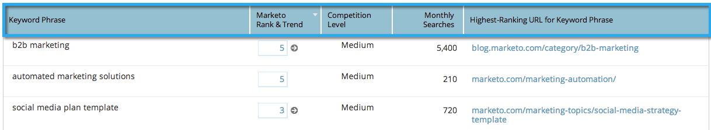

# SEO - Add/Remove Columns From Your Keywords View {#seo-add-remove-columns-from-your-keywords-view}

SEO - Add/Remove Columns From Your Keywords View - Marketo Docs - Product Documentation

You can adjust your keyword view to display the data you are most interested in.

1. Go to the **Keywords** section.

   

   These are the default columns:

1. 

1. Click the gear icon.

   

1. Select or unselect the columns you'd like to see. Click **SAVE**.

   

   Awesome! You have now customized your keyword view.

   

   >[!NOTE]
   >
   >**Related Articles**
   >
   >    
   >    
   >    * [Understanding Keywords - Summary View](seo-understanding-keywords.md)
   >    
   >

