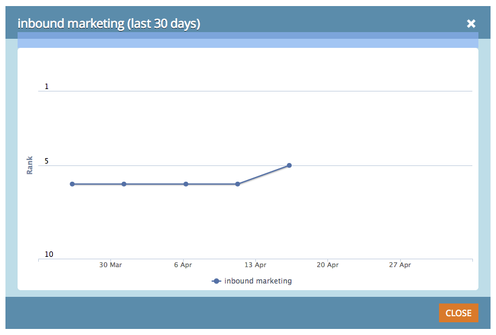

# SEO - Keyword Trends Chart {#seo-keyword-trends-chart}

SEO - Keyword Trends Chart - Marketo Docs - Product Documentation

It's important to monitor how your keyword [SERP Ranks](../../../../product-docs/additional-apps/seo/understanding-seo/understanding-search-engine-optimization.md) are trending over time. Check this cool chart to monitor progress.

1. Go to the **Keywords** section.

   

1. Click the rank box for the keyword you want to trend.

   

   See? It shows your [SERP Rank](../../../../product-docs/additional-apps/seo/understanding-seo/understanding-search-engine-optimization.md) for the past 30 days:

   

   Pretty nifty, huh? You can learn more about your keywords ranking in the Keyword Trends Report.

   >[!NOTE]
   >
   >**Related Articles**
   >
   >    
   >    
   >    * [Using the Keyword Trends Report](../../../../product-docs/additional-apps/seo/reports/seo-use-the-keyword-trends-report.md)
   >    
   >

