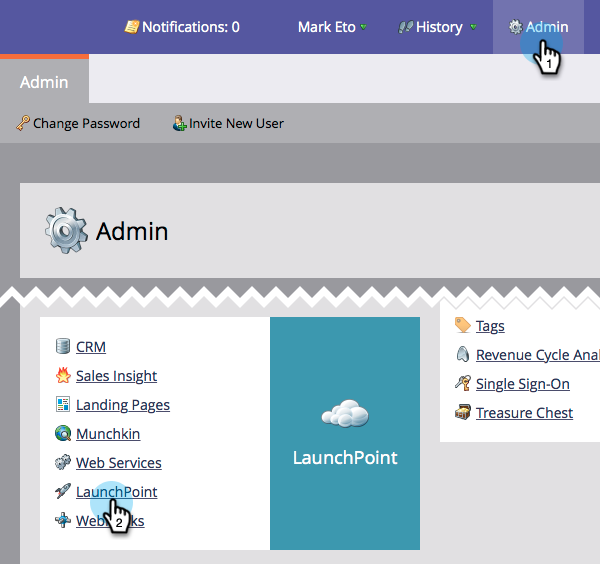
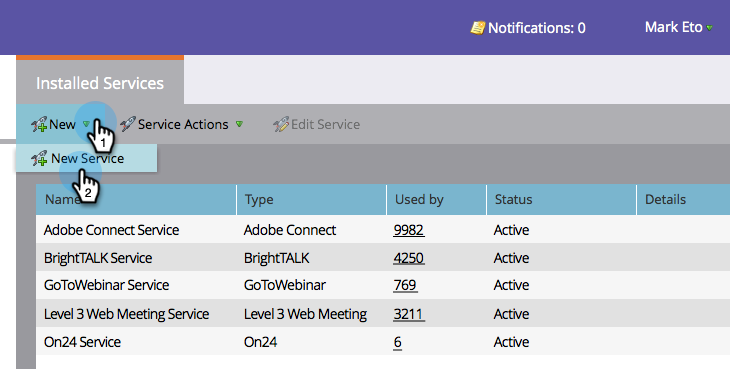
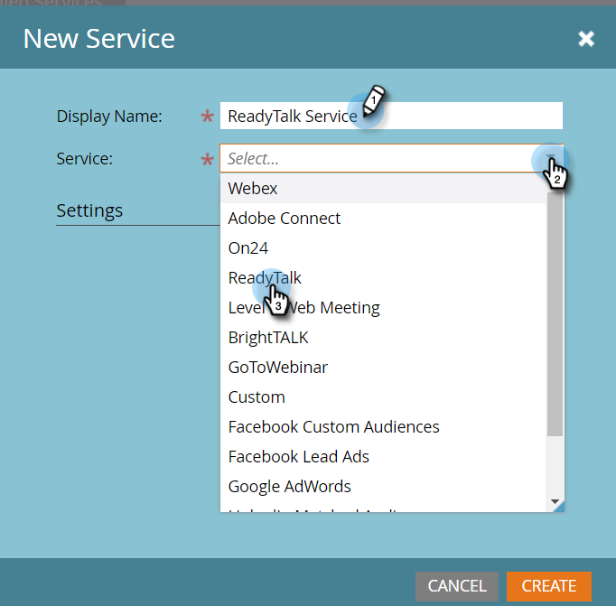
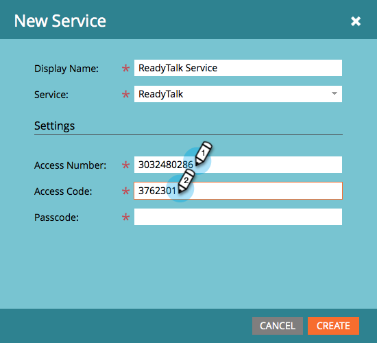
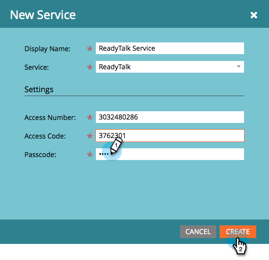
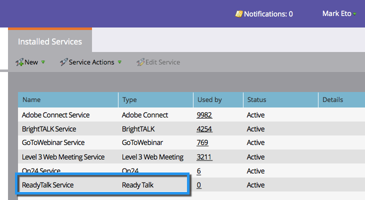

# Add ReadyTalk as a LaunchPoint Service {#add-readytalk-as-a-launchpoint-service}

Add ReadyTalk as a LaunchPoint Service - Marketo Docs - Product Documentation

Marketo manages&nbsp;your ReadyTalk webinar registration and attendance.

>[!NOTE]
>
>**Admin Permissions Required**

>[!NOTE]
>
>**Reminder**
>
>An existing subscription to ReadyTalk and administration rights are necessary for this step. Have the following settings at hand: Access Number, Access Code, and Passcode.

1. Go to&nbsp;**Admin** and click&nbsp;**ReadyTalk**.

   

1. Select&nbsp;**New**&nbsp;and then&nbsp;**New** **Service**.

   

1. Enter a&nbsp;**Display** **Name**.&nbsp;Under&nbsp;**Service**, select** ReadyTalk**.

   

1. Enter your&nbsp;**Access Number**&nbsp;and&nbsp;**Access** **Code**.

   

1. Complete the process by entering your **Passcode** and click&nbsp;**Create**.

   

1. Phenomenal! Your **ReadyTalk** account is now synced with Marketo.

   

>[!NOTE]
>
>**Related Articles**
>
>Learn how to [create an event with ReadyTalk](../../../product-docs/demand-generation/events/create-an-event/create-an-event-with-readytalk.md).

