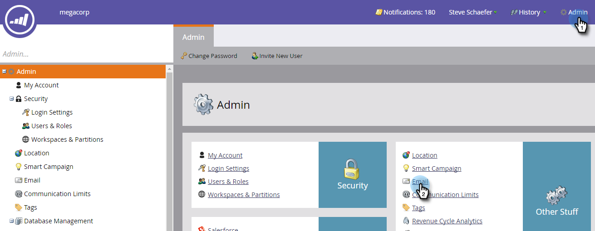

# Delete a Branding Domain {#delete-a-branding-domain}

Delete a Branding Domain - Marketo Docs - Product Documentation

1. In My Marketo, click&nbsp;**Admin&nbsp;**and then the&nbsp;**Email&nbsp;**link.

   

1. In the Branding Domains table, select the domain you want to remove and click **Delete. **

   

   >[!NOTE]
   >
   >If you want to delete the primary branding domain, you must first select a different branding domain to be the primary.

