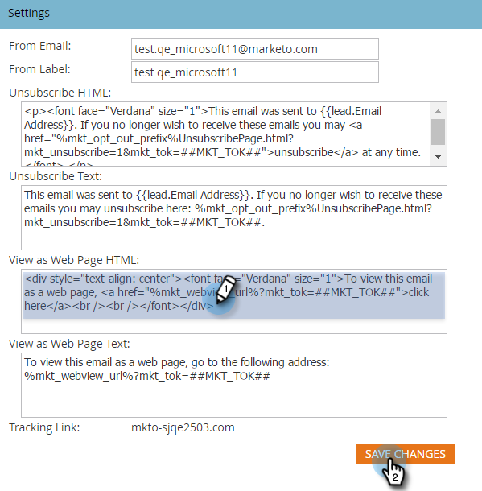

# Edit the "View as Web Page" Message {#edit-the-view-as-web-page-message}

Edit the "View as Web Page" Message - Marketo Docs - Product Documentation

If you need to edit the " [View as a Webpage](../../../product-docs/email-marketing/general/functions-in-the-editor/add-a-view-as-web-page-link-to-an-email.md)" text, here's how.

>[!NOTE]
>
>**Admin Permissions Required**

### What's in this article? {#whats-in-this-article}

[Edit the "View as Web Page" Message](#edit-the-view-as-web-page-message)  
[Default "View as Web Page" Text](#default-view-as-web-page-text)

#### Edit the "View as Web Page" Message {#edit-the-view-as-web-page-message-1}

1. Under&nbsp;**Admin**, click **Email**.&nbsp;

   

   >[!CAUTION]
   >
   >The following variables are critical. Don't delete them!
   >
   >    
   >    
   >    * %mkt_webview_url%?mkt_tok=##MKT_TOK##
   >    
   >    
   >The second part ##MKT_TOK## is the munchkin cookie of that person. It makes sure they get cookied appropriately when they click the link.

1. Edit the **View as Web Page HTML** and **View as Web Page Text **versions to your liking and click **Save Changes**.

   

>[!CAUTION]
>
>Be sure to avoid:
>
>* Adding additional URLs to either of the HTML boxes
>* Putting HTML in the text version
>

There you have it. Send out test emails to ensure&nbsp;formatting.

#### Default "View as Web Page" Text {#default-view-as-web-page-text}

If you ever need to revert to default system "View as Web Page", copy/paste the following:

**View as Web Page HTML:**
`<pre data-theme="Confluence">
To view this email as a web page, <a href="%mkt_webview_url%?mkt_tok=##MKT_TOK##">click here</a>
</pre>` **View as Web Page Text:**

To view this email as a web page, go to the following address:
`<pre data-theme="Confluence">%mkt_webview_url%?mkt_tok=##MKT_TOK##</pre>` Boom! You're done.
