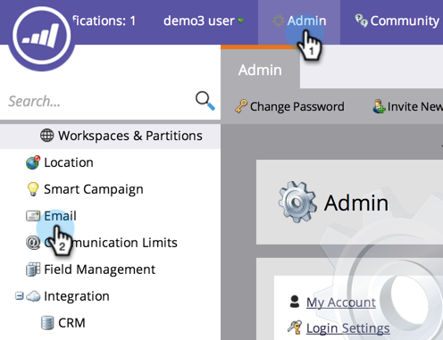

# Edit the Unsubscribe Message {#edit-the-unsubscribe-message}

Edit the Unsubscribe Message - Marketo Docs - Product Documentation

>[!NOTE]
>
>**Admin Permissions Required**

### What's in this article? {#whats-in-this-article}

[Edit the Unsubscribe Message](#edit-the-unsubscribe-message)  
[Default Unsubscribe Text](#default-unsubscribe-text)  
When you send marketing emails (non- [operational](../../../product-docs/email-marketing/general/functions-in-the-editor/make-an-email-operational.md)), unsubscribe text and links are appended to the bottom. You can change the defaults. Here's how.

#### Edit the Unsubscribe Message {#edit-the-unsubscribe-message-1}

1. Under **Admin**, click **Email**.

   

   >[!CAUTION]
   >
   >
   >The following variables are critical. Don't delete them!
   >
   >    
   >    
   >    * **%mkt_opt_out_prefix%**
   >    * **mkt_unsubscribe=1&mkt_tok=##MKT_TOK##**
   >    
   >

1. Edit the **Unsubscribe HTML** and **Unsubscribe Text** versions to your liking and click **Save Changes**.

   

   There you have it.&nbsp;**Make sure to test!**&nbsp;You don't want your marketing emails to have broken unsubscribe links.

>[!TIP]
>
>You can customize the position of the unsubscribe HTML in your email by using [tokens](../../../product-docs/email-marketing/general/using-tokens/add-a-system-token-as-a-link-in-an-email.md).

#### Default Unsubscribe Text {#default-unsubscribe-text}

If you ever need to revert to default system unsubscribe, copy/paste the following:

Unsubscribe HTML:
`<pre data-theme="Confluence">
If you no longer wish to receive these emails, click on the following link: <a href="%mkt_opt_out_prefix%UnsubscribePage.html?mkt_unsubscribe=1&mkt_tok=##MKT_TOK##">Unsubscribe</a> 
</pre>` Unsubscribe Text:
`<pre data-theme="Confluence">%mkt_opt_out_prefix%UnsubscribePage.html?mkt_unsubscribe=1&mkt_tok=##MKT_TOK##</pre>` 

>[!NOTE]
>
>**Related Articles**
>
>* [Edit the "View as Web Page" Message](edit-the-"view-as-web-page"-message.md)
>

