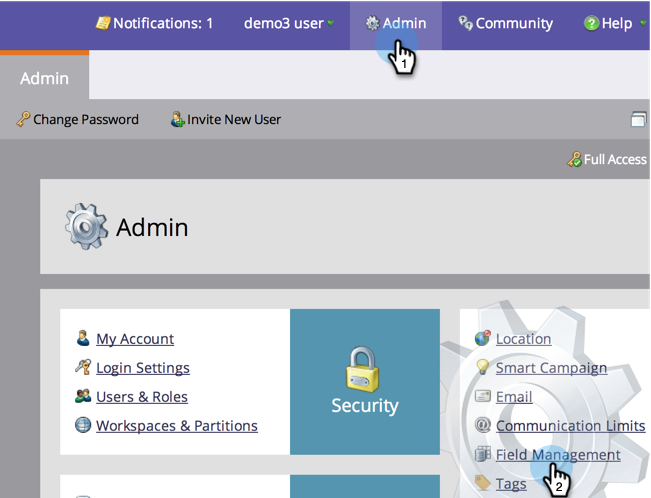
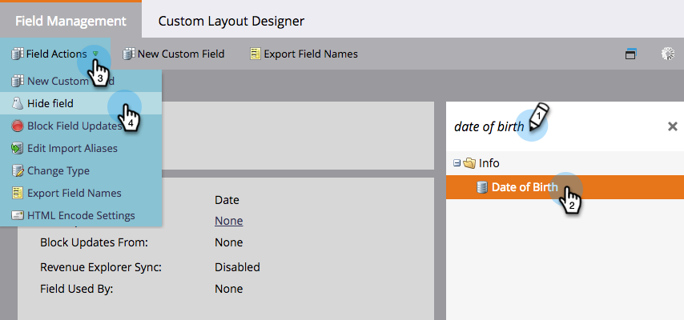
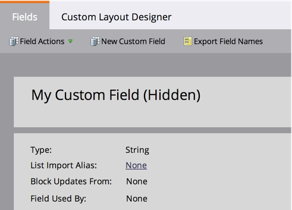
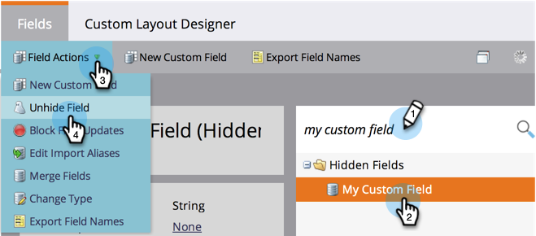

# Hide and Unhide a Field {#hide-and-unhide-a-field}

Hide and Unhide a Field - Marketo Docs - Product Documentation

If you no longer have use for a field in Marketo, you can hide it from the UI so that it no longer displays in the application.

### What's in this article? {#whats-in-this-article}

[Hide a Field](#hide-a-field)  
[Unhide a Field](#unhide-a-field)

#### Hide a Field {#hide-a-field}

>[!NOTE]
>
>**Admin Permissions Required**

1. Go to **Admin** and click **Field Management**.

   

1. Find the field, select it, then under&nbsp;**Field Actions**&nbsp;click **Hide Field**.

   

   >[!NOTE]
   >
   >**Reminder**
   >
   >In order to hide a field it must not be associated with any other assets (including archived ones). Make sure to remove the field from all smart lists, flow step choices, forms, emails, etc., before hiding.

   ##### Click Hide to confirm. {#click-hide-to-confirm}

   

   Nice work! Now you know how to hide a field from the Marketo user interface.

   

#### Unhide a Field {#unhide-a-field}

1. Go to **Admin** and click **Field Management**.

   

1. Find and select the field, then under **Field Actions** click **`Unhide Field`**.

   

   Great work! Now you know how to unhide fields and make them visible again in the Marketo user interface.

   >[!TIP]
   >
   >Need to have a mass hide/unhide performed? Contact Marketo Professional Services: [`[email protected]`](http://docs.marketo.com/cdn-cgi/l/email-protection#b6c5d3c4c0dfd5d3c5f6dbd7c4ddd3c2d998d5d9db98)

