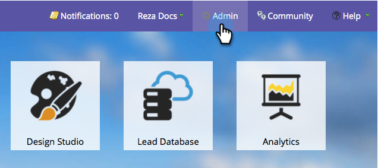
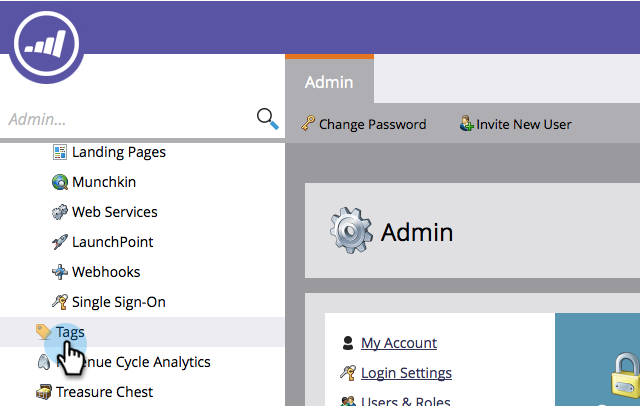
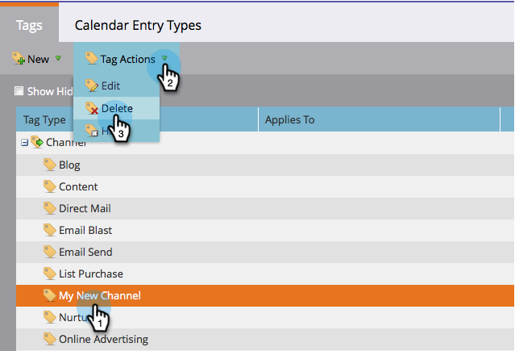

# Delete a Program Channel {#delete-a-program-channel}

Delete a Program Channel - Marketo Docs - Product Documentation

Program channels are a collection of statuses or checkpoints leads should go through in a program.

If you make one by accident or no longer need one, you can delete it.

1. Go to the** Admin** section.

   

1. Click **Tags**.

   

1. Select the channel you want to delete, under Tag Actions, click Delete.

   >[!TIP]
   >
   >If the channel is associated with any program(s), you can't delete, only hide.

   

Bam! You can also&nbsp; [delete specific statuses from channels](delete-a-program-status-from-a-program-channel.md).

>[!NOTE]
>
>**Related Articles**
>
>* [Delete a Program Status From a Program Channel](delete-a-program-status-from-a-program-channel.md)
>

